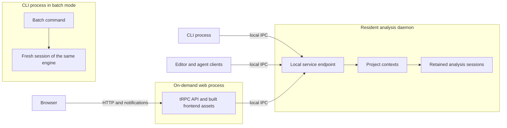

# Processes and clients

**Date:** 2026-09-07. **Status:** Decided architecture. Command spellings,
complete contracts and wire details remain subject to implementation review.

The analysis daemon is the resident backend. A separate, on-demand web process
serves visualization. The CLI connects directly to the daemon for ordinary
analysis commands and can run the same engine in batch mode. This split keeps
web allocations out of the daemon's resident lifetime.

## Process topology

| Process | Owns at runtime | Lifetime |
| --- | --- | --- |
| CLI | Argument parsing, local connection, command formatting and launch/control requests. Batch mode additionally owns its fresh engine session. | One command, except explicit streaming/watch commands. |
| Daemon | Project/worktree contexts, coherent inputs, watchers, compiler sessions, checking, semantic queries, bounded history and local service delivery. | Retained for interactive use, with inactive-context eviction and idle shutdown. |
| Web server | HTTP/tRPC routing, browser notifications, built static assets and bounded connection/request state. | Started when the explorer is used; exits after its clients leave and an inactivity grace period expires. |

The web process owns no independent module discovery, compiler program or
permissions catalog. It queries the existing daemon. A browser tab does not
create another analysis context when it selects the same compatible project
setup. Different worktrees, registries or overlays retain the isolation defined
in [daemon and analysis](daemon.md).

The ordinary daemon process does not host the web listener. This is a deliberate
choice for memory reclamation, not a claim that HTTP requires another process.
It costs an additional runtime and serialization while visualization is active;
the [memory lifecycle](memory-lifecycle.md) explains the tradeoff.

## Shared service boundary

Define one versioned logical analysis service for context lifecycle, input
synchronization, checks, inspection, explanations and change notifications.
Root owns its dispatch-facing vocabulary; domain facts and decisions retain
their existing analysis owners. The service has two implementations of its
call boundary:

- A local client used by CLI and web processes to reach the daemon through IPC.
- An in-process binding to the real context manager and analysis sessions,
  used by assembly and quick tests.

The local socket/named-pipe transport remains the preferred IPC mechanism.
Its exact framing, endpoint-discovery scheme and context-to-process grouping
are contract-review items. The web/daemon split is fixed independently of those
details. Selecting tRPC for the browser does not require loading the web router
or Express into the daemon or ordinary CLI.

Both call boundaries preserve context/generation/revision identity, freshness,
coverage, cancellation and explicit errors. Domain results are plain data;
compiler objects and browser graph objects stay within their implementations.
Bounds apply to request sizes, response sizes, concurrency and notifications.

The daemon validates its own service requests, including context and source
scope. Browser-side types and tRPC input validation do not replace this boundary,
because local clients can reach it directly. Transport adapters map errors while
preserving the distinction between a denied import, incomplete coverage, invalid
project state and unavailable execution.

## CLI commands

These names are proposed; their process behavior is part of the architecture.

| Command | Required behavior |
| --- | --- |
| `ramify check` | Connect to a compatible daemon, starting one if necessary; synchronize the requested inputs, obtain the check result, print it and exit. |
| `ramify inspect ...`, `ramify explain ...` | Query the selected project's analysis with explicit freshness/revision semantics, print the result and exit. |
| `ramify watch` | Keep a bounded subscription open and render published updates. The daemon owns watching and analysis. |
| `ramify check --batch` | Load the engine only for this mode, create a fresh session, run the check and dispose it on exit. CI uses this independent mode. |
| `ramify explore` | Ensure a compatible daemon, start or reuse a compatible web process, open the browser at the selected project and exit. Visualization is a later capability. |
| `ramify daemon status` | Inspect an existing daemon without starting one or loading an analysis engine merely to report absence. |
| `ramify daemon stop` | Request shutdown of the selected daemon instance and report completion or failure. Selection must not silently target another compatible instance. |
| `ramify --help`, `ramify --version` | Run locally without connecting to or starting either server. |

A command releases its request, subscription and bounded revision references on
completion, interruption or connection loss. Its completion does not immediately
discard useful project state; the daemon's idle policy controls that retention.
The watch command holds a live subscription, not an unbounded result history.

Checking requests synchronized inputs explicitly. A watcher may be delayed, so
the last published revision alone cannot prove that a just-saved file was checked.
Inspection identifies whether it reads a published revision, synchronized disk
state or an overlay, according to the [freshness contract](daemon.md#freshness-saves-and-overlays).

Commands render structured results consistently and map known denials and
unavailable checking to unsuccessful enforcement. Exact output/exit-code schemas
remain in contract review. An explicit machine-readable output mode should use
the same result semantics as human-readable output.

Batch execution uses the same engine and rules as retained execution. It starts
neither server. On daemon failure, a reproducible disk operation may use the
bounded reconnect/batch fallback specified in [daemon recovery](daemon.md#transport-process-lifecycle-and-recovery).
Report fallback use; do not silently substitute disk state for an overlay or
current state for an unavailable historical revision.

## Web server and tRPC

Use the Express/tRPC adapter pattern with a Ramify-only router for browser
requests. Procedures validate their inputs, call an injected analysis-service
client and map the result. Analysis and scheduling remain behind that client;
routers do not call other routers to implement domain behavior.

The browser receives a typed tRPC client. Its router type can be exposed as a
type-only contract; importing that type must not pull server implementations
into the browser runtime. tRPC typing does not replace runtime compatibility
checks between separately started clients and daemons.

Published-revision and status events travel through an explicit event adapter.
Reuse the WebSocket/direct-message-channel pattern: production transports
notifications over the network, while quick tests deliver the same mapped events
in-process. Exact socket mounting and event schemas remain review items. Clients
can recover by fetching current state instead of requiring an unbounded replay.

Serve built frontend assets in normal use. Vite and frontend compilation belong
to a separate development entry point and lifetime. Reusing the web architecture
does not mean importing a host application's complete router, service registry,
agent runtime, test runner or development-server assembly.

## Launch, compatibility and shutdown

The small launcher/client path discovers existing processes and coordinates
concurrent starts. After startup it performs a readiness and compatibility
handshake before dispatching a command. A stale endpoint record does not prove
a process is alive; competing launches must not produce duplicate owners of one
context merely because their first checks raced.

Daemon and web entry points have independent lifecycles. Explorer launch reuses
a compatible web process and connects it to the selected daemon. A web restart
does not restart the daemon, and a closed browser does not stop unrelated CLI,
editor or watch sessions. Daemon recovery must never kill another compatible
instance still serving clients.

Web clients hold renewable, expiring activity leases so crashed tabs and broken
connections eventually release subscriptions and revision references. Clean
disconnects release them promptly. After the last lease expires and the idle
grace period passes, the web process closes its listener, releases daemon
references and exits. Browser unload events alone are insufficient for cleanup.
The web process does not own the daemon's shutdown decision.

If the daemon stops, clients receive disconnection/unavailability and follow
bounded recovery. An explicit stop is not immediately undone by a blind retry
loop in a still-open web page. Notify connected clients of intentional shutdown
where possible; a later explicit command can start a daemon again. Distinguish
unexpected failure from intentional shutdown in the lifecycle contract.

Exact lease durations, discovery records and retry limits remain review items.
They must implement these lifecycle guarantees without loading web dependencies
into the resident daemon.

## Modules and executable entry points

Process placement is separate from the [Ramify ownership tree](daemon.md#ramifys-ownership-tree).
The initial owners remain the engine, daemon/context, presentation/layout and
CLI owners described there. Root owns assembly through distinct source entry
files; it is not one eagerly imported application barrel.

- Ordinary CLI entry loads command handling, the lightweight local client and
  formatting. The daemon-owned client implementation must be importable without
  loading its host startup, watchers or compiler assembly.
- Daemon entry loads the local host and analysis assembly, with no web or UI
  implementation in its transitive runtime dependencies.
- Batch dispatch loads the engine factory only when batch execution is selected.
- Later web entry assembles `service-api [dispatch]` with the lightweight daemon
  client. Browser application code belongs to `explorer [ui, browser, dispatch]`;
  reusable project views belong below `presentation [ui, browser]`.

The later owners are declared only when implemented. Root relays the selected
contracts through ordinary exposure declarations. UI props retain `ui`, service
contracts retain `dispatch`, and browser-consumed foreign values need explicit
browser promises. Exact owned interface wildcards cannot claim foreign types.
Separate entry files and package exports must preserve these legal routes and
the runtime dependency boundaries; source modularity alone does not prove a
lightweight entry point.

## Acceptance evidence

These requirements complement DA01–DA18 in [daemon acceptance](daemon.md#acceptance-evidence).
They are implementation obligations, not current passing tests.

| ID | Required witness |
| --- | --- |
| PC01 | Help/version/status complete without launching servers; ordinary CLI startup does not load compiler/web dependencies, and daemon startup does not load the web stack. |
| PC02 | Concurrent commands coordinate startup, select the right worktree/setup and preserve compatible clients during version negotiation. |
| PC03 | Check/inspect/explain reach the daemon directly and agree with equivalent batch inputs; a delayed watcher cannot hide a just-saved change. |
| PC04 | Watch interruption and command exit release subscriptions/revision references; inactive project retention follows the daemon policy. |
| PC05 | Explore starts/reuses the separate web process. Browser loss expires its leases, and web exit/restart leaves warm daemon contexts intact. |
| PC06 | Unexpected process failure, intentional stop, stale endpoints and incompatible versions have bounded, distinct recovery outcomes. |
| PC07 | tRPC and local clients return matching semantic results; actual wire tests preserve errors, revision identity and serialization without a second analyzer. |

CLI and daemon lifecycle evidence is delivered with the local daemon. Web-specific
parts of these requirements are delivered with later visualization. The
[quick-testing architecture](quick-testing.md) distinguishes the evidence each
test mode can establish.
