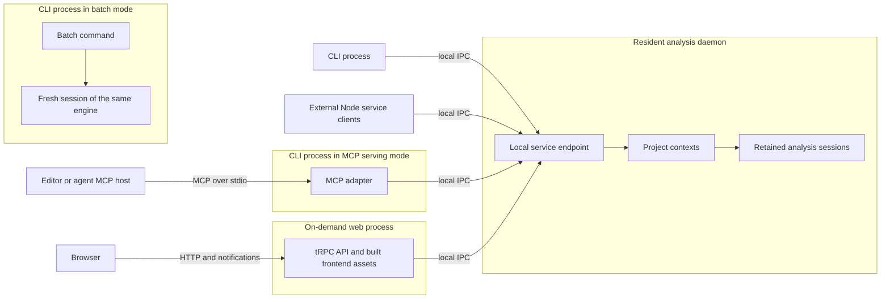

# Processes and clients

**Date:** 2026-09-07. **Status:** Decided architecture. Command spellings,
complete contracts and wire details remain subject to implementation review.

The analysis daemon is the resident backend. A separate, on-demand web process
serves visualization. The CLI connects directly to the daemon for ordinary
analysis commands and can run the same engine in batch mode. Its MCP serving
mode runs an adapter for an editor or agent host, also connecting directly to
the daemon. This split keeps MCP and web allocations out of the daemon's
resident lifetime.

## Process topology

| Process | Owns at runtime | Lifetime |
| --- | --- | --- |
| CLI | Argument parsing, local connection, command formatting and launch/control requests. Batch mode additionally owns its fresh engine session; MCP mode dispatches to the adapter below. | One command, except explicit watch or MCP serving modes. |
| External Node service client | An integrating program uses the lightweight `connectDaemon` client for analysis requests and subscriptions. | Its host owns process lifetime; each connection and operation follows the shared bounded lease and cleanup rules. |
| Daemon | Project/worktree contexts, coherent inputs, watchers, compiler sessions, checking, semantic queries, bounded history and local service delivery. | Retained for interactive use, with inactive-context eviction and idle shutdown. |
| MCP adapter | MCP definitions, input schemas, protocol sessions and translation to the daemon service. | The host-launched `ramify mcp` process serves its stdio connection, then releases resources and exits. |
| Web server | HTTP/tRPC routing, browser notifications, built static assets and bounded connection/request state. May later mount MCP over HTTP. | Started on demand; exits after all relevant client leases expire and an inactivity grace period passes. |

Direct service clients are external Node programs using `connectDaemon`, without
an MCP or web adapter. They use the same IPC validation, compatibility handshake,
recovery policy and bounded activity/revision leases as Ramify's clients. Hosts
dispose connections and subscriptions when finished; clean disconnect releases
references promptly and abandoned leases expire. This is a client integration
role, not another Ramify-owned process or module.

Direct clients, MCP and web adapters own no independent module discovery,
compiler program or permissions catalog. They query the existing daemon. An MCP
session or browser tab does not create another analysis context when it selects
the same compatible project setup. Different worktrees, registries or overlays retain the isolation
defined in [daemon and analysis](daemon.md).

The ordinary daemon process does not host the web listener. This is a deliberate
choice for memory reclamation, not a claim that HTTP requires another process.
It costs an additional runtime and serialization while visualization is active;
the [memory lifecycle](memory-lifecycle.md) explains the tradeoff.

## Shared service boundary

Define one versioned logical analysis service for context lifecycle, input
synchronization, checks, inspection, explanations and change notifications.
Root owns its dispatch-facing vocabulary; domain facts and decisions retain
their existing analysis owners. The service has two implementations of its
call boundary:

- A local client used by CLI, external Node, MCP and web processes to reach the
  daemon through IPC.
- An in-process binding to the real context manager and analysis sessions,
  used by assembly and quick tests.

`daemon` owns both bindings. Its in-process service implementation validates and
dispatches requests to its context manager; the IPC host delegates to that same
implementation. Root exposes the dispatch-facing service interface downward to
`daemon`, which imports and implements it through ordinary declarations. Root
only assembles and injects the analysis driver and other dependencies; it does
not duplicate service routing. `contexts` keeps its own neutral vocabulary and
`AnalysisDriver` port and does not import the root-owned dispatch interface.
The lightweight `connectDaemon` entry remains separate from this host/direct
binding, so importing the client does not load context or compiler assembly.

The local socket/named-pipe transport remains the preferred IPC mechanism.
Its exact framing, endpoint-discovery scheme and context-to-process grouping
are contract-review items. The web/daemon split is fixed independently of those
details. Selecting tRPC for the browser does not require loading the web router
or Express into the daemon or ordinary CLI. The MCP SDK and protocol adapter
are likewise loaded only by an MCP-serving entry point.

Both call boundaries preserve context/generation/revision identity, freshness,
coverage, cancellation and explicit errors. Domain results are plain data;
compiler objects and browser graph objects stay within their implementations.
Bounds apply to request sizes, response sizes, concurrency and notifications.

The daemon validates its own service requests, including context and source
scope. Browser-side types and tRPC input validation do not replace this boundary,
because local clients can reach it directly. Transport adapters map errors while
preserving the distinction between a denied import, incomplete coverage, invalid
project state and unavailable execution.

## CLI commands

These names are proposed; their process behavior is part of the architecture.

| Command | Required behavior |
| --- | --- |
| `ramify check` | Connect to a compatible daemon, starting one if necessary; synchronize the requested inputs, obtain the check result, print it and exit. |
| `ramify inspect ...`, `ramify explain ...` | Query the selected project's analysis with explicit freshness/revision semantics, print the result and exit. |
| `ramify watch` | Keep a bounded subscription open and render published updates. The daemon owns watching and analysis. |
| `ramify check --batch` | Load the engine only for this mode, create a fresh session, run the check and dispose it on exit. CI uses this independent mode. |
| `ramify explore` | Ensure a compatible daemon, start or reuse a compatible web process, open the browser at the selected project and exit. Visualization is a later capability. |
| `ramify mcp` | Lazily load the MCP adapter and serve the host's stdio connection in this process. Resolve a compatible daemon for analysis requests; no web server or per-call CLI subprocess is required. |
| `ramify daemon status` | Inspect an existing daemon without starting one or loading an analysis engine merely to report absence. |
| `ramify daemon stop` | Request shutdown of the selected daemon instance and report completion or failure. Selection must not silently target another compatible instance. |
| `ramify --help`, `ramify --version` | Run locally without connecting to or starting any server. |

A command releases its request, subscription and bounded revision references on
completion, interruption or connection loss. Its completion does not immediately
discard useful project state; the daemon's idle policy controls that retention.
The watch command holds a live subscription, not an unbounded result history.

Checking requests synchronized inputs explicitly. A watcher may be delayed, so
the last published revision alone cannot prove that a just-saved file was checked.
Inspection identifies whether it reads a published revision, synchronized disk
state or an overlay, according to the [freshness contract](daemon.md#freshness-saves-and-overlays).

Commands render structured results consistently and map known denials and
unavailable checking to unsuccessful enforcement. Exact output/exit-code schemas
remain in contract review. An explicit machine-readable output mode should use
the same result semantics as human-readable output.

Batch execution uses the same engine and rules as retained execution. It starts
neither server. After bounded daemon recovery fails, a terminating CLI command
over reproducible disk inputs may use the batch fallback specified in
[daemon recovery](daemon.md#transport-process-lifecycle-and-recovery).
Report fallback use; do not silently substitute disk state for an overlay or
current state for an unavailable historical revision.
Only terminating CLI commands may load the engine for in-process fallback;
they dispose the session and exit. Watch, MCP, web and external service clients
never load a fallback engine: they recover the daemon within the lifecycle
policy or report unavailable execution. No subprocess batch fallback is part
of these long-lived client modes.

## MCP server

The root child `mcp [dispatch]`, physically under `subs/mcp/`, owns MCP tool and
resource definitions, input schemas, protocol sessions and response/error
mapping. Root assembly injects the same analysis-service client used by the CLI.
Handlers call that service directly; the daemon and engine remain the authorities
for project selection, synchronization, checks and query results.

The initial transport is stdio. An editor or agent's MCP host launches
`ramify mcp`; the CLI loads the MCP serving entry and remains in that process
for the connection. It does not spawn a second adapter process or start one
process per tool call. MCP framing reserves stdout for protocol messages;
diagnostics go to stderr, as required by the
[MCP transport specification](https://modelcontextprotocol.io/specification/2025-11-25/basic/transports#stdio).

Tool definitions describe the implemented capabilities and their coverage. A
handler preserves context/generation/revision tokens, explicit freshness and
structured results when mapping them into MCP responses. Invalid input,
unavailable execution and known denials remain distinguishable. MCP session
identity is separate from daemon context or revision identity; changing the
selected project never silently reuses another worktree's state.

The process releases its subscriptions, request references and owned overlay
leases on stdio closure or termination, then exits. Abnormal process loss must
also expire those daemon references. An open but idle MCP connection does not
indefinitely pin historical revisions or require a warm compiler context without
an active service lease. Subsequent requests can reopen an evicted context with
explicit generation/revision handling. Adapter exit does not stop the daemon.

MCP serving follows the shared [shutdown and recovery contract](#launch-compatibility-and-shutdown).
An idle-exited daemon can be started for the next request; an explicit stop must
not be undone by the still-open session. Recovery failure returns stopped or
unavailable execution. MCP never falls back to an in-process compiler session.

### Optional HTTP hosting

If Streamable HTTP support is later needed, the separate web process can mount
the same MCP module with an HTTP transport adapter and an injected daemon client.
It does not route MCP calls through tRPC procedures or create another analyzer.
MCP HTTP sessions then contribute to web-process activity alongside browser
clients, so closing the explorer alone does not stop a server still serving MCP.

HTTP sessions need bounded leases, termination and reconnect behavior. Closing
an individual HTTP connection is not itself MCP request cancellation; preserve
the [Streamable HTTP specification's cancellation semantics](https://modelcontextprotocol.io/specification/2025-11-25/basic/transports#streamable-http).
The shared host can reduce the
number of adapter runtimes when many clients use MCP, but this extension is not
required for the initial stdio delivery.

## Web server and tRPC

Use the Express/tRPC adapter pattern with a Ramify-only router for browser
requests. Procedures validate their inputs, call an injected analysis-service
client and map the result. Analysis and scheduling remain behind that client;
routers do not call other routers to implement domain behavior.

The browser receives a typed tRPC client. Its router type can be exposed as a
type-only contract; importing that type must not pull server implementations
into the browser runtime. tRPC typing does not replace runtime compatibility
checks between separately started clients and daemons.

Published-revision and status events travel through an explicit event adapter.
Reuse the WebSocket/direct-message-channel pattern: production transports
notifications over the network, while quick tests deliver the same mapped events
in-process. Exact socket mounting and event schemas remain review items. Clients
can recover by fetching current state instead of requiring an unbounded replay.

Serve built frontend assets in normal use. Vite and frontend compilation belong
to a separate development entry point and lifetime. Reusing the web architecture
does not mean importing a host application's complete router, service registry,
agent runtime, test runner or development-server assembly.

## Launch, compatibility and shutdown

The small launcher/client path discovers existing processes and coordinates
concurrent starts. After startup it performs a readiness and compatibility
handshake before dispatching a command. A stale endpoint record does not prove
a process is alive; competing launches must not produce duplicate owners of one
context merely because their first checks raced.

Daemon and web entry points have independent lifecycles. Explorer launch reuses
a compatible web process and connects it to the selected daemon. A web restart
does not restart the daemon, and a closed browser does not stop unrelated CLI,
editor or watch sessions. Daemon recovery must never kill another compatible
instance still serving clients.

Web clients hold renewable, expiring activity leases so crashed tabs and broken
connections eventually release subscriptions and revision references. Clean
disconnects release them promptly. After the last lease expires and the idle
grace period passes, the web process closes its listener, releases daemon
references and exits. Browser unload events alone are insufficient for cleanup.
The web process does not own the daemon's shutdown decision. If optional MCP
HTTP hosting is added, its active session leases participate in this same idle
decision; a temporarily closed HTTP stream does not end a live MCP session.

If the daemon stops, clients receive disconnection/unavailability. Recovery
distinguishes three outcomes:

| Outcome | Client behavior |
| --- | --- |
| Automatic idle exit | Leave the daemon stopped until a real analysis request needs it. That request may coordinate a bounded startup. An open idle connection alone must not trigger restart. |
| Unexpected failure | Active work may attempt bounded reconnect/restart, preserving requested input and revision semantics; exhausted recovery reports unavailable execution. Only eligible terminating CLI commands may then use batch fallback. |
| Explicit user stop | Existing clients cancel automatic restart attempts and report stopped/unavailable execution. They remain paused until an explicit user resume/start action or a newly invoked explicit CLI command authorizes startup; background polls and ordinary calls from an existing MCP session do not override the stop. |

A valid active watch lease prevents ordinary idle shutdown. Idle MCP or direct
client connections without active work need not keep a compiler context or daemon
alive. Reopening an evicted context or restarting a daemon yields new generations;
old revision tokens do not silently become requests for current state.

Graceful shutdown reports its disposition. Discovery/control state must also
preserve explicit-stop information for the selected daemon lifecycle, so a
client that misses the notification cannot mistake the stop for a crash. A bare
socket closure is insufficient evidence of the reason. Exact record format,
instance identity and explicit-resume handling belong to contract review;
stale records must not suppress an independently authorized new start.

Exact lease durations, discovery records and retry limits remain review items.
They must implement these lifecycle guarantees without loading web dependencies
into the resident daemon.

## Modules and executable entry points

Process placement is separate from the [Ramify ownership tree](daemon.md#ramifys-ownership-tree).
The initial owners remain the engine, daemon/context, presentation/layout and
CLI owners described there. Root owns assembly through distinct source entry
files; it is not one eagerly imported application barrel.

- Ordinary CLI entry loads command handling, the lightweight local client and
  formatting. The daemon-owned client implementation must be importable without
  loading its host startup, watchers or compiler assembly.
- Daemon entry loads the local host and analysis assembly, with no web or UI
  implementation or MCP SDK/adapter in its transitive runtime dependencies.
- Batch dispatch loads the engine factory only when batch execution is selected.
- MCP serving dispatch loads the root child `mcp [dispatch]` with the lightweight
  daemon client only when that mode is selected. MCP registration and lifecycle
  stay outside the CLI command parser. MCP exposes its serving contract to root,
  which relays selected contracts to descendants through ordinary declarations;
  `service-api` can receive them for optional HTTP hosting without owning the
  MCP definitions.
- Later web entry assembles `service-api [dispatch]` with the lightweight daemon
  client. Browser application code belongs to `explorer [ui, browser, dispatch]`;
  reusable project views belong below `presentation [ui, browser]`.

The later owners are declared only when implemented. Root relays the selected
contracts through ordinary exposure declarations. UI props retain `ui`, service
contracts retain `dispatch`, and browser-consumed foreign values need explicit
browser promises. Exact owned interface wildcards cannot claim foreign types.
Separate entry files and package exports must preserve these legal routes and
the runtime dependency boundaries; source modularity alone does not prove a
lightweight entry point.

## Acceptance evidence

These requirements complement DA01–DA18 in [daemon acceptance](daemon.md#acceptance-evidence).
They are implementation obligations, not current passing tests.

| ID | Required witness |
| --- | --- |
| PC01 | Help/version/status complete without launching servers; ordinary CLI startup does not load compiler/web/MCP dependencies, and daemon startup does not load web or MCP adapters. |
| PC02 | Concurrent commands coordinate startup, select the right worktree/setup and preserve compatible clients during version negotiation. |
| PC03 | Check/inspect/explain reach the daemon directly and agree with equivalent batch inputs; a delayed watcher cannot hide a just-saved change. |
| PC04 | Watch interruption and command exit release subscriptions/revision references; inactive project retention follows the daemon policy. |
| PC05 | Explore starts/reuses the separate web process. Browser loss expires its leases; idle exit waits for the last client lease, including any optional HTTP MCP sessions. Web exit/restart leaves warm daemon contexts intact. |
| PC06 | Idle exit, unexpected failure and explicit stop have distinct recovery outcomes, including a missed shutdown notification. Idle clients do not restart without work; a next request may restart after idle exit; valid watch leases prevent idle exit; existing clients respect explicit stop until explicitly resumed. Stale endpoints and incompatible versions remain bounded. |
| PC07 | tRPC, MCP and local clients return matching semantic results; actual wire tests preserve errors, revision identity and serialization without a second analyzer. |
| PC08 | The MCP host launches one stdio adapter for its connection; calls reuse daemon analysis without starting the web server. Connection/process loss releases leases and leaves other daemon clients intact. If HTTP hosting is added, MCP activity participates in web lifetime and preserves protocol cancellation. |
| PC09 | An external Node client uses the lightweight client entry with the same validation, compatibility and leases; disposal and abrupt host loss release eligible state without loading a compiler. |
| PC10 | After exhausted recovery, only an eligible terminating CLI command runs a visible batch fallback and disposes its session. Watch, MCP, web and external clients return unavailable without loading or spawning another analyzer. |

CLI and daemon lifecycle evidence is delivered with the local daemon. Web-specific
parts of these requirements are delivered with later visualization. MCP-specific
parts accompany the later MCP adapter and do not depend on visualization. The
[quick-testing architecture](quick-testing.md) distinguishes the evidence each
test mode can establish.
