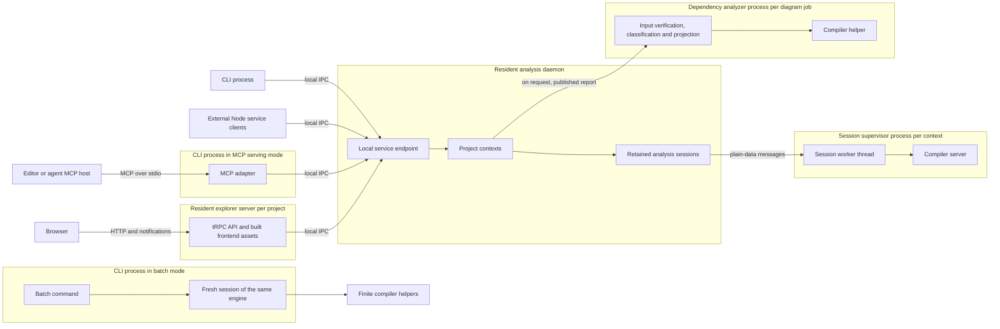

# Processes and clients

**Date:** 2026-09-11; revised 2026-09-17. **Status:** Batch checking, help and
version, the resident daemon with its service, IPC host and lightweight client,
`ramify check` in its complete and hook forms, `watch`, `materialize`,
`daemon status`/`stop`, `explore` and the resident explorer server
([Plan 6B](../plans/iteration-6b-resident-explorer-server/main-plan.md)) are
implemented, as are the explorer's on-demand behavioral dependency diagram and
the daemon-started dependency analyzer process
([Plan 6D](../plans/iteration-6d-behavioral-dependency-diagram/main-plan.md)).
The MCP adapter and unsaved-content overlays are not implemented;
their command spellings, contracts and wire details still require review.

In the resident design, the analysis daemon is the backend. A separate, resident
web process per project serves visualization. The CLI connects directly to the daemon for
ordinary analysis commands and can run the same engine in batch mode. Its MCP serving
mode runs an adapter for an editor or agent host, also connecting directly to
the daemon. This split keeps MCP and web allocations out of the daemon's
resident lifetime.

## Process topology

`ramify check` connects to the resident daemon, starting one when needed, and
the daemon answers from each context's retained analysis session. That session
runs in a worker thread inside a supervisor process with one compiler server.
`--batch` creates a fresh batch session whose finite compiler helpers exit during
the invocation. The diagram's MCP path is not implemented yet.

```mermaid
flowchart LR
  CLI[CLI process] -->|local IPC| API
  Native[External Node service clients] -->|local IPC| API
  Host[Editor or agent MCP host] -->|MCP over stdio| MCP
  subgraph McpProcess[CLI process in MCP serving mode]
    MCP[MCP adapter]
  end
  MCP -->|local IPC| API
  Browser[Browser] -->|HTTP and notifications| Web
  subgraph WebProcess[Resident explorer server per project]
    Web[tRPC API and built frontend assets]
  end
  Web -->|local IPC| API
  subgraph DaemonProcess[Resident analysis daemon]
    API[Local service endpoint] --> Contexts[Project contexts]
    Contexts --> Engine[Retained analysis sessions]
  end
  subgraph SessionProcess[Session supervisor process per context]
    Worker[Session worker thread] --> Server[Compiler server]
  end
  Engine -->|plain-data messages| Worker
  subgraph AnalyzerProcess[Dependency analyzer process per diagram job]
    Analyzer[Input verification, classification and projection] --> AnalyzerHelper[Compiler helper]
  end
  Contexts -->|on request, published report| Analyzer
  subgraph BatchProcess[CLI process in batch mode]
    Batch[Batch command] --> Fresh[Fresh session of the same engine]
  end
  Fresh --> Helpers[Finite compiler helpers]
```

| Process | Owns at runtime | Lifetime |
| --- | --- | --- |
| CLI | Argument parsing, local connection, command formatting and launch/control requests. Batch mode additionally owns its fresh engine session: in process for the Node entry, in a Node child for the [compiled client](optimization.md#native-client). MCP mode dispatches to the adapter below. | One command, except explicit watch or MCP serving modes. |
| External Node service client | An integrating program uses the lightweight `connectDaemon` client for analysis requests and subscriptions. | Its host owns process lifetime; each connection and operation follows the shared bounded lease and cleanup rules. |
| Daemon | Project/worktree contexts, coherent inputs, watchers, compiler sessions, checking, semantic queries, bounded history and local service delivery. | Retained for interactive use, with inactive-context eviction and idle shutdown. |
| Dependency analyzer | One `dependencyDiagram` job: acquiring the project again, verifying its inputs against the published report, classifying the report's recorded imports in a compiler helper and projecting the diagram. It builds no export catalog, interprets no imports and opens no retained session. | Started by the daemon only for a requested diagram, at most one daemon-wide. It exits with its helper when the job settles; cancellation, supersession, the 120-second deadline and an oversized response terminate both within the 5-second disposal limit. |
| MCP adapter | MCP definitions, input schemas, protocol sessions and translation to the daemon service. | The host-launched `ramify mcp` process serves its stdio connection, then releases resources and exits. |
| Web server | One project's daemon connection, context and subscription; HTTP/tRPC routing, built static assets and bounded connection/request state. May later mount MCP over HTTP. | Resident: started by a process manager or by `ramify explore`, and runs until a signal stops it. It has no idle exit. |

Direct service clients are external Node programs using `connectDaemon`, without
an MCP or web adapter. They use the same IPC validation, compatibility handshake,
recovery policy and bounded activity/revision leases as Ramify's clients. Hosts
dispose connections and subscriptions when finished; clean disconnect releases
references promptly and abandoned leases expire. This is a client integration
role, not another Ramify-owned process or module.

Direct clients, MCP and web adapters own no independent module discovery,
compiler program or permissions catalog. They query the existing daemon. An MCP
session or browser tab does not create another analysis context when it selects
the same compatible project setup. Different worktrees or registries retain the
isolation defined in [daemon and analysis](daemon.md).

The ordinary daemon process does not host the web listener. This is a deliberate
choice for memory reclamation, not a claim that HTTP requires another process.
It costs an additional runtime and serialization while visualization is active;
the [memory lifecycle](memory-lifecycle.md) explains the tradeoff.

## Shared service boundary

Batch delivery injects root's `runBatch` operation into `runCli`. It calls
`analyzeProject`, which creates and disposes a real analysis session. Resident
delivery injects a service connector: root's `src/interfaces/service.ts` defines
`RamifyService`, and daemon implements it with the two bindings described below.
Its validator rejects malformed requests, including a hook check's `scope`,
`since` and `deadlineMs`, as `invalid-request`.

Define one versioned logical analysis service for context lifecycle, input
synchronization, checks, inspection, explanations and change notifications.
Root owns its dispatch-facing vocabulary; domain facts and decisions retain
their existing analysis owners. The service has two implementations of its
call boundary:

- A local client used by CLI, external Node, MCP and web processes to reach the
  daemon through IPC.
- An in-process binding to the real context manager and analysis sessions,
  used by assembly and quick tests.

`daemon` owns both bindings. Its in-process service implementation validates and
dispatches requests to its context manager; the IPC host delegates to that same
implementation. Root exposes the dispatch-facing service interface to its
descendants, and `daemon` imports and implements it through ordinary declarations. Root
only assembles and injects the analysis driver and other dependencies; it does
not duplicate service routing. `contexts` keeps its own neutral vocabulary and
`AnalysisDriver` port and does not import the root-owned dispatch interface.
The lightweight `connectDaemon` entry remains separate from this host/direct
binding, so importing the client does not load context or compiler assembly.

The implemented discovery and launcher helpers use Unix domain sockets in a
private endpoint directory, grouped by package path, version and production
runtime bytes. Discovery requires a compiled daemon entry, so it rejects the
incomplete build. The codec frames UTF-8 JSON with a four-byte big-endian
length, and the daemon validates each decoded request before dispatch.
Their source and limits are described in the
[daemon owner](../../subs/daemon/README.md). The web/daemon split is fixed
independently of those details. Selecting tRPC for the browser does not require
loading the web router or Express into the daemon or ordinary CLI. The MCP SDK
and protocol adapter are likewise loaded only by an MCP-serving entry point.

Both call boundaries preserve context/generation/revision identity, freshness,
coverage, cancellation and explicit errors. Domain results are plain data;
compiler objects and browser graph objects stay within their implementations.
Bounds apply to request sizes, response sizes, concurrency and notifications.

The daemon validates its own service requests, including context and source
scope. Browser-side types and tRPC input validation do not replace this boundary,
because local clients can reach it directly. Transport adapters map errors while
preserving the distinction between a denied import, incomplete coverage, invalid
project state and unavailable execution.

## CLI commands

`check` in its three forms, `watch`, `materialize`, `explore`, `daemon status`,
`daemon stop`, `--help` and `--version` are implemented. `inspect`, `explain` and
`mcp` remain unavailable invocations; their rows below record the design.
The implemented invocation contract of `check`, covering root selection,
configuration discovery, warnings and exits, is [CLI invocation](cli-invocation.spec.md).

| Command | Required behavior |
| --- | --- |
| `ramify check` | Connect to a compatible daemon, starting one if necessary; synchronize every current input, obtain the whole report, print it and exit. This is the complete check; human output names the revision's path on its `Mode:` line and `--format json` writes the unchanged `ramify.analysis/1` report. |
| `ramify check --changed <path>... [--since <revision>] [--deadline <ms>] [--format json]` | The bounded hook check agent post-write hooks run, on the [fast incremental check](daemon.md#fast-incremental-checks) path. The CLI hashes each named file relative to the selected root and asks for the first revision covering those identities, waiting at most the deadline (default 2,000 ms). It prints every project finding, marking those new since `--since` or the previous revision; `--format json` writes one `ramify.check/1` document. It never runs a batch analysis. See [hook and complete checks](cli-invocation.spec.md#hook-and-complete-checks). |
| `ramify inspect ...`, `ramify explain ...` | Query the selected project's analysis with explicit freshness/revision semantics, print the result and exit. |
| `ramify watch` | Keep a bounded subscription open and render published updates. The daemon owns watching and analysis. |
| `ramify materialize [--view <api\|architect>]... [--from <path> \| --all] [--root <dir>]` | Synchronize one revision and publish every requested generated view from it in one transaction: the [API discovery view](materialized-api-view.spec.md) of one module or of all modules, and the project's [architect view](architect-view.spec.md), which waits for the daemon's dependency facts for that revision. Without `--view`, the API view alone. It never runs a batch analysis. |
| `ramify check --batch` | Load the engine only for this mode, in the CLI process or its Node child, create a fresh session, run the check and dispose it on exit. CI uses this independent mode. |
| `ramify explore` | Ensure a compatible daemon and open the selected project's context, then reuse that project's ready explorer server, whoever started it, or start one detached. Print `<origin>/analysis/latest`, open it in the platform browser and exit 0. If the browser cannot be opened, the URL is still printed, the command still exits 0 and the server keeps running. |
| `ramify mcp` | Lazily load the MCP adapter and serve the host's stdio connection in this process. Resolve a compatible daemon for analysis requests; no web server or per-call CLI subprocess is required. |
| `ramify daemon status` | Inspect an existing daemon without starting one or loading an analysis engine merely to report absence. |
| `ramify daemon stop` | Request shutdown of the selected daemon instance and report completion or failure. Selection must not silently target another compatible instance. |
| `ramify --help`, `ramify --version` | Run locally without connecting to or starting any server. |

The hook check exits as follows. Findings anywhere in the project fail it, not
only findings in the named files, so an edit to a provider reports the importer
it broke.

| Exit | `ramify check --changed` |
| --- | --- |
| 0 | A covering revision completed with no finding in the project. |
| 1 | A covering revision has findings, or it is invalid; the output marks which findings are new. |
| 2 | Not checked: `cold`, `deadline-exceeded`, `unobserved-input`, `superseded`, `configuration-changed`, `evicted-revision`, an incomplete or unavailable engine outcome, or an unavailable, stopped or incompatible daemon. |
| 130 | Interrupted. |

`examples/hooks/claude-code-post-write.mjs` is an example host adapter outside
every owner. It reads a Claude Code `PostToolUse` event on standard input, runs
`ramify check --changed <file> --format json` from the written file's directory,
prints new findings on standard error and exits 2 to return them to the agent. A
checked revision without new findings exits 0 silently, and a check that could
not finish prints a one-line notice naming the reason and exits 0 so editing
continues. It imports no toolkit source; its
[README](../../examples/hooks/README.md) shows the hook configuration.

A command releases its request, subscription and bounded revision references on
completion, interruption or connection loss. Its completion does not immediately
discard useful project state; the daemon's idle policy controls that retention.
The watch command holds a live subscription, not an unbounded result history.

Checking requests synchronized inputs explicitly. A watcher may be delayed, so
the last published revision alone cannot prove that a just-saved file was checked.
Inspection identifies whether it reads a published revision or synchronized
disk state, according to the [freshness contract](daemon.md#freshness-and-saves).

Commands render structured results consistently and map known denials and
unavailable checking to unsuccessful enforcement. Current `check --format json`
writes one versioned result to stdout, using the same report as human output.
The [invocation contract](cli-invocation.spec.md#output-and-exit) fixes exits:
0 for completed checking without definite errors, 1 for violations or invalid
input, 2 for unavailable/incomplete execution and 130 for interruption.
Warnings and analysis limits alone do not fail a completed check. Output schemas
for later commands remain in contract review.

Batch execution uses the same engine and rules as retained execution. It starts
neither server. After bounded daemon recovery fails, a terminating CLI command
over reproducible disk inputs may use the batch fallback specified in
[daemon recovery](daemon.md#transport-process-lifecycle-and-recovery).
Report fallback use; do not silently substitute current state for an
unavailable historical revision. The bounded hook check, `ramify check --changed`,
never uses this fallback: after exhausted recovery it answers not checked, as the
[CLI invocation contract](cli-invocation.spec.md#hook-and-complete-checks) states.
Only terminating CLI commands may run the fallback engine: the Node entry loads
it in process, and the compiled client runs it in a Node child. Either disposes
the session and exits. Watch, MCP, web and external service clients
never load a fallback engine: they recover the daemon within the lifecycle
policy or report unavailable execution. No batch fallback, in process or in a
child, is part of these long-lived client modes.

## MCP server

The root child `mcp [dispatch]`, physically under `subs/mcp/`, owns MCP tool and
resource definitions, input schemas, protocol sessions and response/error
mapping. Root assembly injects the same analysis-service client used by the CLI.
Handlers call that service directly; the daemon and engine remain the authorities
for project selection, synchronization, checks and query results.

The initial transport is stdio. An editor or agent's MCP host launches
`ramify mcp`; the CLI loads the MCP serving entry and remains in that process
for the connection. It does not spawn a second adapter process or start one
process per tool call. MCP framing reserves stdout for protocol messages;
diagnostics go to stderr, as required by the
[MCP transport specification](https://modelcontextprotocol.io/specification/2025-11-25/basic/transports#stdio).

Tool definitions describe the implemented capabilities and their coverage. A
handler preserves context/generation/revision tokens, explicit freshness and
structured results when mapping them into MCP responses. Invalid input,
unavailable execution and known denials remain distinguishable. MCP session
identity is separate from daemon context or revision identity; changing the
selected project never silently reuses another worktree's state.

The process releases its subscriptions and request references on stdio
closure or termination, then exits. Abnormal process loss must
also expire those daemon references. An open but idle MCP connection does not
indefinitely pin historical revisions or require a warm compiler context without
an active service lease. Subsequent requests can reopen an evicted context with
explicit generation/revision handling. Adapter exit does not stop the daemon.

MCP serving follows the shared [shutdown and recovery contract](#launch-compatibility-and-shutdown).
An idle-exited daemon can be started for the next request; an explicit stop must
not be undone by the still-open session. Recovery failure returns stopped or
unavailable execution. MCP never falls back to an in-process compiler session.

### Optional HTTP hosting

If Streamable HTTP support is later needed, the separate web process can mount
the same MCP module with an HTTP transport adapter and an injected daemon client.
It does not route MCP calls through tRPC procedures or create another analyzer.
MCP HTTP sessions then contribute to web-process activity alongside browser
clients, so closing the explorer alone does not stop a server still serving MCP.

HTTP sessions need bounded leases, termination and reconnect behavior. Closing
an individual HTTP connection is not itself MCP request cancellation; preserve
the [Streamable HTTP specification's cancellation semantics](https://modelcontextprotocol.io/specification/2025-11-25/basic/transports#streamable-http).
The shared host can reduce the
number of adapter runtimes when many clients use MCP, but this extension is not
required for the initial stdio delivery.

## Web server and tRPC

Use the Express/tRPC adapter pattern with a Ramify-only router for browser
requests. Procedures validate their inputs, call an injected analysis-service
client and map the result. Analysis and scheduling remain behind that client;
routers do not call other routers to implement domain behavior.

The browser receives a typed tRPC client. Its router type can be exposed as a
type-only contract; importing that type must not pull server implementations
into the browser runtime. tRPC typing does not replace runtime compatibility
checks between separately started clients and daemons.

Published-revision and status events travel through an explicit event adapter.
Reuse the WebSocket/direct-message-channel pattern: production transports
notifications over the network, while quick tests deliver the same mapped events
in-process. Exact socket mounting and event schemas remain review items. Clients
can recover by fetching current state instead of requiring an unbounded replay.

The explorer server serves one project. It owns a project binding: one daemon
connection, one context opened with the same setup as `ramify explore`, and one
subscription that holds that context against idle eviction. The binding reopens
the context after an eviction and reconnects, with bounded backoff, after a
connection failure; each reconnect may start the daemon. After an explicit stop
it only polls without starting, and resumes once another client starts the
daemon. Browsers send no context or generation identity. The router reads the
binding for each request, answers `unavailable` while it is not ready and treats a
revision from an earlier generation as superseded.

The routes are `/`, a home page listing the server's pages, the project root,
binding state and daemon PID; `/analysis/latest`, the explorer on the newest
published revision; `/modules/latest`, the module tree on the same revision;
`/health/ready`; and `/trpc`. Both pages accept `?module=<id>` to focus one module
on first load, and each links to the other in a new tab. Old `/explore/*` URLs redirect
to `/analysis/latest`. The listener binds `127.0.0.1`, on a fixed port when one is
given, and accepts only loopback `Host` and `Origin` values. The implemented page
polls server status every three seconds while visible instead of receiving
events. A newer published revision, including one from a new generation, marks
its refresh control stale; while the binding is not ready the page keeps its
model and shows a connection notice. Pushed events remain a later option.

The analysis page requests the behavioral dependency diagram through the
`dependencyView({ revision })` procedure once its project view is ready. The
server relays it to the daemon's `dependencyDiagram` operation and maps the
result to the browser model without loading compiler or analysis code. Per
binding it holds at most one in-flight daemon request and one settled model,
both for the newest requested revision; a daemon `busy` answer is remembered for
one second as `waiting`, and a newer publication, eviction or server close
releases both. The page polls a pending answer at most once per second while
visible, stops on a ready, superseded or unavailable answer, and shows a result
only for its displayed revision and input ID. Refresh loads the newest project
view first and then requests its diagram; display settings change no request.

Serve built frontend assets in normal use. Vite and frontend compilation belong
to a separate development entry point and lifetime. Reusing the web architecture
does not mean importing a host application's complete router, service registry,
agent runtime, test runner or development-server assembly.

## Launch, compatibility and shutdown

The small launcher/client path discovers existing processes and coordinates
concurrent starts. After startup it performs a readiness and compatibility
handshake before dispatching a command. A stale endpoint record does not prove
a process is alive; competing launches must not produce duplicate owners of one
context merely because their first checks raced.

Daemon and web entry points have independent lifecycles. Each explorer server
advertises one discovery record per build and project,
`explorer-<buildKey>-<projectKey>.json` in the daemon endpoint directory, where
the project key is the first 16 hex digits of the context ID. The server writes
the record once its binding is first ready, so a server that has never reached
the daemon, such as one started while the daemon is explicitly stopped, is not
discoverable until then. `ramify explore` reuses any ready record for its build
and project, including a process-manager server, and otherwise starts
`explorer-entry.js --root <root>` detached. A server started either way is
resident. The server and the shell must select the same endpoint directory
(`RAMIFY_ENDPOINT_DIR` or `XDG_RUNTIME_DIR`); otherwise they use different daemons.

The explorer server has no browser leases and no idle exit. `SIGINT` or `SIGTERM`
closes its listener, marks its record stopped with reason `explicit`, releases
the subscription, context and connection, and exits 0. Its subscription counts as
daemon activity, so the daemon does not idle-exit while a server runs, and the
context's retained analysis stays in memory for that time. A web restart does not
restart the daemon, and a closed browser does not stop unrelated CLI, editor or
watch sessions. The web process does not own the daemon's shutdown decision.
Daemon recovery must never kill another compatible instance still serving clients.
If optional MCP HTTP hosting is added, its sessions need their own bounded
lifecycle; a temporarily closed HTTP stream does not end a live MCP session.

If the daemon stops, clients receive disconnection/unavailability. Recovery
distinguishes three outcomes:

| Outcome | Client behavior |
| --- | --- |
| Automatic idle exit | Leave the daemon stopped until a real analysis request needs it. That request may coordinate a bounded startup. An open idle connection alone must not trigger restart. |
| Unexpected failure | Active work may attempt bounded reconnect/restart, preserving requested input and revision semantics; exhausted recovery reports unavailable execution. Only eligible terminating CLI commands may then use batch fallback. |
| Explicit user stop | Existing clients cancel automatic restart attempts and report stopped/unavailable execution. They remain paused until an explicit user resume/start action or a newly invoked explicit CLI command authorizes startup; background polls and ordinary calls from an existing MCP session do not override the stop. |

A valid active watch lease prevents ordinary idle shutdown. Idle MCP or direct
client connections without active work need not keep a compiler context or daemon
alive. Reopening an evicted context or restarting a daemon yields new generations;
old revision tokens do not silently become requests for current state.

Graceful shutdown reports its disposition. Discovery/control state must also
preserve explicit-stop information for the selected daemon lifecycle, so a
client that misses the notification cannot mistake the stop for a crash. A bare
socket closure is insufficient evidence of the reason. Exact record format,
instance identity and explicit-resume handling belong to contract review;
stale records must not suppress an independently authorized new start.

Exact lease durations, discovery records and retry limits remain review items.
They must implement these lifecycle guarantees without loading web dependencies
into the resident daemon.

## Modules and executable entry points

Process placement is separate from the [Ramify ownership tree](daemon.md#ramifys-ownership-tree).
Eleven owners are declared: the batch owners plus daemon and its contexts
child. Root owns assembly through
distinct source entry files; it is not one eagerly imported application barrel.
The installed `bin.ramify` is `dist/src/ramify`, a launcher that runs the
compiled client for the host when present and otherwise the Node entry.
`src/cli-entry.ts`, built as `dist/src/cli-entry.js`, is the Node entry; it
imports CLI handling and lazily imports `src/batch.ts` for batch analysis.
`src/compiled-entry.ts` is compiled with Bun into the host executable, which runs
batch checks through `dist/src/batch-entry.js` in a Node child. Both share
`src/cli-process.ts`; the [native client](optimization.md#native-client)
describes the build and its dependency boundary. Help/version load no compiler
or UI assembly. Package exports select separate analysis, inventory, model,
presentation, layout, CLI and client entries; the package root selects analysis.

The resident entry-point requirements remain:

- Ordinary CLI entry loads command handling, the lightweight local client and
  formatting. The daemon-owned client implementation must be importable without
  loading its host startup, watchers or compiler assembly.
- Daemon entry loads the local host and analysis assembly, with no web or UI
  implementation or MCP SDK/adapter in its transitive runtime dependencies.
- Batch dispatch loads the engine factory only when batch execution is selected.
- MCP serving dispatch loads the root child `mcp [dispatch]` with the lightweight
  daemon client only when that mode is selected. MCP registration and lifecycle
  stay outside the CLI command parser. MCP exposes its serving contract to root,
  which relays selected contracts to descendants through ordinary declarations;
  `service-api` can receive them for optional HTTP hosting without owning the
  MCP definitions.
- The dependency analyzer entry, `src/dependency-analyzer-entry.ts`, is the only
  entry that loads the analyzer and behavior classifier. The daemon starts it
  through root's injected process runner and loads neither.
- Later web entry assembles `service-api [dispatch]` with the lightweight daemon
  client. Browser application code belongs to `explorer [ui, browser, dispatch]`;
  reusable project views belong below `presentation [ui, browser]`.

The later owners are declared only when implemented. Root relays the selected
contracts through ordinary exposure declarations. UI props retain `ui`, service
contracts retain `dispatch`, and browser-consumed foreign values need explicit
browser promises. Exact owned interface wildcards cannot claim foreign types.
Separate entry files and package exports must preserve these legal exposure channels and
the runtime dependency boundaries; source modularity alone does not prove a
lightweight entry point.

## Acceptance evidence

These requirements complement DA01–DA18 in [daemon acceptance](daemon.md#acceptance-evidence).
They are implementation obligations, not current passing tests.

| ID | Required witness |
| --- | --- |
| PC01 | Help/version/status complete without launching servers; ordinary CLI startup does not load compiler/web/MCP dependencies, and daemon startup does not load web or MCP adapters. |
| PC02 | Concurrent commands coordinate startup, select the right worktree/setup and preserve compatible clients during version negotiation. |
| PC03 | Check/inspect/explain reach the daemon directly and agree with equivalent batch inputs; a delayed watcher cannot hide a just-saved change. |
| PC04 | Watch interruption and command exit release subscriptions/revision references; inactive project retention follows the daemon policy. |
| PC05 | Explore reuses the project's ready explorer server, including a process-manager server, or starts one detached, and prints and opens `/analysis/latest`; opener failure still exits 0 and leaves the server running. The server is resident per project: it holds one subscription, has no idle exit, recovers after context eviction, daemon failure and daemon restart at the same URL, stays paused after an explicit stop until another client starts the daemon, and exits 0 on a signal. Web exit/restart leaves warm daemon contexts intact. |
| PC06 | Idle exit, unexpected failure and explicit stop have distinct recovery outcomes, including a missed shutdown notification. Idle clients do not restart without work; a next request may restart after idle exit; valid watch leases prevent idle exit; existing clients respect explicit stop until explicitly resumed. Stale endpoints and incompatible versions remain bounded. |
| PC07 | tRPC, MCP and local clients return matching semantic results; actual wire tests preserve errors, revision identity and serialization without a second analyzer. |
| PC08 | The MCP host launches one stdio adapter for its connection; calls reuse daemon analysis without starting the web server. Connection/process loss releases leases and leaves other daemon clients intact. If HTTP hosting is added, MCP activity participates in web lifetime and preserves protocol cancellation. |
| PC09 | An external Node client uses the lightweight client entry with the same validation, compatibility and leases; disposal and abrupt host loss release eligible state without loading a compiler. |
| PC10 | After exhausted recovery, only an eligible terminating CLI command runs a visible batch fallback and disposes its session. Watch, MCP, web and external clients return unavailable without loading or spawning another analyzer. |

CLI and daemon lifecycle evidence is delivered with the local daemon. Web-specific
parts are delivered by the explorer plans; Plan 6B's
[completion report](../plans/iteration-6b-resident-explorer-server/iterations/iteration4-results.md)
records PC05's current evidence. MCP-specific
parts accompany the later MCP adapter and do not depend on visualization. The
[quick-testing architecture](quick-testing.spec.md) distinguishes the evidence each
test mode can establish.
