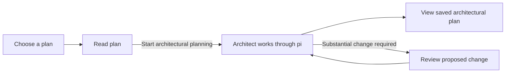
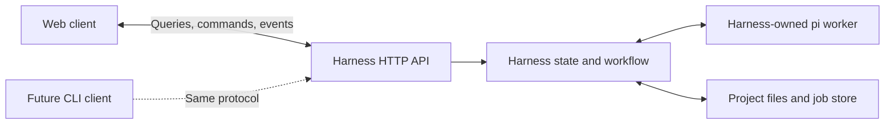

# Plan: Pi architectural planning MVP

> **Superseded** on 2026-09-19 by the [harness principles](../../../harness.principles.md) and the
> [harness architecture](../../../architecture.md). Kept for comparison; not current. See the
> [archive index](../../README.md) for what may be reused.

**Date:** 2026-09-19. **Status:** current implementation scope; package scaffold
exists, architectural planning workflow is not implemented.

This deliverable ends with a saved, viewable architectural plan. The later
[implementation runner](../pi-agent-implementation/main-plan.md) owns Start
implementation and execution progress. It is outside the current scope. The
[other harness proposal](../agent-harness-mvp/main-plan.md) remains separate.

The product is the separate `ramify-agent/` application consuming Ramify and pi.
Its package scaffold and own instructions already exist. These plans now live
under `ramify-agent/docs/`; `plans/<name>/plan.md` below means the user's target
project input, not this documentation layout.

## 1. Product boundary

The harness is a standalone, long-lived Node process serving one local project.
The web interface is its first client: it reads projections of harness state
and sends a small set of commands. A future CLI will use the same protocol.
Starting or closing a client does not own the harness or the planning lifecycle.

The launcher starts the harness independently and may open the web client as a
convenience. After startup, selecting a plan, running architectural planning
and viewing the result are available in the browser. Single-user local operation
and one active job per project are the starting assumptions; browsing other
plans remains available while a job runs.

Pi uses an existing subscription. The architect selects scopes and revises its
proposal automatically; it waits for a person only for a substantial change to
the requested plan. Retain architect tool/evidence records now. Engineering
execution, change attribution and implementation KPIs belong to the successor.
The architect phase measures its own sessions, usage and observed activity now.



The only launch action is **Start architectural planning**. This release has
no Implementation tab, Start implementation control or engineering execution
endpoint. Its completion gate does not depend on building the successor.

### Ramify dependency and measurement ownership

[Plan 2C: Module measurements](../../../../../docs/plans/iteration-2c-module-measurements/main-plan.md)
is a required generic data dependency. Build and verify its CLI and generated
measurement contracts before accepting iteration 2's integration. Iteration 1
can deliver plan browsing/protocol work while that producer is unfinished.

Ramify supplies byte buckets, file/owner facts and revisioned architectural
views. ramify-agent selects and combines that data, records its own activity,
and computes all agent KPIs. Ramify receives no session, role, scope, cause or
KPI concept. Its Plan 2C stays unchanged by this consumer plan.

The [measurement/KPI contract](../../../measurements-and-kpis.md) fixes acquisition,
revision matching, proxy units, baselines, phase boundaries and coverage. The
[producer review](../../../reviews/2026-09-19-plan2c-consumer-review.md) records
open generic contract issues; the adapter may not hide them behind guessed
ownership or zero-valued measurements.

## 2. Choose and read a plan

Discover immediate directories matching `plans/*/plan.md` beneath the configured
project root. The directory name is the stable plan ID; the first Markdown H1
is its displayed title, falling back to the directory name. No prescribed
Markdown template is required.

The plan list shows title, relative path and the latest phase/status. Provide
Refresh and an empty state explaining where a plan file belongs. Unreadable
files get a visible error rather than silently disappearing. Do not recursively
search arbitrary project directories or follow plan paths outside the root.

Selecting a plan opens a page with two views:

| View | Initial contents |
| --- | --- |
| Plan | Read-only rendered `plan.md`, its path and last-modified time |
| Architecture | Empty state and **Start architectural planning**, or the latest saved result |

The same plan remains selected when changing views or reloading the page. Local
links may open allowed project documents read-only; render Markdown without
executing embedded HTML or scripts. The application provides no create, edit,
rename or delete actions for plan files.

External editing remains possible. Refresh re-reads the file and updates its
content identity. A running job continues with its captured input; the page
shows when that differs from the current file and lets the user read the
captured version. Editing a file is not an instruction to change an active run.

## 3. Start architectural planning

**Start architectural planning** starts a background job and opens its progress
view. Display the current activity, elapsed time and a short activity feed.
Useful activities include Preparing project, Reading plan, Finding existing
behavior, Choosing scopes, and Saving architectural plan. Show these when the
corresponding activity is observed; they are not invented percentage estimates.

The job performs the following steps:

1. Capture the plan text, referenced documents actually used and their hashes.
   Prepare the planning workspace and record the source revision.
2. Acquire `ramify measure --format json` and Ramify's architect evidence at
   matching revisions. Retain the initial baseline. Load the module-architect skill,
   the authored architect prompt package, applicable project instructions and
   the captured plan in a fresh pi session.
3. Identify required outcomes and constraints, inspect existing behavior and
   foreign API availability, and decide which modules carry the work.
4. Select manageable scopes using Ramify measurements alongside behavioral
   evidence, identify reuse and cross-scope contracts, and propose work packages
   with dependencies and acceptance. Scope sums are calculated by the harness;
   the architect explains the choice without inventing measured numbers.
5. Submit a structured architectural plan through a custom pi tool. The harness
   validates it and requests automatic correction if necessary.
6. Atomically save the completed artifact. Only then show Architecture ready
   and open the saved result for inspection. The job is complete at this point.

The architect may read source where its discovery procedure needs it. It does
not modify application source, `module.ramify` or the user's `plan.md`. The harness
owns materialization and artifact writes. A model's closing message alone is
not a completed architectural plan.

Ordinary missing detail is addressed through discovery, explicit assumptions
and scheduled discovery/contract work. If the request cannot be met without a
substantial change, use the decision procedure in section 6. Invalid JSON or
missing output gets bounded automatic correction; exhausted recovery is shown
as a failed job, never as a completed architectural plan.

Authoring the [architect prompt package](architect-prompts.md) is an explicit
iteration 2 deliverable. It includes role/decomposition instructions, task
context assembly, tool descriptions, validation correction and continuation
after interruptions or substantial decisions. Reuse the architect skill's
semantic guidance and explicitly adapt its report to the artifact format.
Validate both assembled instructions and real decomposition quality;
successful JSON submission alone does not establish useful architecture.

### The saved architectural plan

Use a versioned JSON artifact as the shared input for visualization and
implementation:

```text
<project>/plans/some_plan/
  plan.md
  architecture/
    001.json
    002.json
  .harness/
    jobs/<job-id>/
      job.json
      input/plan.md
      measurements/<snapshot-id>.json
      events.jsonl
      sessions/
      checks/
```

Architecture files are immutable completed revisions. Job metadata identifies
the result of each planning job and the workspace/input provenance needed by
a future implementation run. There is no separately maintained architecture Markdown
file; the web view renders the JSON. Job records and sessions stay in the
hidden state directory. Architectural planning makes no application source
changes in either the original checkout or the planning worktree.

The [artifact contract](architecture-artifact.md) defines the shared contents:
requirements, module changes and relative work weight, reuse findings, seams,
selected scopes, work packages, dependency order, acceptance and assumptions.
Artifact inputs reference the measurement snapshot and policy/baseline IDs;
job records retain actual session/activity evidence separately.
This records an implementation direction without pretending to know every
future coding step. Executable brief preparation belongs to the successor.

A regenerated plan produces another revision and preserves the last successful
one if generation fails. Regeneration is available while the project is idle.
A second planning job cannot run concurrently for the same project. Each
completed revision remains independently readable.

## 4. Visualize the architectural plan

The Architecture view contains:

- A short summary of the intended change and preserved constraints.
- A dependency diagram of work packages, labeled with their primary modules
  and scope. Arrows mean **must complete before**, not source-code imports.
- An affected-module list, identifying existing and proposed modules, intended
  responsibilities and qualitative work weight: major, supporting or minor.
- A detail panel for the selected work package: goal, read/write scope, reuse,
  related contracts, prerequisites, acceptance and the reasoning/evidence.
- Scope-size breakdowns from Ramify data, normalized proposed scope sizes and
  coverage, separate from observed architect session/time/token/activity totals.
  Implementation cost/drift KPIs read Not started until implementation exists.
- Assumptions and discovery limits, with unresolved substantial decisions
  clearly separated from ordinary implementation work.

An exact-owner scope and a subtree scope must be distinguishable. Selecting a
package highlights its affected modules and dependencies. A simple ordered
list provides the same information when a diagram is inconvenient. The default
view shows the most recent completed revision; earlier revisions remain
readable with an explicit revision label.

This is a visual inspection surface. Graph editing, dragging tasks to reschedule,
editing contracts and inline plan editing are out of scope. The user can read
the result, select an earlier revision or regenerate it. Viewing the completed
architecture is the end of this deliverable.

## 5. Planning workspace, freshness and lifecycle

Create a dedicated Git worktree from the project's current commit for each
planning job. Capture the original `plan.md` even if it is uncommitted. Local
uncommitted source changes are not included; show the source commit and this
limitation before launch. Prepare dependencies from project configuration and
record the worktree and input identities for the successor. Non-Git projects
are deferred. Preserve the user's checkout and existing edits.

The harness owns materialization and artifact publication. The architect receives
read/search tools and structured submission, with applicable project instructions
and the module-architect skill. Application source and `module.ramify` stay
unchanged. Generated views and harness state stay outside source/change reports.

A changed plan, used reference document or source commit marks a saved result
stale. Keep it readable with that label and offer Regenerate architecture.
Regeneration captures new inputs and writes a new revision; a failed job never
replaces the last completed result. A running job continues on its captured
inputs, and the page distinguishes those from newer files.

Persist planning progress in the harness and let clients poll snapshots/new
events about once per second while active. Reloading or closing the browser does not stop
the job. Display connectivity separately from job state. Provide Stop and
Resume for deliberate cancellation and continuation. Reconcile worker/process
state before resuming or recovering after a harness restart; never start two
workers. An accidental interruption is recovered automatically when possible;
an explicit Stop is not retried automatically. A dropped HTTP connection is
not Stop: accepted jobs continue even when every client disconnects.

## 6. Automatic planning and substantial decisions

Ordinary discovery, scope selection, task splitting/combining and dependency
ordering happen automatically. Neither missing detail nor invalid structured
output asks a person to choose scopes or repair JSON.

Only a substantial change to required behavior or acceptance, a protected
compatibility promise, a core architecture outside the requested feature or an
explicit user constraint creates a decision wait. Assess cumulative changes
against the original request and approved amendments. Unavailable evidence or
another affected module alone is not a substantial change.

The browser decision card explains the discovery, why the original request
cannot be fulfilled, the concrete proposed change, affected requirements and
alternatives. Accept proposed change binds the response to that exact proposal;
Keep original requirements sends the architect back to alternatives. Persist
the decision beside the job without editing `plan.md`. A stale response cannot
approve a later proposal. Independent discovery may continue, but an unapproved
substantial proposal cannot become a completed architectural plan.

Retry transient execution once and allow one focused correction for an invalid
result. Repeated planning without new evidence or an advance toward a valid
artifact is bounded to three attempts for the same unresolved condition. An
unrecoverable login, setup or storage error or exhausted recovery produces a
failed job with diagnostics, not an invented plan-change decision.

## 7. Standalone harness and clients



The harness process owns project discovery, credentials, worktrees, pi sessions,
planning decisions, validation, persistence and recovery. It can run a complete
job with no browser connected. Pi SDK sessions run in child workers supervised
by this harness; their process boundaries and events are internal details.
There is no additional web application backend making workflow decisions.

| Boundary | Responsibility |
| --- | --- |
| Harness core | Domain commands, authoritative state transitions, projections, job ownership and recovery |
| Pi adapter | Explicit session context/tools, subscription access, native session persistence and worker lifecycle |
| HTTP adapter | Versioned queries/commands/events, request validation and mapping to the core |
| Shared protocol/client | Wire schemas and a small HTTP client usable from browser or Node |
| Web client | Render plans/architecture/progress and collect command inputs; own only selection, layout and connection state |

Use one TypeScript repository initially, with separate harness and browser build
entry points. The protocol/client imports neither pi nor Node filesystem APIs
nor browser UI code. The harness imports no web components; the web imports no
harness runtime. These boundaries do not require separately published packages.
The harness may serve compiled static web assets as a convenience, but its API
and jobs must work with those assets absent. A development web server is only
an asset host/proxy and never starts or advances a planning job on its own.

Start with HTTP JSON: read-only queries for the configured project, plans,
artifacts, jobs and events; commands for start/regenerate planning, stop, resume
and answer a substantial-change proposal. Progress uses snapshots and ordered,
cursor-based events. No WebSocket or message broker is required. The
[client protocol](client-protocol.md) owns exact operations and consistency rules.

The harness validates every command against current state and input identities.
An accepted command returns a durable receipt/job reference, not a claim that
planning has completed. Command IDs make transport retries idempotent; expected
versions reject stale controls and a project lock rejects concurrent work.
Clients render allowed actions from harness projections and can reconnect by
fetching current state. Domain decisions never depend on client event replay,
a browser timer, local storage or a live subscription to the event feed.

Reuse pi's SDK sessions, custom tools and events, pinning and testing its release
at implementation kickoff. See [pi SDK documentation](https://github.com/earendil-works/pi/blob/main/packages/coding-agent/docs/sdk.md).
Use existing subscription login on the harness machine, with readiness/errors
projected to clients and no API-billing fallback. Credentials remain in pi's
server-side credential management. See its [provider documentation](https://github.com/earendil-works/pi/blob/main/packages/coding-agent/README.md#providers--models).
A second account system or browser credential manager is outside scope.

Job metadata owns input identity; ordered durable events own transitions and
decisions. Projections derive from those records. Native pi sessions own
conversation content, referenced by activity records. Preserve observed source
reads and evidence references. The harness computes planning KPI projections
from those observations and retained Ramify snapshots; engineering cost/drift
KPIs belong to the later implementation runner. Both use the same consumer
measurement contract and HTTP read projection.

Use Ramify's [architect view](../../../../../docs/architecture/architect-view.spec.md),
[API views](../../../../../docs/architecture/materialized-api-view.spec.md) and the
[module-architect skill](../../../../../.claude/skills/module-architect/SKILL.md).
No new analyzer or agent-specific Ramify output is introduced.

## 8. Iterations and completion

| Iteration | User-visible result |
| --- | --- |
| [1](iterations/iteration1.md) | Run the standalone harness and use its web client to choose/read a plan |
| [2](iterations/iteration2.md) | Launch pi planning, handle substantial decisions and save a valid artifact |
| [3](iterations/iteration3.md) | Inspect architecture, revisions and freshness; complete the live planning trial |

The [manifest](iterations/manifest.json), [artifact contract](architecture-artifact.md),
[client protocol](client-protocol.md), [prompt package](architect-prompts.md) and
[acceptance cases](acceptance.md) cover
only this deliverable. Its final gate is a real browser/pi/subscription journey
from selecting a plan to viewing the
saved architecture, actual planning activity KPIs and scope-size projections
using a built Plan 2C producer. Original plan and application source remain unchanged.
A separate protocol test must complete planning without a browser and attach
a client later to inspect the same job. No feature implementation or
feature-level implementation checks are required.

Hand off the artifact schema, produced fixture artifact, input/worktree identity,
versioned architect prompts and trial evidence, pi adapter, command/query
protocol, job lifecycle, decision UI and architecture
client to the
[implementation runner](../pi-agent-implementation/main-plan.md). The successor
can consume these without duplicating the architecture schema or plan reader.

Out of scope: Start implementation, the Implementation tab, engineering workers,
task execution/scheduling, implementation progress/verification, engineering
scope metrics, plan/architecture editing, parallel jobs, merge/publication,
remote hosting and a user-facing CLI client. The `ramify-agent/` project owns
implementation and its own checks;
no agent runtime is added to the Ramify toolkit.
