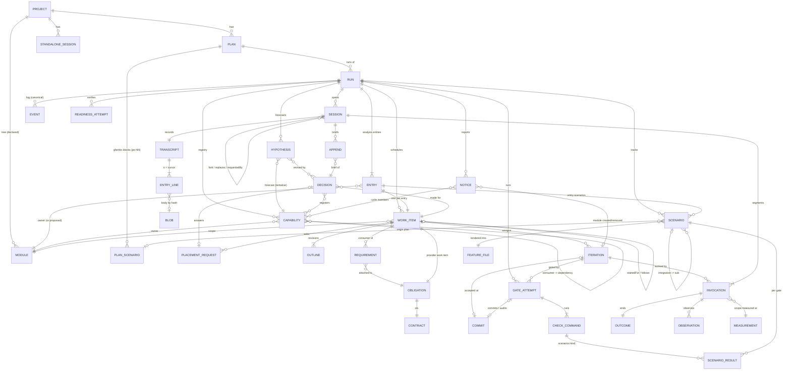

# Harness information model: inventory for a plan execution dashboard

Scope: what `subs/harness/` (with `ledger`, `audit`, `scenarios`, `evidence`,
`agent`, `agent/pi`) records on disk and publishes through `/api/v1`, as a
dashboard designer needs it. Written 2026-09-23 against ramify-agent at
`7d6af7f` (branch `ramify-agent`).

Conventions:

- Paths without a prefix are relative to `ramify-agent/subs/harness/`.
- The protocol is `src/interfaces/protocol/*.ts` (called "P/" below, e.g.
  `P/runs.ts:222`).
- "Run dir" is `plans/<plan-id>/.harness/jobs/<run-id>/` in the target project.
- The real completed example run is
  `/tmp/ramify-agent-loop-trial-XJHJla/collection-review/plans/status-badge-tone/.harness/jobs/20260923T164537Z-dbf0c2` (read through a copy)
  ("the example run"), served at `http://127.0.0.1:4391`. Captured answers are
  in [api-examples/](api-examples/).

Three facts shape everything below:

1. **The run log is the only authority.** `events.jsonl` holds every state
   transition, and each line also carries the full bodies of the records that
   transition commits. The record files are materialized copies
   (`subs/ledger/README.md:19-53`, `src/run/log.ts:19-28`).
2. **Every answer is a projection** computed from the log and the record
   files. Nothing in an answer is stored, and the internal event union and
   record schemas are private (`P/runs.ts:6-19`).
3. **Status is never a stored field.** Work-item, capability, scenario,
   session and run states are all reduced from events
   (`src/projections/work.ts:57-59`, `subs/scenarios/src/states.ts:61-68`,
   `src/run/snapshot.ts:92-238`).

---

## 1. Entity catalogue

Each entry lists: **ID**, **key fields**, **lifecycle**, **timestamps**,
**stored at**, **exposed by**.

### 1.1 Project

- **ID**: none. One harness serves one project; the directory name is shown.
- **Fields**: `name`, `root` (absolute), `planPattern`.
- **Stored**: nothing. The harness derives it from its configuration.
- **Exposed**: `GET /api/v1/project` (`P/queries.ts:11`).
- **Module tree**: `GET /api/v1/project/modules` (`P/evidence.ts:89`) returns
  `{status: available, revision, input, modules[{module, dir, parent}]}`, or
  `unavailable` with a message. The example project has 15 modules at
  revision `rev/1:…:12`.

### 1.2 Plan and plan entry

- **ID**: `PlanId` is the directory name under `plans/` and is never hidden
  (`P/ids.ts:3-4`), e.g. `status-badge-tone`.
- **Plan entry** (list row): the `readable` form has `{id, title, path}`; the
  `unreadable` form has `{id, path, message}` (`P/queries.ts:25-43`). The
  title is the file's first heading.
- **Plan document**: `{id, title, path, markdown}` (`P/queries.ts:52`).
- **Lifecycle**: none. The harness reads a plan and never edits it
  (`docs/glossary.md:18-25`).
- **Timestamps**: none, not even the file's modification time.
- **Stored**: `plans/<id>/plan.md`. A run captures a copy in
  `input/plan.md` and records its hash in `job.json.manifest.planHash`.
- **Exposed**: `GET /plans` and `GET /plans/:planId`. The captured copy is
  also exposed, as `analysis.plan.{markdown, hash}` (`P/runs.ts:449-450`).
- **Plan scenarios** (`ps-01`, `ps-02`, …) are extracted from the plan's
  `gherkin` blocks when the run starts. They are stored in
  `job.json.planScenarios.{scenarios[], limitations[]}`, each with
  `{id, name, outline, lines, anchors, source}`. A limitation is a block that
  does not parse (`subs/scenarios/README.md:23-35`). **Not exposed as a
  list**: a tracked scenario names only its `planScenario` id and its lines.

### 1.3 Run (job)

- **ID**: `RunId` equals `JobId`, `YYYYMMDDTHHMMSSZ-xxxxxx`
  (`P/ids.ts:8`, `P/runs.ts:22`); e.g. `20260923T164537Z-dbf0c2`.
- **Version**: the sequence of the run's last event (`P/jobs.ts:14`).
- **State**: `running | completed | failed | stopped | interrupted`
  (`P/jobs.ts:47`).
- **Phase**: `analysis → [awaiting-review] → readiness → working →
  final-verification → ended` (`P/runs.ts:137`, derived at
  `src/run/snapshot.ts:92-238`).
- **Snapshot fields** (`P/runs.ts:222-264`):
  - `agent`: `pi` or `scripted`.
  - `stopRequested`.
  - `startedAt`, `updatedAt`, `endedAt`.
  - `failure`: `{reason, message, evidence[]}`.
  - `current`: `{workItem, iteration, request, role, invocation, waitingFor}`.
  - `waits[]`: `{workItem, requirements[], reason}`.
  - `counts`: `workItems`, `completedWorkItems`, `openRequirements`,
    `invocations`, `readinessAttempts`, `gateAttempts`,
    `scenarios{pending, bound, declared, implemented}`, `degradedStarts`.
  - `writer`: `{held, unsettled}`.
  - `review`.
  - `notices[]`.
- **Failure reasons** (`P/runs.ts:94-130`):
  - `analysis-invalid`, `readiness-failed`, `project-config-invalid`,
    `acceptance-harness-missing`
  - `agent-failed`, `invalid-submission`, `inputs-changed`
  - `dependency-cycle`, `unresolvable-requirement`
  - `repair-exhausted`, `acceptance-incomplete`, `recovery-exhausted`
  - `writer-unsettled`, `limit-exceeded`, `internal`
- **Stored**:
  - `job.json` (`ramify-agent.job/3`, written once, `src/run/records.ts:213`).
    It holds:
    - `manifest`: `planHash`; `source.{commit, dirty}`;
      `versions.{architectPrompt, procedure, skill, ramify}`; `architectView`
      with its revision, input and coverage limits.
    - `prompts`: package and hash per role.
    - `policy`: `run-policy/2`, with every limit (repair rounds 3,
      infrastructure retries 2, max iterations per work item 12, max work
      items 64, max invocations 400, run bound 8 h, …), the context budget of
      each role, and the commands.
    - `projectConfig` (`ramify-agent.project/1`), `baseline.measurement`,
      `planScenarios` and `reviewStop`.
  - In the example run, `job.json` is 10,244 B.
- **Exposed**:
  - `GET /plans/:planId/runs` returns runs newest first (at most 200), with
    `total`, the configured `agent`, and `unserved[]` directories that cannot
    be read or have an unsupported version (`P/runs.ts:268-284`).
  - `GET …/runs/:runId` returns the snapshot (`P/runs.ts:288`).
  - **`job.json`'s policy, manifest, prompts and project config are not
    exposed.** See §5.
- **Example**: `state: completed`, `phase: ended`, `version: 39`,
  `startedAt 16:45:37.594Z`, `endedAt 16:57:34.945Z` (11 min 57 s), 4
  invocations, 4 gate attempts, 2 of 2 scenarios implemented.

### 1.4 Capability (entry and lower-level, registered and forecast)

The glossary's vocabulary (`docs/glossary.md:27-62`):

- A **top-level capability** is called an **entry capability** in the
  records.
- A **capability extension** is always a new capability. The retired value
  `extend` is refused with an explanation (`src/analysis/records.ts:25-41`).

Capabilities come in three sources:

| Source | Record | ID | Stored | Meaning |
|---|---|---|---|---|
| Entry assignment | `EntryAssignments.entries[]` `{capability, description, owner, proposed?, planRefs, citations}` | kebab slug | `analysis/entries.json` (`ramify-agent.entry-assignments/1`, `src/run/records.ts:280`) | The plan requires it. One work item per entry, always. |
| Registry entry | `RegistryEntry` `{capability, revision, behavior, owner, proposed?, origin: entry\|global-decision\|local-decision, decision, consumers[{capability, workItem}], previousOwner?}` | slug + revision | `registry/<cap>/<rev>.json` (`src/analysis/records.ts:78-91`) | Confirmed ("registered"). Consumer links are the dependency edges. |
| Hypothesis forecast | `Hypothesis.capability` | slug | `hypotheses/<id>/<rev>.json` | Tentative. **No work derives from it.** |

- **Progress state**: `todo | working | completed` (`P/runs.ts:663-686`).
  - `completed` requires current verification evidence.
  - A fake-backed pass counts as `working`, and so does a provider wait,
    whose reason is given.
  - A superseded hypothesis leaves the list rather than becoming
    `completed`.
  - A reopening returns a capability to `working` (`README.md` projections
    §, `src/projections/progress.ts`).
- **Answer fields**: `{capability, owner, entry, tentative, state, reason,
  dependsOn[{capability, tentative}], workItems[], evidence[] (gate ids),
  scenarios{implemented, total}|null}`.
- **"Required"**: `entry: true` means the plan requires the capability; a
  consumer requirement's `forCapability` is required by that consumer. There
  is no other "required" flag.
- **Exposed**:
  - `GET …/capabilities` (at most 500; registered capabilities first, then
    forecast ones).
  - `GET …/module-capabilities` compares the initial associations with the
    capabilities implemented where they are owned. Its placement is
    `declared | proposed | unplaced`, its roles are
    `entry-owner | suggested-owner | involved`, and its coverage is
    `complete | partial | unavailable` (`P/runs.ts:704-848`).
- **Example**:
  - `render-status-badge-tone` (entry): `completed`, evidence `ga-0003`,
    scenarios 2/2.
  - `status-badge-wording` (registered by local reuse decision
    `ld-wi-001-01`): `todo`, "No work started (reuse by ld-wi-001-01)".
  - `status-badge-tone-rendering` (a forecast only): `todo`, `tentative`.
  - **The run completed while two capabilities still read `todo`.** A "left
    to do" count must exclude tentative forecasts and reuse registrations.
    See §4 and §5.

### 1.5 Hypothesis

- **ID**: a kebab slug the architect proposes, unique in the run, plus a
  revision.
- **Fields** (`src/analysis/records.ts:43-75`):
  - `standing`: `tentative | confirmed | superseded`.
  - The forecast: `capability`, `change: reuse|create|create-by-extraction`,
    `changesExistingSymbols`, `suggestedOwner`, `anticipatedConsumers[]`,
    `involvedModules[]`, `dependsOn[]` (all tentative).
  - Its support: `confidence` (low, medium or high), `rationale`,
    `assumptions`, `uncertainties`, `citations`.
  - `cause`: `{initial: inv}` or `{decision, reason}`.
  - `supersededBy?`, `confirmedBy?`.
- **Lifecycle**: revision 1 comes from the initial analysis and is never
  rewritten. Each later revision comes from one global decision.
- **Timestamps**: only the event that committed it (`analysis-accepted` or
  `decision-accepted`).
- **Exposed**: `GET …/analysis` gives `hypotheses[]` at the current revision,
  with `initial{change, suggestedOwner, rationale}`, `decisions[]`,
  `supersededBy` and `confirmedBy` (`P/runs.ts:350-368`). Intermediate
  revisions are not exposed, and neither are `assumptions`, `uncertainties`,
  `citations` or `involvedModules`.
- **Delivery**: `hypotheses-delivered {workItem, refs[{id, revision, hash}]}`
  records which revisions a work item was given (`src/run/log.ts:229`). A work
  item's outline shows them as `hypothesesSeen`.

### 1.6 Decision (placement, scope, breaking, plan-revision, contract)

Only placement has its own record. The other kinds are projected from the
record where the choice was made (`P/runs.ts:471-541`).

| Kind | ID | Source record | Key fields |
|---|---|---|---|
| `placement` | `gd-NNN` (global, from request `pr-NNN`) or `ld-wi-NNN-NN` (local) (`src/architecture/records.ts:24-31`) | `decisions/<id>.json` `ramify-agent.placement-decision/1` | `authority`, `request`, `question`, `outcome: reuse\|create\|extract\|external`, `capability`, `changesExistingSymbols`, `owner`, `proposed{parent, directory, purpose, tags}`, `rationale`, `revises`, `hypotheses[]`, `registry[]` |
| `scope` | the iteration ID | `IterationAssignment.scope` | `modules`, `includedChildren`, `broad`, `rationale`, `extra[]`, `authorizations[]` |
| `breaking` | work item + outline revision | `WorkItemOutline.breakingChanges[]` | `guarantee`, `reason`, `affectedConsumers` |
| `plan-revision` | work item + outline revision | `WorkItemOutline` | `decomposition: single-iteration\|staged`, `rationale`, `reason`, `stages` |
| `contract` | `ct-NNN` + revision | `ContractRecord` | `capability`, `provider`, `authority{kind, owner, rationale}`, `mode: fake-backed\|access-only`, `establishedBy{iteration, gate}` |

- **Common fields**: `at`, `sequence` and `workItem`.
- **Exposed**: `GET …/decisions` returns every decision in commit order, at
  most 500.
- **Not exposed from the placement record**: `constraints`,
  `uncertainties`, `evidence{view, citations, gaps}`, `brief`, and
  `revises.affected[]` (only `revises` as an ID is exposed).
- **Example**: 4 decisions: 2 `plan-revision`, 1 local `placement` (reuse)
  and 1 `scope`.

### 1.7 Placement request (the global-architect question)

- **ID**: `pr-NNN` (`src/architecture/records.ts:24`).
- **Fields**: `workItem`, `requester`, `forCapability`, `question`,
  `requiredBehavior`, `findings[]`, `candidates[]`, `unresolved[]`,
  `hypotheses[{ref, stance: supports|contradicts|departs, evidence}]` and
  `localDecisions[]` (`src/architecture/records.ts:59-80`).
- **Lifecycle** (events):
  1. `placement-requested`
  2. `view-refreshed` (with `unavailable` when the view cannot be
     refreshed)
  3. The fork's session: `session-opened` with `fork`
  4. Either `fork-returned-partial` (which consumes one retry) or
     `decision-accepted`
  5. `brief-appended`
  6. `decision-delivered`

  Requests run one at a time.
- **Stored**: `requests/<id>.json`.
- **Exposed**: a work item's detail lists its `requests[]`, with `decision`
  (`P/runs.ts:651-659`). There is no project- or run-level list of requests.

### 1.8 Module (declared, proposed, created, removed)

- **ID**: the declared-name path from the root, e.g.
  `collection-review/workspace/shared-ui` (`P/evidence.ts:17`). A module
  also has a `dir` relative to the project.
- **States a dashboard can show**:
  - **Declared (placed)**: the module is in the current tree
    (`/project/modules`).
  - **Proposed**: a `moduleProposal{parent, directory, purpose, tags}` on an
    entry (`EntryView.proposed`) or on a placement decision
    (`decision.proposed`). The comparison shows `placement: proposed` while
    the module is absent from the tree.
  - **Created or removed**: a notice read from the accepted commit, never
    from an agent's words (`src/work/iterations.ts:146-153`).
    - Notice fields: `{kind: module-created|module-removed, at, sequence,
      summary, module, declaration, commit, iteration, decision}`.
    - The notice is carried on `iteration-closed.notices` and projected into
      the snapshot's `notices[]` (`P/runs.ts:180-214`).
  - **Unplaced**: anything else, including every module while the tree is
    unavailable.
- **Timestamps**: a notice's `at`; the tree answer's `revision` and `input`.
- **Exposed**: `/project/modules`, `/module-capabilities`, snapshot
  `notices`, `EntryView.proposed` and `decision.proposed`.

### 1.9 Work item

- **ID**: `wi-NNN`, the count of committed work items
  (`src/work/records.ts:26`).
- **Record** `ramify-agent.work-item/1` (`src/work/records.ts:28-50`):
  - `module`.
  - `origin`: one of `{entry: slug}`, `{obligation: ref}`,
    `{verification: ref}` or `{integration: sc-NNN}`.
  - `follows?`: the completed item this one follows up.
  - `goal`, `requirementRefs[]`, `acceptanceRefs[]` (plan anchors and
    lines).
  - `startedFor`: the work item whose yield started this one.
- **Outline** `ramify-agent.work-item-outline/1`, one file per revision
  (`src/work/records.ts:74-99`):
  - `invocation`, `changes`, `decomposition{kind, rationale}`.
  - `reuse[]`, `breakingChanges[]`.
  - `stages[{title, approach: non-breaking|breaking, dependsOn, note}]`.
  - `hypothesesSeen[]`, `revisionReason`.
- **State**: `todo | working | yielded | completed`
  (`P/runs.ts:552`; derived at `src/projections/work.ts:57-59`):
  - `completed` once a work-item gate passes;
  - `yielded` while it waits for requirements;
  - `working` once it has started;
  - `todo` otherwise.
- **Lifecycle events**: `work-item-started` → (`hypotheses-delivered`,
  `outline-revised`, `iteration-assigned`/`iteration-closed`,
  `placement-requested`, `work-item-yielded` / `work-item-resumed`) →
  `work-item-completed`.
- **Timestamps**: only via events.
- **Stored**: `work-items/<wi>/item.json`, `outline/<rev>.json`, and
  `iterations/<nn>/{assignment,result}.json`.
- **Exposed**:
  - `GET …/work-items` (at most 200): summary with `capability`, `origin`,
    `state`, `follows`, `startedFor`, `currentIteration`, `waitingFor[]`,
    `completedBy` and `counts{outlineRevisions, iterations, gateAttempts,
    invocations}` (`P/runs.ts:555-572`).
  - `GET …/work-items/:wi`: outlines, iterations, gates, requirements and
    requests (`P/runs.ts:606-660`).
  - The work item's `requirementRefs` and `acceptanceRefs` are **not
    exposed**.

### 1.10 Iteration

- **ID**: `wi-NNN.iNN` (`src/work/iterations.ts:23`).
- **Kinds**: `ordinary | breaking | contract | verification | repair |
  integration` (`src/work/iterations.ts:89`).
- **Assignment** `ramify-agent.iteration-assignment/1`, immutable
  (`src/work/iterations.ts:92-138`):
  - `outline` ref, `stage`, `kind`, `goal`, `approach`.
  - `scope`, a WriteScope: `revision`; `base`; `extra[{path,
    purpose: contract|conformance|fake|exposure-declaration|consumer}]`;
    `read[]`; `bootstrap[]`; `resolved{roots, files, view}`.
  - `requirementRefs`, `externalCapabilities[]`, `completionEvidence`,
    `evidenceObligations[]`.
  - `gate{checkpoint, tests policy}`: derived by the harness, never by an
    agent.
  - `guarded[{path, hash}]`, `authorizations[]`.
  - `requestedBy?`, `revisesContract?`, `scenarios?` (informative).
- **Result** `ramify-agent.iteration-result/1`
  (`src/work/iterations.ts:156-170`):
  - `outcome`: `accepted | partial | unsuitable | exhausted | superseded`.
  - `invocations[]`, `gate`, `commit`.
  - `findings[]`, `changedAssumptions[]`, `recommendation?`, `artifacts[]`.
- **Lifecycle**: `iteration-assigned` (or `contract-requested` for a
  contract iteration) → engineer invocation(s) → gate attempt(s), possibly
  repaired → `iteration-closed`.
- **Exposed**: `work-items/:wi.iterations[]`:
  - `{id, kind, stage, goal, approach, scope, checkpoint,
    completionEvidence, authorizations}`;
  - `result`, **without `invocations[]` and `artifacts[]`**;
  - `gates[]` (summary);
  - `invocations[{id, role, ended, outsideScope}]`.

  `resolved`, `guarded`, `evidenceObligations`, `externalCapabilities` and
  `requestedBy` are not exposed.
- **Example**: `wi-001.i01`, `ordinary`, accepted by `ga-0002` at commit
  `e99fee07`, with one finding ("step definitions use `.ts`, so
  React.createElement").

### 1.11 Session (every role)

- **ID**: in a run, `ses-NNNN` in opening order (`P/sessions.ts:50`). A
  standalone session keeps its job-style ID (`P/sessions.ts:52`).
- **Roles** (`P/runs.ts:30-36`):

| Role | What it is | Session pattern | Reach (`P/sessions.ts:81-86`) |
|---|---|---|---|
| `initial-architect` | The one analysis invocation. Its session **becomes the long-lived global architect parent context**, which "is no role": briefs are appended to it without inference (`P/runs.ts:25-29`). | `ses-0001`. It stays suspended for the whole run and is finished `run-ended`. | `{kind: run}` |
| `global-fork` | One fork of the parent per placement request. It decides where a capability belongs. | Opened with `fork{from: point, reason: placement-request, generation, briefs}`. Compaction is forbidden. | `{kind: request, request, workItem, capability}` |
| `local-architect` | One continuing session per work item. | Continued with `continues.reason: placement-answered\|iteration-closed\|completion-refused\|repair`. Compaction is allowed. | `{kind: work-item, …}` |
| `engineer` | Works one iteration. It is the only kind of writer. | Usually fresh per iteration. `replaces{reason: reconstructed}` when a lost session is rebuilt. | `{kind: work-item, …}` |
| `contract-engineer` | A contract sub-session: an engineer with the contract skill. | Opened with `requestedBy{invocation, reason: contract-needed}`. | `{kind: work-item, …}` |
| (standalone) engineer | The `session` CLI command: one engineer on one module from a person's prompt, outside any run. | Its own single invocation. | `{kind: module, module}` |

- **States**: `live | suspended | finished` (in the log), plus the
  read-side `interrupted` (`P/sessions.ts:61-67`).
  - Finish reasons: `work-closed | run-ended | lost | replaced |
    interrupted | not-kept` (`P/sessions.ts:71`).
  - Transitions: Plan 9 table (`docs/plans/09-session-model-and-transcripts/main-plan.md:117-124`).
- **Fields**: `executor` (`pi` or `scripted`), `model` (e.g.
  `openai-codex/gpt-5.6-sol:high`), `work{workItem?, iteration?, request?}`,
  `opened`, `changed`, `awaiting`, `point`, `invocations[]`, `appends[]`,
  `suspended[{from, until}]`.
- **Lineage** (both directions): `fork`, `replaces`, `replacedBy`,
  `requestedBy`, `requested[]`, `forks[]` (`P/sessions.ts:196-209`).
- **Timestamps**: `opened` and `changed` are `{sequence, at}`; so is every
  invocation's `started` and `ended`, and every suspension interval.
- **Stored**:
  - `session-opened`, `invocation-*` and `session-finished` events.
  - `transcripts/<ses>.jsonl`.
  - A standalone session has
    `plans/.harness/sessions/<id>/{session.json, outcome.json, …}`
    (`src/sessions/records.ts:26-40`).
- **Exposed**:
  - `GET /sessions?offset=` lists every session of the project, 200 per
    page (`P/sessions.ts:130-137`).
  - `GET …/runs/:runId/sessions` returns the run's sessions at one run
    version (`P/sessions.ts:239-244`).
  - `GET …/sessions/updates?version=&cursors=` is the poll
    (`P/sessions.ts:292-298`).
  - `GET /sessions/standalone/:id` (`P/sessions.ts:325-337`).
- **Example**: `ses-0001` (initial architect, 1 invocation),
  `ses-0002` (local architect, 2 invocations, suspended twice), `ses-0003`
  (engineer, 1 invocation).

### 1.12 Invocation

- **ID**: `inv-NNNN`, the count of committed invocations
  (`src/run/records.ts:29-44`).
- **Invocation record** `ramify-agent.invocation/1`
  (`src/run/records.ts:501-529`):
  - `role`, `work`, `attempt` (the count of this role's invocations for
    this work).
  - `session{requested, actual, ref, from?, degradedReason?}`.
  - `prompt{package, hash, inputsHash}`.
  - `scope{write revision, measurement ref, size (S_s)}`.
  - `writer`, `supersedes?`, `base` (commit), `startedAt`.
- **Outcome record** `ramify-agent.invocation-outcome/1`
  (`src/run/records.ts:531-580`):
  - `ended`: `submitted | ended | failed | stopped |
    context-budget-reached | invalid-submission`.
  - `rejectedSubmissions`.
  - `interruption?`: `idle-timeout | absolute-timeout | provider-error |
    session-lost | adapter-fault`.
  - `disposition`: `applied | superseded | incomplete`.
  - `submission{hash}`, `budget{threshold, observed, reportDelivered}`.
  - `settled{confirmed, at, groupsKilled, lateWrites}`.
  - `outsideScope[]`, `usage`, `elapsedMs`, `error?`.
- **Other files**:
  - `submission.json`: the accepted submission, verbatim.
  - `observations.jsonl`: the observation log (§1.20).
  - `lines.json`: line events for writers.
  - `session/`: pi's own jsonl.
  - `shell/NNN.log`, `hooks/NNN.json`, `scenarios/NNN/`.
- **Exposed**:
  - As `SessionInvocation` (`P/sessions.ts:154-178`): `start`, `started`,
    `ended`, `outcome`, `kept`, `continues`, `degraded`, `point` and
    `evaluation`.
  - As `InvocationEvaluation` (`P/runs.ts:1065-1093`): `guarding`,
    `outsideScope`, `hookChecks`, `excursions`, `gaps`, `lines` and
    `usage`.
  - The snapshot's `current.invocation`.
  - **Not exposed**: `attempt`, prompt package and hash, scope size, `base`,
    `disposition`, `rejectedSubmissions`, `budget`, `elapsedMs` (derivable
    from `started`/`ended`), `settled`, `interruption` (in the transcript
    only), and the submission body (visible only as the tool-call input in
    the transcript).
- **Example**: `inv-0003` (engineer) took `elapsedMs 180849`, used
  input 29,472, cache-read 315,776 and output 4,124 tokens, and
  changed 3 paths (+91/−7, coverage `partial` because of `unguarded-shell`).

### 1.13 Submission kinds (the outcome an agent chose)

Every agent finishes only through its submission tool
(`subs/agent/README.md:84-90`).

| Role | Kinds | Where |
|---|---|---|
| initial-architect | one analysis submission | `src/analysis/submission.ts:66` |
| local-architect | `assign`, `request-placement`, `request-completion`, `yield-for-providers`, `unresolved` | `src/work/submission.ts:119` |
| engineer | `completion-proposed`, `partial`, `unsuitable` (reason `scope\|break-discovered\|provider-cannot-conform`), `contract-needed` | `src/work/engineer.ts:102` |
| contract-engineer | `established`, `incomplete` | `src/contracts/submission.ts:72` |
| global-fork | `decision`, `partial` | `src/architecture/submission.ts:147` |

- **Exposed**: only indirectly, through the records they produce and as
  transcript tool-call inputs. The chosen kind is not a field of any
  answer.

### 1.14 Transcript, entries, blobs, points, appends

- **Transcript**: one per session, `transcripts/<ses>.jsonl`. It is raw
  output and never a record (`P/transcripts.ts:5-25`).
- **Entry**: `{n, at, type, invocation|null, …}`. `n` starts at 1, rises by
  one per entry and is the cursor.
- **Entry types** (`P/transcripts.ts:305-307`):
  - `started` (`:214`): role, work, start, requested mode, continues, fork,
    replaces, requestedBy, executor, model, `systemPrompt` and `prompt`
    bodies.
  - `message` (`:232-255`), by role:
    - `user`;
    - `assistant`: blocks text, thinking (with visibility), tool-call (with
      its action), other; `usage`; `detail{model, thinkingLevel, stopReason,
      error, reasoningTokens, cost, cacheWrites}`;
    - `tool-result`: `callId`, `tool`, `isError`, `blocks`, `output`.
  - `harness` (`:141-203`): `guard-denied`, `submission-verdict`
    (accepted, rejected or refused), `post-write-check`, `read-reminder`,
    `brief-appended`, `note-appended`, `budget-reached`.
  - `compaction` (`:259-271`), started or ended: reason
    `manual|threshold|overflow`, `tokensBefore`, `tokensAfter`, `aborted`.
  - `retry` (`:273-283`), started or ended: `attempt`, `maxAttempts`,
    `delayMs`, `succeeded`.
  - `point` (`:289`).
  - `ended` (`:296-302`): `ended`, `interruption` (adds
    `stopped-by-caller`), `error`, `actual{mode, degradedReason}`.
- **Body** (`P/transcripts.ts:38-42`): `inline` (8 KiB at most), `blob`
  (`blobs/<sha256>` with a `preview`), or `file` (a path in the run dir,
  such as `invocations/inv-0003/hooks/001.json`).
- **Point**: `{session, invocation}` or `{session, append: sequence}`
  (`P/transcripts.ts:99-102`).
- **Append**: a brief appended to a suspended session between invocations:
  `{appended, decision, generation, outcome: appended|already-present,
  point}` (`P/sessions.ts:182-188`).
- **"Chapter"**: not a protocol entity. The standalone response says "its
  transcript's one chapter" (`P/sessions.ts:322`). In the web, a chapter is
  one invocation segment (between `started` and `ended`), so it is derived.
- **Exposed**:
  - `…/sessions/:ses/transcript?after=n` returns at most 200 entries or
    512 KiB, with `file: present|missing`, `cursor`, `more`, `partial` and
    `unreadable[]`.
  - `…/bodies/:hash` and `…/sessions/:ses/files?path=` return at most
    1 MiB (`P/sessions.ts:252-315`).
- **Example**:
  - `ses-0003` has 75 entries: 1 `started`, 1 user, 20 assistant and 41
    tool-result messages, 7 post-write checks, 2 read reminders, 1
    submission verdict, 1 `ended` and 1 `point`.
  - The run has 8 blobs of 8.7–48.5 KB (system prompts and large reads).
  - Per-message `detail.cost` is recorded, e.g. `total 0.04243`.

### 1.15 Gate and gate attempt

- **ID**: `ga-NNNN`, the count of committed gate attempts
  (`src/run/records.ts:41`). A "gate" in the protocol is always one attempt.
- **Checkpoints** (`P/runs.ts:583`; policy at
  `src/checks/checkpoint.ts:37-44`):

| Checkpoint | Tests | Commits? | Scenario check |
|---|---|---|---|
| `readiness` | all-project + nested | no (in place) | quick, `all-untagged`, plus full `--dry-run` |
| `iteration` | owned-by-scope | yes (audit) | quick, `identity` (scope owners past `pending`) |
| `contract` | owned-by-scope | yes | quick, `identity` |
| `breaking-iteration` | all-project | yes | quick, `all-untagged` |
| `work-item` | all-project (+ the last scope's probe) | yes | quick, `all-untagged` |
| `final` | all-project | yes | full, `all` |

- **Attempt record** `ramify-agent.gate-attempt/3`
  (`src/run/records.ts:642-690`):
  - Identity and inputs: `subject{workItem?, iteration?}`, `proposedBy`,
    `repairRound`, `infrastructureAttempt`, `head`.
  - Commit and audit: `commit`, `audited`,
    `evidence{runRef, reportCommit, treeRef}` (ramify-audit refs).
  - Rules and changes: `guardedChanges[]`, `rules[]` (`fake-naming`),
    `commands[]`, `scenarios?: none-selected`.
  - Result: `verdict: passed|failed|not-verified`,
    `cause: in-scope|infrastructure|timeout|invalid-session|
    outside-assignment|guarded-change|unknown`,
    `attribution?{inScope, outside}`,
    `next: accept|repair|retry-infrastructure|return-to-local-architect|
    exhausted`.
- **Other gate files**:
  - `operation.json`: the durable input of a committing gate
    (`ramify-agent.gate-operation/1`, `src/run/records.ts:697`).
  - `audit-workspace.json`: worktree lifecycle.
  - `NN-<kind>.log`: complete outputs.
  - `scenarios/*.profile.mjs|*.ndjson`: Cucumber profiles and message
    streams.
- **Lifecycle** (events): `gate-committing` (intent, committing checkpoints
  only) → commands run → `gate-attempted {verdict, next}`. Readiness has no
  intent event; `readiness-passed` and `readiness-failed` close it.
- **Exposed**:
  - `GET …/gates/:gate` returns the view (`P/runs.ts:892-944`). Each command
    has `{kind, argv, cwd, startedAt, elapsedMs, exitCode, outcome,
    notVerified, runnerError, selection, output{path, bytes, truncated, tail
    ≤ 8 KiB}, scenarios}`.
  - Summaries (`id, checkpoint, verdict, cause, next, repairRound`) appear in
    `work-items/:wi.iterations[].gates` and `.gates`.
  - **There is no gate list.** The readiness and final gates can be found
    only through event refs (`readiness-passed.gate`,
    `job-completed.gate`) or through scenario gate results.
  - **Not exposed**: `proposedBy`, `attribution`, `scenarios: none-selected`,
    the command `env`, and the full output. `output.path` is an absolute
    path on the recording machine, which the protocol cannot fetch.
- **Example**:
  - `ga-0001` (readiness) ran 5 commands, all passed; the ramify-check log
    is 1.8 MB.
  - `ga-0002` (iteration) committed `e99fee07`, audited, in 8.0 s.
  - `ga-0003` (work-item) ran 5 commands, the last the scope probe
    `vitest run`.
  - `ga-0004` (final): the full-mode scenario check passed.

### 1.16 Check (command) and which ones are tests

`kind` is `ramify-check | type-check | tests | conformance | scenarios`
(`P/runs.ts:918`).

- **`tests`**: the project's own runner. `vitest run <files>` for
  `owned-by-scope`; `npm test` for all-project. Only the exit code is read:
  **no test output is parsed**, so per-test counts and names do not exist
  (`README.md` checks/gate.ts §).
- **`type-check`**: `npm run type-check`.
- **`ramify-check`**: `ramify check --batch --format json`. Exit 2 means
  not checked, which is never a pass. Findings are attributed to the scope
  (`attribution`, not exposed).
- **`conformance`**: the contract's conformance suite, run against the real
  provider.
- **`scenarios`**: Cucumber (`cucumber-js`), one run per module with a
  generated profile.
  - Results are parsed from the NDJSON message stream into
    `ScenarioCheckSummary`: mode, selection, dryRun, excluded,
    runs[{module, exit}], scenarios[{id, run, status, file, line, failure,
    undefined[]}], untracked{passed, skipped, failed} and failures[]
    (`P/runs.ts:863-888`).
  - The record also holds each step's `binding` (`uri:line`) and
    setup/teardown exits; these are **not exposed**.
- **Not-verified reasons**: `timeout`, `runner-error`, `command-missing`,
  `empty-selection`, `interrupted`, `discovery-error`,
  `required-suite-missing` (`P/runs.ts:925`).
- **Audit**: not a check kind. Committing gates execute through
  `ramify-audit` 0.1.0 in a temporary worktree of the exact commit and
  publish refs (`subs/audit/README.md`). The evidence is
  `gate.evidence{runRef, reportCommit, treeRef}`.
- **Engineer-side checks, outside gates**:
  - **Post-write hook check**: `ramify check --changed` after each settled
    mutation, and a complete check at completion. Recorded as the
    `hook-check` observation and the `post-write-check` transcript entry;
    counted in `evaluation.hookChecks{passed, findings, notChecked,
    newFindings}`.
  - **`run_scope_tests`**: the engineer's diagnostic tool. Recorded as the
    `scope-tests` observation, with `scenarios{selected, passed,
    failures}`; its outputs go under `invocations/<inv>/scenarios/NNN/`.
    Not exposed except as a transcript tool-result.

### 1.17 Readiness attempt and infrastructure recovery

- **Readiness attempt** `ramify-agent.readiness-attempt/1`, at
  `readiness/NN/attempt.json` (`src/run/records.ts:310-333`):
  - `attempt`, `head`, `verdict`, `recovery`, `nested[]`.
  - `steps[{step, outcome, detail, command?, gate?}]`, over 14 steps:
    `project-root`, `git-clean`, `compiler-config`, `test-runner`,
    `project-config`, `acceptance-runner`, `baseline-acceptance`,
    `acceptance-full`, `nested-packages`, `test-discovery`, `ramify-daemon`,
    `baseline-tests`, `baseline-type-check`, `baseline-ramify-check`
    (`src/run/records.ts:301-306`).
  - **Not exposed.** Only the `readiness-failed {attempt, step, detail,
    recovery, final}` event summary, `readiness-passed{gate}` and the
    snapshot's `counts.readinessAttempts`.
- **Infrastructure recovery** `ramify-agent.infrastructure-recovery/1`,
  `rec-NNNN`, at `recoveries/<id>.json` (`src/run/records.ts:336-351`):
  - `subject{gate|readiness|invocation}`.
  - `cause`: the gate causes plus `session-lost` and `daemon-unavailable`.
  - `action`: `restart-daemon|reinstall-nested|rerun-command|
    reconstruct-session|none`.
  - `attempt`, `outcome: recovered|failed`, `evidence`.
  - **Not exposed.** A gate's `infrastructureAttempt` is the only trace.

### 1.18 Scenario (plan scenario, architect scenario, tracked scenario)

- **Plan scenario**: `ps-NN`, in `job.json.planScenarios` (§1.2).
- **Tracked scenario**: `sc-NNN` (`subs/scenarios/src/records.ts:14`);
  record `ramify-agent.scenario/1`, `scenarios/<id>.json`, immutable
  (`subs/scenarios/src/records.ts:19-43`):
  - `kind: entry|integration`; `entry` (null for integration); `owner`
    (the LCA of the sub-scenarios' owners for integration).
  - `origin`: `{kind: plan, planScenario, ref.lines}` or
    `{kind: architect, refs[]}`.
  - `partOf`, `subScenarios[]`, `name`, `source[]`, `hash`, `file`.
- **Entry, integration, sub-scenario and architect scenario** are defined
  in the glossary (`docs/glossary.md:148-194`).
- **States**: `pending → bound → declared → implemented`, plus withdrawal
  back to `pending`. Only the harness moves a state
  (`subs/scenarios/src/states.ts:13, 61-68`; `P/runs.ts:396`).

  | Event | From | To |
  |---|---|---|
  | `scenario-declared` | `pending` | `bound` (work item holds fakes) or `declared` |
  | `scenario-due` | `bound` | `declared` (requirements verified) |
  | `scenario-implemented` | `declared` | `implemented` (a passing gate ran it); it never returns |
  | `scenario-bound-passed` | `bound` | `bound` (a fake-backed pass is recorded) |
  | `scenario-withdrawn` | `bound` or `declared` | `pending` (exhaustion, placement request or yield) |

  The pending tag `@ramify-pending` is present while a scenario is
  `pending` or `bound`. The identity tag is `@ramify-sc-NNN`.
- **Status in one check**: `passed | failed | undefined | pending |
  ambiguous | skipped` (`P/runs.ts:400`).
- **Execution mode**: `quick | full`, fixed per check (`P/runs.ts:404`).
  The final gate is full; the others are quick. Readiness also dry-runs
  full.
- **Analysis warnings**: `names-view-symbol`, `names-view-file`,
  `sub-scenario-shares-no-step`, `duplicate-architect-steps`
  (`P/runs.ts:408`).
- **Exposed**:
  - `GET …/scenarios` (at most 500): each scenario with `state`, `origin`,
    `entry`, `partOf`, `subScenarios`, `workItem`, `owner`, `file`,
    `implementedBy` and `gates[{gate, checkpoint, subject, verdict, mode,
    dryRun, status, failure, undefined[]}]` (`P/runs.ts:971-1004`).
  - `analysis.scenarios[]` gives the frozen text (`source`) with warnings.
  - `counts.scenarios` and `capability.scenarios{implemented, total}`.
  - **Timestamps are not in the scenario answer.** They come from events
    (`scenario-*`, with refs `{kind: scenario}`).

### 1.19 Feature file

- **Path**:
  `<owner-dir>/src/tests/features/<planId>/<entry>.feature` (or
  `integration.feature`), under `src/features/` for a testing module
  (`subs/scenarios/src/records.ts:95-99`).
- **Content**: rendered by the harness from records and states. It carries a
  header comment and identity and pending tags. Agents may never edit it; it
  is a guarded file.
- **Commits**: "Scenarios of <planId>" (`scenarios-materializing` →
  `scenarios-materialized{commit, files}`) and "Withdraw sc-…"
  (`scenarios-withdrawing` → `scenario-withdrawn{commit}`), both with the
  `Ramify-Run` and `Ramify-Scenarios` trailers.
- **Exposed**: the scenario's `file`, the materialization event's summary
  and its `commit` ref. The file list and the rendered content are **not a
  query**.
- **Example**: one file,
  `subs/workspace/subs/shared-ui/src/tests/features/status-badge-tone/render-status-badge-tone.feature`,
  committed as `2fe54cc2`.

### 1.20 Observations (per invocation)

- **File**: `invocations/<inv>/observations.jsonl`. Each line is
  `{n, at, type, data}`. The log is canonical for what was observed and
  for nothing else (`src/run/observations.ts:32-126`).
- **Types**:
  - `activity`: `read | search | tool | tool-error | message(+usage)`.
  - `rejection`: `callId`, `target`, `attempt`, `errors[{path, message}]`.
  - `guard`: `tool`, `requested`, `resolved`, `owner`, `scopeRevision`,
    `verdict: allowed|blocked-scope|blocked-unresolved`, `reason`.
  - `mutation`: `paths`, `added`, `deleted`, `observedBy: tool|snapshot`,
    `toolFailed`, `attributable`.
  - `hook-check`.
  - `excursion`: `module`, `firstEntry`.
  - `scope-tests`.
  - `context`: `tokens`, `window`, `threshold`. Always an estimate; null
    means unknown.
  - `compaction`.
  - `coverage-gap`: `unguarded-shell | changed-paths-unknown |
    usage-unavailable | context-unavailable | observation-truncated |
    unsupported-runner | transcript-incomplete`.
- **Example**: `inv-0003` recorded 63 activity, 61 context, 2 excursion, 4
  guard, 7 mutation, 9 hook-check and 2 scope-tests observations, plus gaps
  (1 `unguarded-shell`, 2 `changed-paths-unknown`).
- **Exposed**: only aggregated into `InvocationEvaluation`. The per-call
  context series, rejections and scope-tests are not exposed.

### 1.21 Contracts, obligations, requirements (delegation)

- **Contract**: `ct-NNN` + revision (`src/contracts/records.ts:31, 64-89`).
  - `capability` ref, `decision`, `authority`, `provider`, `behavior`,
    `mode`.
  - `artifacts{interface[], conformance[], fake[], exposure[]}`.
  - `establishedBy{iteration, gate}`.
- **Obligation**: `ob-ct-NNN` + revision: `contract`, `capability`,
  `provider`, `behavior`, `evidence.conformance`.
- **Requirement**: `rq-NNN` + revision: `workItem`, `consumer`,
  `forCapability`, `obligation`, `contractRevision`, `behavior`,
  `evidence{tests, fakeInjections}`.
- **Lifecycle**:
  1. `contract-requested`, then the contract-engineer session.
  2. `contract-registered`.
  3. `work-item-yielded`.
  4. The provider work item (`origin: obligation`), then
     `provider-conformed`.
  5. `work-item-resumed`, then the consumer's `verification` iteration.
  6. `requirement-verified` (the only event that closes a delegation).

  A revision goes through `evidence-reopened` (follow-up work items and
  superseded iterations) or `revision-needed`.
- **Exposed**:
  - Contracts, as `decisions[kind=contract]`.
  - Requirements, per consumer work item: `{id, revision, obligation,
    consumer, forCapability, behavior, verified}`.
  - `counts.openRequirements` and `waits`.
  - Obligations, contract artifacts, fake injections and conformance paths
    are not exposed directly.

### 1.22 Review and approval

- **Only one human review exists**: approving the accepted analysis.
- **Command**: `approve-analysis{reviewer, note?}`
  (`P/runs.ts:65-75`).
- **Events**: `review-requested`, which with `reviewStop` sets the phase
  `awaiting-review`, and `analysis-approved{reviewer, note, duringRun}`.
- **Snapshot**: `review` is `not-reviewed` or `{reviewer, at, duringRun}`
  (`P/runs.ts:151-154`). The note is only in the event summary.
- **Refusals**: before acceptance, during `final-verification`, for a
  failed, stopped or interrupted run, and a second approval
  (`subs/harness/README.md` "The run" §). Approval is allowed after
  completion; it is the one event after a terminal event
  (`src/run/log.ts:470-477`).
- There is no review of gates, commits or scenarios, and no comment
  record.

### 1.23 Commits

- **Kinds** (all on the run branch `ramify-agent-run/<run-id>`):
  - The source commit the run started from: `job.json.manifest.source`.
  - The materialization commit.
  - A withdrawal commit.
  - One commit per passing committing gate, which the harness writes from
    records (trailer `Ramify-Gate`).
- **Where they appear**: `iteration-closed.commit`,
  `IterationResult.commit`, `gate.commit` and `gate.audited`,
  `job-completed.commit`, `scenarios-materialized.commit`,
  `scenario-withdrawn.commit`, module notices, and `invocation.base`.
- **Exposed**: only as IDs, in refs `{kind: commit}` and gate and iteration
  fields. There is no commit query, message, diff or branch name.
- **Example**: `1bbe014` (base), `2fe54cc` (scenarios), `e99fee0` (accepted
  iteration). The final gate audited `e99fee0` without a new commit.

### 1.24 Metrics, tokens, measurements

- **Measurement snapshot**: `ms-NNNN`, `measurements/<id>.json`
  (`src/run/records.ts:356-370`). It holds a verbatim `ramify.measure/1`
  document, `head`, `view` and `supplementary[]`. The baseline `B` is the
  first snapshot (754,777 B in the example run, 48.8 KB file).
- **Metrics answer**: `GET …/metrics` (`P/runs.ts:1102-1124`).
  - `baseline`.
  - `metrics[]` under policy `kpi/1`: scope bytes per changed line,
    session counts and weights, adaptation shares, compactions and budget
    returns per role, gate attempts per accepted iteration, blocked writes,
    observation coverage, and usage tokens by category.
  - `lineage.metrics[]` under policy `lineage/1`: fork, continuation,
    repair and fresh-engineer segments, degraded starts, replacements,
    forks served.
  - `evaluation{guarding, outsideScope[], invocations[]}`.
  - Every metric has `state: measured|partial|unavailable|not-applicable`.
    Only a `measured` metric has a value.
- **Tokens**:
  - Per message, `usage{input, output, cacheRead, cacheWrite, total}`
    (transcript and observations).
  - Per invocation, `outcome.usage` and `evaluation.usage`.
  - Per run, the `usage-tokens.*` KPIs.
  - Cost is recorded per assistant message (`detail.cost`) but **never
    summed**: "no usage becomes a price".
- **Example**: input 101,031; cache-read 836,480; output 17,582 tokens.
  The scope-per-line KPIs are `partial` because of `unguarded-shell`.

### 1.25 Events (run log)

See §3.2 for the full list of 49 types. On disk, one line is:

```json
{"sequence":N,"at":"…","event":{"sequence":N,"jobId":"…","at":"…","type":"…","data":{…}},
 "records":[{"path":"…","id":"…","revision":1,"body":{…}}], "effect":{"key":"gate-commit:ga-0002","phase":"intent|completion","result":…}}
```

- **Exposed**: `GET …/events?after=` returns the snapshot plus at most 500
  `ProjectedRunEvent{sequence, at, transition, summary, refs[{kind, id}]}`.
  `transition` equals the internal type, and `summary` is an English
  sentence (`P/runs.ts:292-326`, `src/projections/events.ts:20-220`).
- **Ref kinds**: `work-item`, `iteration`, `invocation`, `gate`,
  `decision`, `request`, `contract`, `obligation`, `requirement`,
  `capability`, `commit`, `scenario`, `session`.
- **Example**: the log is 39 events and 210 KB, because record bodies are
  embedded. The event page is 8.9 KB.

### 1.26 Notices

- **Kinds** (`P/runs.ts:199-214`):
  - `module-created`, `module-removed`.
  - `dependency-cycle{cycle[], closedBy, resolved}`.
- **Retention**: kept for the whole run and after it, resolved or not.
- **Order**: module notices first.
- **Degraded starts are not a notice kind.** They are counted in
  `counts.degradedStarts`, on each `SessionInvocation.degraded`, and in the
  lineage metrics (§4).

### 1.27 Failures and errors (wire)

- **Run failure**: see §1.3.
- **Protocol errors** (`P/errors.ts:19-30`): `invalid-request`,
  `not-found`, `unreadable`, `conflict`, `stale-version`, `busy`,
  `unavailable`, `inputs-changed`, `internal`, `unsupported-version`, with
  `evidence[]`.
- **Unserved sources**: `runs.unserved[]` and `sessions.unserved[]`.

---

## 2. Relationship map

### 2.1 Relations

Direction reads "A → B" (A names B). "Exp." says whether the relation is
exposed, and in which answer.

| # | A → B | Card. | Exp. | Where |
|---|---|---|---|---|
| 1 | Project → Plan | 1:N | yes | `/plans` |
| 2 | Plan → Run | 1:N | yes | `/plans/:p/runs` |
| 3 | Plan → PlanScenario (`ps-NN`) | 1:N | **no** list | job.json only; tracked scenario `origin.planScenario` |
| 4 | Run → EntryAssignment (entry capability) | 1:N | yes | `analysis.entries` |
| 5 | Entry → WorkItem | 1:1 | yes | `EntryView.workItem`, `workItem.capability` |
| 6 | Entry → owner Module (or proposal) | N:1 | yes | `EntryView.owner`, `.proposed` |
| 7 | Run → Hypothesis | 1:N | yes | `analysis.hypotheses` |
| 8 | Hypothesis → forecast Capability | N:1 | yes | `hypothesis.capability` |
| 9 | Hypothesis → suggested owner / involved Modules | N:1 / N:M | owner yes; involved only via `module-capabilities` rows | |
| 10 | Hypothesis → Hypothesis (`dependsOn`, `supersededBy`) | N:M | yes | analysis |
| 11 | Hypothesis revision ← Decision | N:1 | yes | `hypothesis.decisions[]`; `placement.hypotheses[]` |
| 12 | Hypothesis revision → WorkItem (delivered) | N:M | partial | `outline.hypothesesSeen`; `hypotheses-delivered` event summary (refs only the work item) |
| 13 | Registry Capability → owner Module | N:1 (per revision) | yes | `capabilities[].owner` |
| 14 | Capability → Capability (consumer→dependency) | N:M | yes | `capabilities[].dependsOn` |
| 15 | Capability → WorkItem | 1:N | yes | `capabilities[].workItems` |
| 16 | Capability → Gate (evidence) | N:M | yes | `capabilities[].evidence` |
| 17 | Capability → Decision (registered by) | N:1 | via decisions | `placement.registry[]` |
| 18 | WorkItem → Module | N:1 | yes | `workItem.module` |
| 19 | WorkItem → WorkItem (`startedFor`, `follows`) | N:1 | yes | work-item summary |
| 20 | WorkItem → Outline revisions | 1:N | yes | `work-items/:wi.outlines` |
| 21 | WorkItem → Iteration | 1:N | yes | `.iterations` |
| 22 | Iteration → Outline stage | N:1 | yes | `iteration.stage` (index into outline stages) |
| 23 | Iteration → WriteScope (modules) | 1:1 | yes | `iteration.scope`; `decisions[kind=scope]` |
| 24 | Iteration → Invocation | 1:N | yes | `iteration.invocations` |
| 25 | Iteration → Gate attempt | 1:N | yes | `iteration.gates` |
| 26 | Iteration → Commit | 0..1 | yes | `result.commit` |
| 27 | WorkItem → Gate (work-item gates) | 1:N | yes | `.gates`; `completedBy` |
| 28 | WorkItem → PlacementRequest | 1:N | yes | `.requests` |
| 29 | PlacementRequest → Decision | 1:0..1 | yes | `request.decision` |
| 30 | Decision → WorkItem | N:1 | yes | `decision.workItem` |
| 31 | Decision → Decision (`revises`) | N:0..1 | yes | placement `revises` |
| 32 | Decision → proposed Module | N:0..1 | yes | `placement.proposed` |
| 33 | WorkItem (consumer) → Requirement | 1:N | yes | `.requirements`; `waitingFor` |
| 34 | Requirement → Obligation → Contract | N:1:1 | partial | `requirement.obligation`; contract in decisions; obligation no query |
| 35 | Obligation → provider WorkItem | 1:1 | event only | `contract-registered.providerWorkItem` ref |
| 36 | Contract → Iteration + Gate (established by) | N:1 | yes | `decision.establishedBy` |
| 37 | Scenario → Entry capability | N:1 | yes | `scenario.entry` |
| 38 | Scenario → WorkItem | N:0..1 | yes | `scenario.workItem` |
| 39 | Scenario → owner Module / feature file | N:1 | yes | `scenario.owner`, `.file` |
| 40 | Integration Scenario → Sub-scenarios | 1:N | yes | `subScenarios`, `partOf` |
| 41 | Integration Scenario → integration WorkItem | 1:0..1 | yes | `scenario.workItem`; `work-item-started.scenario` |
| 42 | Scenario → Gate results | 1:N | yes | `scenario.gates`, `implementedBy` |
| 43 | Scenario → declaring Invocation | N:1 | event only | `scenario-declared.by` (ref kind invocation) |
| 44 | Session → Invocation | 1:N | yes | `runSession.invocations` |
| 45 | Session → Session (fork, replaces, requestedBy, forks, requested) | N:M | yes | `lineage` |
| 46 | Session → reach (run / work item / request / module) | N:1 | yes | `reaches` |
| 47 | Session → Transcript | 1:1 | yes | `…/transcript` |
| 48 | Session → Appends (briefs ← decisions) | 1:N | yes | `appends[].decision` |
| 49 | Invocation → WorkItem / Iteration / Request | N:1 | yes | `work`; evaluation |
| 50 | Invocation → Gate (`proposedBy`) | 1:N | **no** | attempt.json only |
| 51 | Invocation → MeasurementSnapshot | N:1 | **no** | invocation.json |
| 52 | Gate → Commit, audited commit, audit refs | 1:0..1 | yes | gate view |
| 53 | Gate → Scenario results | 1:N | yes | `commands[].scenarios.scenarios` |
| 54 | Iteration → Module notice | 1:N | yes | snapshot notices (`iteration`, `commit`, `decision`) |
| 55 | Cycle notice → Capabilities, closing WorkItem | 1:N | yes | notice `cycle[]`, `closedBy` |
| 56 | Event → any entity | 1:N | yes | `refs[]` |
| 57 | Readiness attempt → Gate | 1:0..1 | event only | `readiness-passed.gate` |
| 58 | Recovery → Gate / Readiness / Invocation | N:1 | **no** | recoveries/*.json |
| 59 | Standalone Session → Module | N:1 | yes | `reaches{kind: module}` |

### 2.2 ER diagram



---

## 3. Chronology

### 3.1 What is timestamped

| Item | Timestamp | Source |
|---|---|---|
| Every run event | `at` (ISO), with `sequence` as the total order. The ledger line also has its own `at`, which is a few ms later. | events.jsonl; `ProjectedRunEvent.at` |
| Run | `startedAt`, `updatedAt`, `endedAt` | snapshot |
| Session | `opened`, `changed` `{sequence, at}`; suspensions `{from, until}` | run sessions |
| Invocation | `started`, `ended` `{sequence, at}`; `invocation.startedAt`; `outcome.elapsedMs`; `outcome.settled.at` | sessions answer; records (the last three are private) |
| Transcript entry | `at` for every message, tool result, harness decision, compaction and retry | transcript |
| Observation | `at` for each | observations.jsonl (private) |
| Gate command | `startedAt`, `elapsedMs` | gate view |
| Gate attempt as a whole | none of its own; `gate-committing.at` → `gate-attempted.at` | events |
| Decision | `at`, `sequence` (of the committing event) | decisions |
| Notice | `at`, `sequence` | snapshot |
| Review | `review.at` | snapshot |
| Receipt | `acceptedAt` | command response; `job-started.data.command.receipt` |
| Audit workspace | `recordedAt`, `cleanedAt` | audit-workspace.json (private) |
| Records (work item, hypothesis, scenario, outline, iteration) | **none**; time comes from the event that committed them | |
| Plan file | **none** | |

### 3.2 Event types (the complete internal union, all projected)

These are the 49 types from `src/run/log.ts:58-461`. The column marked ✓
shows the 22 types the example run emitted.

| Group | Transition | Data (summary) | Example |
|---|---|---|---|
| Run | `job-started` | the accepted command | ✓ |
| | `stop-requested` | command | |
| | `job-completed` | `gate`, `commit`, `workItems` | ✓ |
| | `job-failed` | `reason`, `message`, `evidence` | |
| | `job-stopped` | `settled` | |
| | `job-interrupted` | `message` | |
| Sessions | `session-opened` | `session`, `role`, `work`, `executor`, `model`, `fork?`, `replaces?`, `requestedBy?` | ✓ |
| | `invocation-started` | `invocation`, `role`, `session`, `work`, `start`, `continues?` | ✓ |
| | `invocation-ended` | `invocation`, `ended`, `submission` hash, `session`, `kept` / `finished`, `degraded?` | ✓ |
| | `session-finished` | `session`, `reason` | ✓ |
| Analysis and review | `analysis-accepted` | counts of entries, hypotheses, registry, work items and scenarios, plus `warnings` | ✓ |
| | `review-requested` | none | |
| | `analysis-approved` | `reviewer`, `note`, `duringRun` | |
| Readiness | `readiness-passed` | `attempt`, `gate` | ✓ |
| | `readiness-failed` | `attempt`, `step`, `detail`, `recovery`, `final` | |
| Scenarios | `scenarios-materializing` (intent) | `files` | ✓ |
| | `scenarios-materialized` | `commit`, `files` | ✓ |
| | `scenario-declared` | `scenario`, `by`, `state` | ✓ |
| | `scenario-due` | `scenario`, `cause` | |
| | `scenario-implemented` | `scenario`, `gate` | ✓ |
| | `scenario-bound-passed` | `scenario`, `gate` | |
| | `scenarios-withdrawing` (intent) | `withdrawal`, `workItem`, `scenarios`, `reason` | |
| | `scenario-withdrawn` | `scenario`, `reason`, `commit` | |
| Work items | `work-item-started` | `workItem`, `module`, `origin`, `scenario?` | ✓ |
| | `hypotheses-delivered` | `workItem`, `refs` | ✓ |
| | `outline-revised` | `workItem`, `revision`, `invocation` | ✓ |
| | `iteration-assigned` | `workItem`, `iteration`, `kind`, `scopeRevision`, `invocation`, `decisions` | ✓ |
| | `iteration-closed` | `outcome`, `gate`, `commit`, `notices` | ✓ |
| | `work-item-yielded` | `requirements`, `invocation` | |
| | `work-item-resumed` | `requirements` | |
| | `work-item-completed` | `workItem`, `gate` | ✓ |
| Placement | `placement-requested` | `request`, `workItem`, `requester`, `capability` | |
| | `view-refreshed` | `request`, `attempt`, `view`, `unavailable` | |
| | `fork-returned-partial` | `request`, `invocation`, `retry` | |
| | `decision-accepted` | `request`, `decision`, `workItem`, `invocation`, counts | |
| | `brief-appended` | `decision`, `generation`, `session`, `ref`, `outcome` | |
| | `global-context-rebuilt` | `generation`, `reason` | |
| | `decision-delivered` | `decision`, `workItem` | |
| Contracts | `contract-requested` | `workItem`, `iteration`, `capability`, `consumer`, `provider`, `requestedBy`, `revises` | |
| | `contract-registered` | `contract`, `revision`, `mode`, `obligation`, `requirements`, `providerWorkItem` | |
| | `provider-conformed` | `obligation`, `revision`, `workItem`, `iteration`, `gate` | |
| | `requirement-verified` | `requirement`, `revision`, `workItem`, `iteration`, `gate` | |
| | `evidence-reopened` | `cause`, `contract`, `revision`, `bindings`, `followUps`, `superseded` | |
| | `revision-needed` | `obligation`, `iteration`, `consumerWorkItem` | |
| | `dependency-cycle-detected` | `members`, `requirements`, `workItems`, `closedBy`, `detection` | |
| Writer | `writer-acquired` | `invocation`, `scopeRevision` | ✓ |
| | `writer-released` | `invocation`, `confirmed`, `groupsKilled` | ✓ |
| Gates | `gate-committing` (intent) | `gate`, `checkpoint` | ✓ |
| | `gate-attempted` | `gate`, `checkpoint`, `verdict`, `next`, `committing?` | ✓ |

Terminal events are `job-completed`, `job-failed`, `job-stopped` and
`job-interrupted`. Nothing follows a terminal event except
`analysis-approved` after `job-completed` (`src/run/log.ts:470-477`).

### 3.3 Building timelines

**Per run**: page through `/events?after=` (500 per page).

- Use `sequence` for order and `at` for time.
- Group by `transition` into swim lanes: analysis, readiness, each work
  item, gates and sessions.
- Durations come from pairs of events:
  - `invocation-started` → `invocation-ended`;
  - `gate-committing` → `gate-attempted`;
  - `writer-acquired` → `writer-released`;
  - `work-item-started` → `work-item-completed`;
  - `analysis-accepted` → `readiness-passed` (readiness);
  - `review-requested` → `analysis-approved` (review wait).

The example run's timeline (all times UTC on 2026-09-23):

| Time | Event |
|---|---|
| 16:45:37.6 | start |
| 16:45:38 → 16:48:41.8 | initial architect `inv-0001` (3 min 04 s) |
| 16:48:41.8 → 16:48:51.2 | readiness `ga-0001` (9.4 s; no intent event) |
| 16:48:51.2 → 16:48:52.3 | feature materialization |
| 16:48:52.3 | `wi-001` started |
| 16:48:57.3 → 16:53:20.1 | local architect `inv-0002` (4 min 23 s) |
| 16:53:20.1 | outline r1 and `wi-001.i01` assigned |
| 16:53:21.1 → 16:56:23.3 | engineer `inv-0003` (3 min 02 s; writer held 16:53:21 → 16:56:22.8) |
| 16:56:23.8 | `sc-001` and `sc-002` declared |
| 16:56:27.9 → 16:56:35.9 | gate `ga-0002` (8.0 s) |
| 16:56:35.9 | scenarios implemented, iteration closed, `ses-0003` finished |
| 16:56:39.5 → 16:57:14.0 | local architect `inv-0004` (35 s, continued) |
| 16:57:14.0 | outline r2 |
| 16:57:14.8 → 16:57:25.1 | gate `ga-0003` (work-item) |
| 16:57:25.1 | `wi-001` completed |
| 16:57:25.4 → 16:57:34.9 | final gate `ga-0004` |
| 16:57:34.9 | `ses-0001` finished, `job-completed` |

**Per session**: `…/sessions` gives `opened`, `invocations[].started` and
`ended`, and `suspended[]` intervals. Transcript entries (`at`) give
second-level detail: messages, tool calls, harness decisions, compactions
and retries. Use `…/sessions/updates` to poll several followed sessions at
once, with cursors.

**Per work item**: filter events by `refs.kind = work-item` (and its
iterations), then join `work-items/:wi` (outlines, iterations with gates and
invocations). Iterations have no time of their own: use `iteration-assigned`
and `iteration-closed`. Gates add `commands[].startedAt/elapsedMs`.

**Per scenario**: filter events by `refs.kind = scenario`, then join
`scenarios[].gates`.

**Per capability**: there are no capability events except
`placement-requested`, `decision-accepted` and the cycle events. Time comes
through its work items.

### 3.4 What "current" is derivable (now)

- **Run level**: snapshot `state`, `phase`, `stopRequested`, `current`
  (`workItem`, `iteration`, `request`, `role`, `invocation`, `waitingFor`),
  `writer.held` or `writer.unsettled`, and `waits[]`.
- **Sessions**: `state = live` with `awaiting` (the invocation being
  awaited). The latest transcript entries show what the agent is doing:
  its last tool call and the harness decision.
- **A running gate**: a `gate-committing` event without a matching
  `gate-attempted` means that committing gate is executing. There is no
  explicit "gate running" field, and `current` is null then. A **readiness**
  gate has no intent event, so while it runs only `phase: readiness` shows.
- **Work items**: `state = working` and `currentIteration`, or `yielded`
  with `waitingFor`.
- **Repair status**: the latest gate summary's `next` (`repair`,
  `retry-infrastructure`, `return-to-local-architect`) and `repairRound`.
- **Liveness**: `updatedAt` and `changed.at` move only with events.
  Transcript `at` moves with every message. The context-window fill of a
  live invocation is **not exposed**; it is in `context` observations only.

### 3.5 What "left to do" is derivable

- **Work items**: `todo` (queued), `working` and `yielded`.
  `counts.workItems - completedWorkItems`.
- **The queue grows**: delegations, follow-ups (`evidence-reopened`) and
  integration work items (created when the last sub-scenario is implemented)
  add work while the run runs. The total is never known in advance; the
  bound is `maxWorkItems` (64, in `job.json`, not exposed).
- **Scenarios**: `counts.scenarios.{pending, bound, declared}` and each
  entry's `scenarios{implemented, total}`. Final acceptance requires every
  tracked scenario `implemented` (`acceptance-incomplete`).
- **Capabilities**: `todo` and `working`. Exclude `tentative: true`
  forecasts (no work derives from them), and treat reuse registrations
  carefully: see the example's `status-badge-wording`.
- **Open requirements**: `counts.openRequirements`, and requirements with
  `verified: false` per work item.
- **Remaining iterations** of a work item: stages of the latest outline
  (`stages[]`, where `staged` is used) minus the iterations accepted for
  those stage indexes. A `single-iteration` outline has 0 stages and 1
  expected iteration. The bound is `maxIterationsPerWorkItem` (12, not
  exposed).
- **Remaining phases**: phase order is fixed, and the final gate always
  follows the last work-item completion.
- **Remaining budget**: repair rounds used (`repairRound` against the limit
  of 3, not exposed), invocations used (`counts.invocations` against 400,
  not exposed), and run time (`startedAt` against 8 h, not exposed).

---

## 4. Issues: every problem or warning the model records

| Issue | Where recorded | Exposed as |
|---|---|---|
| Run failure (15 reasons, §1.3) | `job-failed{reason, message, evidence}` | `snapshot.failure`; event |
| Run stopped (settled or not) | `stop-requested`, `job-stopped{settled}` | `stopRequested`, `state: stopped`, event summary ("did not become idle in time…") |
| Run interrupted (harness gone) | `job-interrupted{message}`; recovery closes open invocations as `failed` with `session-lost` | `state: interrupted`; sessions shown `interrupted` |
| Unreadable or unsupported run or session | query-time | `runs.unserved[]`, `sessions.unserved[]`, `unsupported-version` errors |
| Analysis submission rejected, then invalid | `rejection` observations; after 3 per turn, `invalid-submission` | transcript `submission-verdict: rejected\|refused`; outcome `invalid-submission`; `analysis-invalid` / `invalid-submission` failure |
| Scenario form warnings (4 kinds) | `analysis-accepted.warnings` | `analysis.warnings` |
| Plan gherkin block that does not parse | `job.json.planScenarios.limitations` | **not exposed** |
| Readiness step failed; recovery; exhausted | `readiness-failed{step, detail, recovery, final}`; `ReadinessAttempt`; `InfrastructureRecovery` | event summary; `counts.readinessAttempts` (attempt and recovery records not exposed) |
| Project config invalid or acceptance harness missing | readiness step | failure reasons `project-config-invalid`, `acceptance-harness-missing` |
| Gate failed or not verified | `GateAttempt.verdict/cause/next`, command `notVerified`, `runnerError` | gate view; work-item gate summaries; `gate-attempted` summary |
| Repair round / retry | `gate.repairRound`, `infrastructureAttempt`; local architect `continues.reason: repair`; lineage `repair.*` metrics | gate view and summaries; sessions; metrics |
| Repair exhausted | `next: exhausted`; `iteration-closed outcome: exhausted`; `repair-exhausted` failure | work item detail; snapshot |
| Guarded file changed without authorization | `gate.cause: guarded-change`, `guardedChanges[]` | gate view |
| Fake-naming rule violated | `gate.rules[]` | gate view |
| Failure outside the assignment | `cause: outside-assignment`, `attribution{inScope, outside}` | cause yes; attribution **no** |
| Write blocked by the guard | `guard` observation (`blocked-scope`, `blocked-unresolved`); transcript `guard-denied` | `evaluation.guarding.verdicts`; `blocked-write-attempts` KPI; transcript |
| Write outside scope via shell (unguarded) | `outcome.outsideScope`, `mutation{observedBy: snapshot}`; `coverage-gap: unguarded-shell` | `evaluation.outsideScope`, `metrics.evaluation.outsideScope[]`, `guarding.complete=false` |
| Read excursion outside scope | `excursion` observation; transcript `read-reminder` | `evaluation.excursions` |
| Post-write check findings or not checked | `hook-check`; transcript `post-write-check` | `evaluation.hookChecks{findings, notChecked, newFindings}` |
| Coverage gaps (7 kinds) | `coverage-gap` observations; `lines.gaps` | `evaluation.gaps[{kind, count}]`; `observation-coverage` KPIs |
| Context budget reached (overflow) | `outcome.ended: context-budget-reached`, `budget{…}`; transcript `budget-reached` | invocation `outcome`; `budget-return-rate.*`, `repeated-budget-returns` KPIs |
| Compaction | transcript `compaction` entries; `compaction` observation | transcript; `compactions.*` KPIs |
| Model call retries by the executor | transcript `retry` entries | transcript only |
| Agent crash / provider error / timeouts | `outcome.interruption` (idle-timeout, absolute-timeout, provider-error, session-lost, adapter-fault), `error` | transcript `ended.interruption/error`; `agent-failed` failure |
| Degraded start (a continue or fork made fresh) | `invocation-ended.degraded{requested, actual, reason}` | `counts.degradedStarts`; `SessionInvocation.degraded`; `degraded-starts.*` lineage metrics; event summary |
| Session lost or replaced (reconstructed, context-rebuilt) | `session-opened.replaces`, `session-finished{lost\|replaced}`; `global-context-rebuilt` | lineage `replaces/replacedBy`; `replacements.*` metrics; event |
| Fork returned partial (placement retry) | `fork-returned-partial{retry}` | event only |
| View refresh unavailable | `view-refreshed.unavailable` | event summary |
| Iteration partial or unsuitable (engineer gave up; scope, break-discovered, provider-cannot-conform) | `IterationResult.outcome`, `findings`, `recommendation` | work item detail (the unsuitable reason itself only in the transcript) |
| Iteration superseded (contract revision) | `evidence-reopened.superseded`; result `superseded` | work item detail; event |
| Completion refused (a scenario still pending or bound; open requirement) | local architect continued with `completion-refused`; bounded, then `acceptance-incomplete` | session `continues.reason`; failure |
| Scenario withdrawn | `scenarios-withdrawing`, `scenario-withdrawn{reason, commit}` | events; scenario state back to `pending` |
| Scenario failing / undefined / ambiguous in a check | scenario check summary | `scenario.gates[].status/failure/undefined`; gate view |
| Composition failure (integration fails while its subs pass) | diagnostics only | **not exposed** (sent to agents only) |
| Dependency cycle | `dependency-cycle-detected{detection}`; second detection → `dependency-cycle` failure | snapshot notice `{cycle, closedBy, resolved}` |
| Provider cannot conform | `revision-needed` | event only |
| Evidence reopened (completed work returns to working) | `evidence-reopened` | event; capability state; follow-up work items |
| Writer unsettled | `writer-released{confirmed: false}` | `snapshot.writer.unsettled`; `writer-unsettled` failure |
| Late writes after stop | `outcome.settled.lateWrites` | **not exposed** |
| Inputs changed (plan or source) | failure `inputs-changed`; approval refusal `inputs-changed` | failure / error |
| Whole-run bounds exceeded | `limit-exceeded` with a counter message | failure |
| Transcript torn or unreadable line | reader | `page.partial`, `page.unreadable[]` |
| Audit workspace | `audit-workspace.json{state}` | **not exposed** |
| Architect-view coverage limits | `manifest.architectView.coverageLimits` | `analysis.view.coverageLimits`; `module-capabilities.coverage.gaps` |

---

## 5. Gaps

### 5.1 Recorded on disk, not exposed through the protocol

1. **Run configuration** (`job.json`): the `policy.limits` bounds, context
   budgets, commands, `projectConfig`, prompt package versions and hashes,
   `manifest.source.commit`, `planScenarios` with `limitations`, and
   `reviewStop`. Without the limits a dashboard cannot show "round 2 of 3"
   or "invocation 37 of 400".
2. **No gate list query.** The readiness and final gates can be found only
   through event refs. Also missing from the gate view: `proposedBy`,
   `attribution`, `scenarios: none-selected`, the per-step scenario
   `binding`, and setup/teardown exits.
3. **Full gate command output.** `output.path` is an absolute path on the
   recording machine, and `…/files?path=` serves only paths a transcript
   names (`gates/…` answers `not-found`). The ramify-check log (1.8 MB) is
   reachable only as its 8 KiB tail.
4. **Readiness attempts** (the 14 steps with details) and
   **infrastructure recoveries** (cause, action, outcome).
5. **Invocation records**: `attempt`, prompt package, `inputsHash`, scope
   size `S_s`, `base` commit, `supersedes`, `disposition`,
   `rejectedSubmissions`, `budget`, `settled` (`lateWrites`), `elapsedMs`,
   `error`, and the accepted submission body and kind. These can be partly
   recovered from the transcript.
6. **The observation series**: context tokens over time (a live
   context-fill gauge), rejections with errors, `scope-tests` runs, and the
   individual guard and mutation events. Only aggregates are exposed.
7. **Record details**:
   - hypothesis `assumptions`, `uncertainties`, `citations`,
     `involvedModules` and intermediate revisions;
   - placement decision `constraints`, `uncertainties`, `evidence`, `brief`
     and `revises.affected`;
   - work item `requirementRefs` and `acceptanceRefs`;
   - iteration `resolved` scope, `guarded`, `evidenceObligations`,
     `externalCapabilities`, `requestedBy`, and result `invocations` and
     `artifacts`;
   - registry revision history and `previousOwner`;
   - obligations and contract artifacts (the fake, conformance and exposure
     paths).
8. **Placement requests** have no run-level list; they are only per work
   item.
9. **Measurement snapshots** beyond the baseline's size.
10. **Feature files**: the list and the rendered content.
11. **Audit workspace and operation records.**
12. **The event vocabulary is not typed on the wire.** `transition` is free
    text (`P/runs.ts:307`), although it is the internal type name and all
    49 are projected (`src/projections/events.ts:19`). A client must
    hard-code the list, and it can change "without changing the wire".
13. **Most event data** is reduced to the `summary` sentence and `refs`.
    For example, `readiness-failed.step`, `fork-returned-partial.retry` and
    `dependency-cycle-detected.detection` are prose only. The review note
    is in the summary but not in the snapshot.
14. **Composition-failure diagnostics** (suspect bridging Givens) go to
    agents only.

### 5.2 Not recorded at all

1. **Per-test results** (counts, names, durations of vitest tests). Only
   exit codes and output files exist: "no test output is parsed". Cucumber
   is the only runner with structured per-scenario results.
2. **Start and end times of a gate as a whole**, and a start event for
   non-committing gates. Readiness has no intent event, so a live dashboard
   cannot say "readiness gate running since T" except through the phase.
3. **Start and end times on records**: work item, iteration, outline,
   hypothesis and scenario files carry no timestamp. Times are only those
   of their events, so they must be joined.
4. **An explicit "what is running now"** covering gates, materialization
   and view refresh. `current` covers only invocations and waits.
5. **Plan-level progress across runs.** Every run starts with an empty
   registry, so nothing links run N to run N+1 of the same plan. There is
   no notion of a plan being "done".
6. **Forecasts of remaining work**: no estimate of the number of work
   items, iterations or time left, and no ETA. The work queue grows
   dynamically.
7. **Cost in money**: `detail.cost` exists per message but is
   deliberately never aggregated. There are no price tables or per-run
   cost totals.
8. **Human interaction beyond analysis approval**: no comments,
   acknowledgements of notices, per-gate or per-commit review, or
   dismissal of warnings.
9. **Commit content**: the diff, message and changed-file list of each
   accepted commit, and the run branch name. Only line events per writer
   invocation exist, and these are not exposed per path.
10. **A lifecycle for hypothesis-forecast capabilities.** A forecast whose
    capability is never registered under the same slug stays `todo` and
    `tentative` after the run completes, unless a decision supersedes or
    confirms it. The same holds for reuse registrations that get no work
    item of their own. The example's `status-badge-tone-rendering` and
    `status-badge-wording` both read `todo` in a completed run. A "left to
    do" view built naively on `capabilities[].state` overstates remaining
    work, and the model records no "not needed" or "retired" state.
11. **Heartbeat** for a live invocation that is thinking with no message
    yet. Nothing is written between model messages.
12. **Queue order and priority**: the scheduler's depth-first order is
    computed (`src/contracts/schedule.ts`) but never recorded or projected.
    A dashboard cannot show "next up".
13. **Architecture drift outside a run**: module-tree revisions are
    exposed as "latest" only. There is no history of the tree.

---

## Appendix: example-run file inventory (105 files, 13 MB)

| Path | Size | Content |
|---|---|---|
| `job.json` | 10.2 KB | `ramify-agent.job/3` |
| `events.jsonl` | 210 KB | 39 events, record bodies embedded |
| `input/plan.md` | 1.5 KB | captured plan |
| `prompts/manifest.json` | 11.7 KB | prompt packages and file hashes |
| `analysis/entries.json` | 2.4 KB | 1 entry |
| `hypotheses/*/1.json` | 1.6–2.7 KB | 2 hypotheses |
| `registry/*/1.json` | 0.4–0.5 KB | 2 capabilities |
| `decisions/ld-wi-001-01.json` | 2.1 KB | 1 local decision |
| `scenarios/sc-00{1,2}.json` | 0.8–0.9 KB | 2 tracked scenarios |
| `work-items/wi-001/item.json` | 1.0 KB | work item |
| `work-items/wi-001/outline/{1,2}.json` | 1.5 KB | outline revisions |
| `work-items/wi-001/iterations/01/assignment.json` | 4.9 KB | iteration assignment |
| `work-items/wi-001/iterations/01/result.json` | 0.4 KB | iteration result |
| `readiness/01/attempt.json` | 4.0 KB | 14 steps passed |
| `measurements/ms-0001.json` | 48.8 KB | baseline measure |
| `gates/ga-000{1..4}/attempt.json` | 20–27 KB | gate attempts |
| `gates/*/NN-*.log` | up to 1.85 MB | complete outputs (the ramify-check log dominates) |
| `gates/*/operation.json`, `audit-workspace.json` | 6.8–8.7 KB; 0.8 KB | committing gates only |
| `gates/*/scenarios/*.ndjson`, `*.profile.mjs` | 17–22 KB; 0.6 KB | Cucumber streams and profiles |
| `invocations/inv-000{1..4}/invocation.json` | 4.2–4.7 KB | invocation records |
| `invocations/*/outcome.json` | 0.8 KB | outcomes |
| `invocations/*/submission.json` | 0.6–8.4 KB | accepted submissions |
| `invocations/*/observations.jsonl` | 3–35 KB | observation logs |
| `invocations/*/session/*.jsonl` | 142–205 KB | pi's own session files (inv-0001..0003) |
| `invocations/inv-0003/hooks/00{1..7}.json` | 6 KB–1.8 MB | post-write check outputs |
| `invocations/inv-0003/shell/00{1,2}.log` | 0–71 B | shell outputs |
| `invocations/inv-0003/scenarios/00{1,2}/` | | `run_scope_tests` output |
| `invocations/inv-0003/lines.json` | 1.0 KB | line events |
| `transcripts/ses-000{1,2,3}.jsonl` | 104 / 145 / 91 KB | transcripts |
| `blobs/<sha256>` | 8.7–48.5 KB | 8 bodies |

Captured protocol answers: [api-examples/](api-examples/). They include
`run.json`, `run_events_after_0.json`, `run_analysis.json`,
`run_decisions.json`, `run_work-items*.json`, `run_capabilities.json`,
`run_module-capabilities.json`, `run_scenarios.json`,
`run_gates_ga-000{1..4}.json`, `run_metrics.json`, `run_sessions.json`,
`run_sessions_ses-0003_transcript_after_0.json`, `run_sessions_updates_*.json`,
`sessions.json`, `project*.json` and `plans*.json`.
