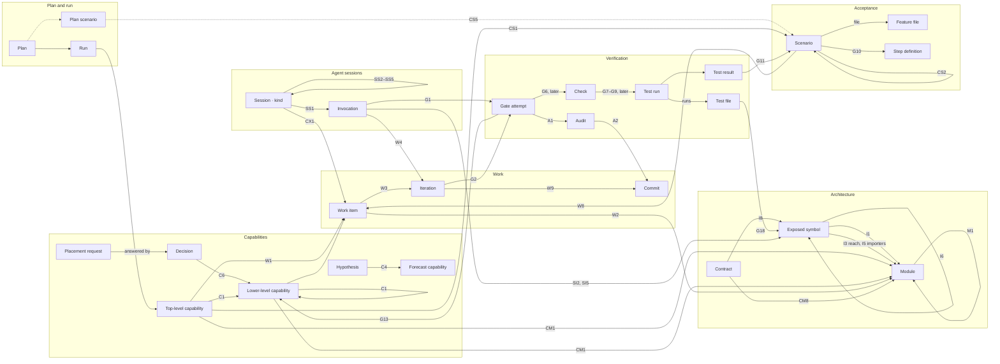

# Dashboard elements and their relationships

Status: analysis, 2026-09-24, against `ramify-agent` at `7d6af7f`.

This catalog lists every element a plan execution dashboard could display, what
is known about each, and how the elements relate. It is written for whoever
designs or builds the dashboard. It does not design views; the
[design proposal](2026-09-23-plan-execution-dashboard/design-proposal.md)
does that.

For each element and each relationship it says where the fact comes from and
whether the dashboard can get it today. It builds on these inventories, which
hold the source citations:

- [the harness information model](2026-09-23-plan-execution-dashboard/inventory-model.md):
  entities, events, issues and gaps;
- [cross-module interfaces](2026-09-23-plan-execution-dashboard/research-interfaces.md):
  Ramify's exposure surface, the harness's contracts, and what sessions read
  and change;
- [gates, checks and test runs](2026-09-23-plan-execution-dashboard/research-tests.md):
  what each check runs, what results exist and what the harness parses;
- [the web client](2026-09-23-plan-execution-dashboard/inventory-web.md) and
  [its diagrams](2026-09-23-plan-execution-dashboard/inventory-diagrams.md):
  what is shown today.

The examples come from the real pi run `20260923T164537Z-dbf0c2` of the
fixture plan `status-badge-tone`.

## How to read the catalog

**Availability** says how a dashboard can get a fact:

| Mark | Meaning |
|---|---|
| **P** | Published by the harness protocol (`/api/v1`). |
| **R** | Recorded in the run directory or the project, but not published. A new projection can publish it. |
| **J** | Derivable by joining published or recorded facts. |
| **X** | Derivable only by parsing logs, transcripts or source. |
| **—** | Not recorded anywhere. |

**Shown today** says what the current web client does with a relationship:
**linked** (shown and navigable), **text** (shown as an ID or prose), or
**no**.

Everything the harness publishes is a projection of the run's event log.
Element states are derived from events and never stored.

---

## 1. The elements at a glance

| Group | Element | ID | Real run | Bounds and scale |
|---|---|---|---|---|
| Plan and run | Plan | slug | 4 plans in the project | — |
| | Run | `YYYYMMDDTHHMMSSZ-xxxxxx` | 1 | 200 runs per list |
| Capabilities | Top-level capability | slug | 1 | one per plan entry |
| | Lower-level capability | slug + revision | 1 (a reuse registration) | up to 500 per answer |
| | Forecast capability | slug | 1 | one per hypothesis |
| | Hypothesis | slug + revision | 2 | — |
| | Decision | `gd-NNN`, `ld-wi-NNN-NN`, iteration ID, `ct-NNN` | 4 | up to 500 per answer |
| | Placement request | `pr-NNN` | 0 | one at a time |
| Architecture | Module | declared-name path | 15 | — |
| | Exposed symbol | `owner#binding` | 103 originals, 105 exposure steps | the whole project |
| | Interface file | path | 3 | — |
| | Contract, obligation, requirement | `ct-NNN`, `ob-ct-NNN`, `rq-NNN` | 0 | — |
| | View | revision | architect view revisions `:1`–`:12` | — |
| Acceptance | Scenario | `sc-NNN` | 2 tracked, 1 of the project's own | up to 500 per answer |
| | Plan scenario | `ps-NN` | 2 | — |
| | Feature file | path | 1 | one per entry, plus integration |
| | Step definition | `uri:line` | 5 | — |
| Work | Work item | `wi-NNN` | 1 | 64 per run |
| | Iteration | `wi-NNN.iNN` | 1 | 12 per work item |
| | Commit | sha | 3 (base, scenarios, iteration) | — |
| Agents | Session | `ses-NNNN` | 3 | 200 per page |
| | Invocation | `inv-NNNN` | 4 | 400 per run |
| | Transcript entry | cursor `n` | 75 in the engineer's session | 200 entries per page |
| | Brief (append) | run event sequence | 0 | — |
| Verification | Gate attempt | `ga-NNNN` | 4 | 3 repair rounds per iteration |
| | Audit | audited commit and run ref | 3, all passed | one per committing gate attempt |
| | Check (drill-in, later) | position in its gate | 18 | 4 or 5 per gate |
| | Test run, result, file (later) | — | 79 tests in 20 files | — |
| | Readiness attempt | `NN` | 1 | 2 infrastructure retries |
| Signals | Event | sequence | 39 | 500 per page |
| | Notice | per kind | 0 | — |
| | Issue | per kind | 4 cautions (partial guarding and coverage) | about 40 kinds |
| | Measurement | metric ID | about 20 KPI families | — |

---

## 2. Element catalog

### 2.1 Plan and run

#### Plan

The plan document the user chose. The harness reads it and never edits it.

- **Identity**: the directory name under `plans/` and its first heading. **P**
- **Facts**: the path and the Markdown. **P** Its Gherkin blocks become plan
  scenarios at the start of a run (see
  [Scenario](#scenario)).
- **Runs**: newest first, each with state, phase and counts. **P**
- **Time**: none, not even the file's modification time. **—**
- **Issues**: unreadable plan. **P**
- **Across runs**: nothing links one run of a plan to the next, so a plan has
  no progress of its own. **—**

#### Run

One implementation of one plan, from analysis to its final gate.

- **Identity**: the run ID, which starts with its start time. **P**
- **State**: `running`, `completed`, `failed`, `stopped` or `interrupted`.
  **P**
- **Phase**: `analysis`, `awaiting-review`, `readiness`, `working`,
  `final-verification`, `ended`. **P** Each phase's start comes from its
  first event. **J**
- **Now**: `current` (work item, iteration, request, role, invocation,
  what it waits for), `waits[]`, the writer. **P** A running gate,
  materialization or view refresh is not in `current`. **J** from event pairs;
  a running readiness gate has no start event. **—**
- **Counts**: work items and completed ones, invocations, gate and readiness
  attempts, scenarios by state, open requirements, degraded starts. **P**
- **Limits**: repair rounds (3), iterations per work item (12), work items
  (64), invocations (400), run time (8 h), context budgets per role. **R**
  (`job.json`)
- **Inputs**: the source commit, prompt package versions and hashes, the
  project configuration. **R**
- **Review**: the one human review, approval of the analysis, with reviewer
  and time. **P** The note is only in the event summary. **P**
- **Outcome**: the failure reason (15 kinds), message and evidence. **P**
- **Time**: started, updated, ended. **P**
- **Example**: completed in 11 min 57 s at version 39.

### 2.2 Capabilities and forecasts

Three kinds of capability share one progress answer. They are told apart by
`entry` and `tentative`.

#### Top-level capability

A capability the plan requires, called an entry capability in the records.
The initial architect assigns each plan entry exactly one.

- **Identity**: its slug and description. **P**
- **Owner**: the module that owns it, or a proposed module. **P**
- **Progress state**: `todo`, `working` or `completed`, with the reason for
  the state. **P** `completed` needs current verification evidence. A pass
  against fakes, or a wait for a provider, still counts as `working`.
- **Work**: exactly one work item. **P**
- **Acceptance**: its scenarios and how many are implemented. **P**
- **Evidence**: the passing work-item gates. **P**
- **Depends on**: lower-level capabilities. **P**
- **Plan references and citations**: plan lines and the symbols the architect
  cited. **R**
- **Time**: through its work item's events. **J**
- **Example**: `render-status-badge-tone`, owned by
  `workspace/shared-ui`, `completed`, evidence `ga-0003`, 2 of 2 scenarios
  implemented.

#### Lower-level capability

A capability registered by a placement decision (`origin` is `entry`,
`global-decision` or `local-decision`), which other capabilities depend on.

- **Identity**: its slug and revision. **P** (revision **R**)
- **Owner**: per revision. **P** The previous owner after a re-placement.
  **R**
- **Behavior**: the behavior it was registered for. **R**
- **Progress state**, **work items**, **evidence** and **dependencies**: as for a
  top-level capability. **P**
- **Registered by**: a placement decision. **P**
- **Consumers**: the capabilities that depend on it, as the reverse of their
  `dependsOn`. **J**
- **Issues**: members of a dependency cycle. **P**
- **Example**: `status-badge-wording`, registered by the local reuse decision
  `ld-wi-001-01`, still `todo` in the completed run ("No work started").

#### Forecast capability

A capability a hypothesis predicts and no record has confirmed. No work is
derived from a forecast.

- **Identity**: its slug, with `tentative: true`. **P**
- **Source**: its hypothesis, with the hypothesis's standing and confidence.
  **P**
- **State**: always `todo` unless a decision confirms or supersedes it. It
  never retires when the run completes. **—** (the retired state is
  proposed in the
  [capability registry analysis](2026-09-23-capability-registry-analysis.md))
- **Example**: `status-badge-tone-rendering`, still `todo` after the run.

#### Hypothesis

A forecast by the architects: which capability will be needed, where it
belongs and what it depends on. Architects revise it as the run learns.

- **Identity**: its slug and revision. **P** Only the current revision is
  published. **R** for the others.
- **Standing**: `tentative`, `confirmed` or `superseded`. **P**
- **Forecast**: the capability; its change (`reuse`, `create`,
  `create-by-extraction`); its suggested owner; its dependencies. **P**
  Whether it changes existing symbols, its anticipated consumers and the
  involved modules. **R** (the involved modules are also on the
  module-capability rows, **P**)
- **Support**: confidence and rationale. **P** Assumptions, uncertainties and
  citations. **R**
- **History**: the decisions that revised it, what superseded or confirmed it.
  **P**
- **Delivered to**: the work items that were given each revision. **P**
- **Example**: `create-status-badge-tone-rendering`, tentative.

#### Decision

A choice an architect made, recorded where it was made. Only placement has a
record of its own; the other kinds are projected from their records.

| Kind | ID | Facts **P** | Facts **R** |
|---|---|---|---|
| placement | `gd-NNN` (global), `ld-wi-NNN-NN` (local) | authority, question, outcome (`reuse`, `create`, `extract`, `external`), capability, owner or proposed module, rationale, the decision it revises, hypotheses, registered capabilities | constraints, uncertainties, evidence and citations, the brief, the affected consumers of a revision |
| scope | iteration ID | modules, included children, broad, rationale, extra paths with their purpose, authorizations | — |
| breaking | work item and outline revision | guarantee, reason, affected consumers | — |
| plan-revision | work item and outline revision | decomposition, rationale, reason, stages | — |
| contract | `ct-NNN` and revision | capability, provider, authority, mode, established by | artifacts, behavior |

Every decision has its time, sequence and work item. **P**

#### Placement request

A local architect's question to the global architect: where should this
capability belong?

- **Identity**: `pr-NNN`. **P** (per work item only; no list for the run)
- **Facts**: the question, the behavior required, candidates, findings,
  unresolved points, the hypotheses the request supports or contradicts, and
  the local decisions it rests on. **P**
- **Answer**: the decision, or a partial return that uses up one retry. **P**
- **Time**: requested, view refreshed, fork opened, decided, delivered. **J**
  from events.

### 2.3 Architecture: modules and interfaces

#### Module

A Ramify module of the target project.

- **Identity**: its declared-name path from the root, and its directory. **P**
- **Place in the tree**: its parent and children. **P**
- **Placement in this run**: `declared`, `proposed` (with the proposed
  parent, directory, purpose and tags), or `unplaced`. **P**
- **Changes in this run**: created or removed, read from the accepted commit,
  with the iteration and decision. **P**
- **Header tags and source areas**: the module's tags, and its ordinary and
  tests areas with their tag profiles. **R** (the architect view and the
  check report)
- **Purpose**: the first paragraph of its README. **R** (architect view
  `module.json`)
- **Symbols**: exposed, internal and supporting counts. **R**
- **Use**: the modules it imports from and the modules that import from it,
  counted in distinct symbols. **R**
- **Size**: its own and its subtree's context size. **R** (the measurement
  snapshots)
- **Tests**: its test files, their titles and what they exercise. **R**
  (architect view `tests.jsonl`)
- **Capabilities**: those it owns, those initially associated with it and
  those implemented there. **P**
- **Time**: the tree's revision; its latest state only. There is no tree
  history. **—**
- **Example**: `collection-review/workspace/shared-ui`, tags `[ui, browser]`.

#### Exposed symbol

A symbol one module exposes to its parent or its descendants. This is the
unit of a cross-module interface in Ramify's model.

- **Identity**: owner, file and binding (`owner#binding`); its kind and
  shape. **R**
- **Signature and documentation**: the declared signature (240 B at most in
  the architect view) and one doc paragraph. **R**
- **Tags**: required-importer and required-symbol tags, with their evidence.
  **R**
- **Exposure steps**: each module that exposes or re-exposes it, the
  direction (`parent` or `descendants`), and the alias used at that step.
  **R** (the check report, complete; the architect view drops the aliases at
  re-exposing steps)
- **Reach**: the modules where it is visible. **J** (close the exposure steps
  over the tree)
- **Availability**: per source area, whether it can be imported as a value,
  as a type only, or is blocked by a tag. **J** API views record it only
  for the modules the harness materialized. **R**
- **Importers**: the modules that import it. **R** (at most 12 per list in
  the architect view; complete in the check report)
- **Signature companions**: the project symbols its signature names. **R**
  (forward direction only; the reverse is **J**)
- **Tested by**: test files whose tests exercise it. **R**
- **Changes**: whether a run added, removed or changed it. **J** for added and
  removed (compare check reports of successive gates). **X** for signature
  changes (compare the source at two commits). No interface history is
  kept. **—**
- **Issues**: `exposed-without-companion` and import denials. **R** (read
  only when a check fails)
- **Example**: `StatusBadge`, exposed by `shared-ui` to its parent and
  re-exposed by `workspace` to its descendants. It is visible in 13 modules,
  imported by `catalog/ui` and `reviews/ui/pure-ui`, and blocked by `ui`
  elsewhere. The engineer added `tone?` to its companion `StatusBadgeProps`,
  and nothing in the run records that change.

#### Interface file

A file under a module's `src/interfaces/`, and whether `expose-src *` exposes
all its exports.

- **Identity**: its path and owning module. **J** (a path pattern)
- **Wildcard exposure**: **X** (parse `module.ramify`)
- **Exports**: as exposed symbols. **R**
- **Example**: `workspace/contracts/src/interfaces/vocabulary.ts`, exposed by
  wildcard with `[browser]` to its parent; `reviews/core/src/interfaces/port.ts`.

#### Contract, obligation and requirement

The harness's record of an agreement between a consumer and a provider,
established by a contract engineer when an engineer needs a capability that
another module must provide.

- **Contract** `ct-NNN` and revision:
  - capability, provider, authority (provider, consumer or independent),
    mode (`fake-backed` or `access-only`), the iteration and gate that
    established it. **P**
  - behavior, and its artifacts: the interface files with their export
    names, conformance suites, fakes, and the exposure declarations to add
    to `module.ramify`. **R**
  - state: requested, registered at revision n, reopened. **J**
- **Obligation** `ob-ct-NNN`: the provider's duty, with its conformance
  evidence; state open or conformed. **R** (the ID only is **P**)
- **Requirement** `rq-NNN`: the consumer work item's need, with its test
  policy and fake injections; state open, passing against fakes, or
  verified. **P** for identity, capability and whether it is verified; **R**
  for its evidence.
- **Checks on it**: the harness verifies that the paths exist and applies
  the fake-naming rule. It never checks export names or declaration text
  against Ramify; only the gate's complete `ramify check` does. **—**
- **Example**: none. The contract engineer has not yet run on a real
  project.

#### View

The generated views agents read: the architect view (`.ramify-architect/`)
and each module's API view (`src/.ramify/`).

- **Identity**: the view's revision and input. **P** for the analysis view
  and the current tree; **R** for the view each iteration resolved.
- **What a session was offered**: the API views its prompt named. **X**
  (prompt text only)
- **Coverage**: cut fields, unavailable details, unknown shapes. **P** (the
  analysis view's coverage limits)
- **History**: views are overwritten in place, so only the latest revision
  survives. **—**
- **Example**: the analysis used revision `:1`, the local decision `:2`, the
  engineer's hook checks `:3` to `:10`; `:12` is on disk.

### 2.4 Acceptance

#### Scenario

A tracked Gherkin scenario the run must implement. It is the plan's main
acceptance gate.

- **Identity**: `sc-NNN` and its name. **P**
- **Kind**: `entry`, or `integration` with sub-scenarios. **P**
- **Origin**: a plan scenario (`ps-NN`, with its lines in the plan), or the
  architect. **P**
- **Frozen text**: the Gherkin source frozen when the analysis was accepted.
  **P**
- **Belongs to**: its entry capability, owner module (for an integration
  scenario, the lowest common ancestor of its sub-scenarios' owners), work
  item and feature file. **P**
- **State**: `pending`, `bound`, `declared` or `implemented`, with withdrawal
  back to `pending`. **P**
- **Implemented by**: the gate that first ran it passing. **P**
- **Results**: each gate that ran it, with checkpoint, mode (`quick` or
  `full`), dry run, status (`passed`, `failed`, `undefined`, `pending`,
  `ambiguous`, `skipped`), the first failure and undefined steps. **P**
- **Step bindings**: each step's matching definitions. **R**
- **Warnings**: the four form warnings of the analysis. **P**
- **Time**: through `scenario-*` events. **J**
- **Example**: `sc-001` and `sc-002`, both `implemented` by `ga-0002`, then
  passed at `ga-0003` (quick) and `ga-0004` (full).

The project's own scenarios, which the run does not track, are counted per
check (passed, skipped, failed). **P** Their names, files and failures are in
the message streams. **R**

#### Plan scenario

A Gherkin block of the plan, extracted at the start of a run.

- **Identity**: `ps-NN`, its name and lines. **R** (a tracked scenario names
  its `ps-NN` and lines, **P**)
- **Limitations**: blocks that do not parse. **R**

#### Feature file

The file the harness renders from the scenario records, which agents may not
edit.

- **Path**: `<owner>/src/tests/features/<plan>/<entry>.feature`. **P**
- **Content**: **R** (in the project, at the materialization commit)
- **Commits**: the "Scenarios of <plan>" commit and any withdrawal commits.
  **P** as event references.

#### Step definition

A step implementation a scenario's steps bind to.

- **Identity**: `uri:line`. **R** (per scenario and gate)
- **Owner module**: **J** from the path.
- **Symbols it imports**: **R** (the check report's accesses from test
  areas; step files have no architect-view test record)
- **Example**: `sc-001`'s four steps bind to
  `status-badge-tone.steps.ts:37, 48, 54, 61`.

### 2.5 Work

#### Work item

The unit of scheduled work for one capability in one module.

- **Identity**: `wi-NNN`, its goal and its capability. **P**
- **Origin**: an entry, an obligation (a provider's work), a verification or
  an integration scenario. **P**
- **Module**: **P**
- **State**: `todo`, `working`, `yielded` (waiting for requirements) or
  `completed`. **P**
- **Outline revisions**: decomposition, stages, reuse, breaking changes, the
  hypotheses it saw. **P**
- **Relations to other work items**: `follows` and `startedFor`. **P**
- **Counts**: outline revisions, iterations, gate attempts, invocations.
  **P**
- **Plan references**: requirement and acceptance anchors. **R**
- **Queue position**: **—** (the scheduler's order is not recorded)
- **Time**: started, yielded, resumed, completed. **J** from events.

#### Iteration

One engineer assignment within a work item, with a write scope.

- **Identity**: `wi-NNN.iNN`, its kind (`ordinary`, `breaking`, `contract`,
  `verification`, `repair`, `integration`), stage, goal and approach. **P**
- **Write scope**: modules, included children, extra paths with their
  purpose (`contract`, `conformance`, `fake`, `exposure-declaration`,
  `consumer`), authorizations. **P** Resolved files, guarded files, the view
  revision. **R**
- **External capabilities**: the capabilities it uses from other modules,
  with owner, role and contract. **R**
- **Evidence obligations**: **R**
- **Result**: `accepted`, `partial`, `unsuitable`, `exhausted` or
  `superseded`, with gate, commit, findings and recommendation. **P**
- **Time**: assigned and closed. **J** from events.
- **Example**: `wi-001.i01`, accepted by `ga-0002` at `e99fee0`.

#### Commit

A commit the harness writes on the run branch `ramify-agent-run/<run-id>`: the
scenario materialization, withdrawals, and one per passing committing gate.

- **Identity**: its sha. **P** (as references)
- **Message, diff, changed files**: **R** (git in the project). The
  trailers name the gate, work item, iteration and invocations. **R**
- **Example**: `1bbe014` (base), `2fe54cc` (scenarios), `e99fee0`
  (iteration).

### 2.6 Agent sessions

#### Session

A pi conversation the harness owns. It spans one or more invocations and
keeps a transcript.

- **Identity**: `ses-NNNN` and its role. **P**
- **State**: `live`, `suspended`, `finished` or `interrupted`, and the finish
  reason (`work-closed`, `run-ended`, `lost`, `replaced`, `interrupted`,
  `not-kept`). **P**
- **Reaches**: the element the session serves: the run, a work item (with
  its capability and module), a placement request (with its work item and
  capability), or a module. **P**
- **Work**: work item, iteration, request. **P**
- **Executor and model**: **P**
- **Invocations**, **briefs appended**, **suspensions** (from and until):
  **P**
- **Lineage**: fork, replaces, replaced by, requested by, requested, forks.
  **P**
- **Awaiting**: the invocation the harness is waiting for, while it is live.
  **P**
- **Tokens**: per invocation. **P** Per session. **J**
- **Time**: opened and last changed. **P**
- **Issues**: degraded starts, lost or replaced sessions, interruptions.
  **P**

The session kinds:

| Kind | Serves | How it opens and continues | Submissions | Writes source | Real run |
|---|---|---|---|---|---|
| Initial architect | the run | opened once; its session stays suspended as the global architect context, receiving the briefs of global decisions without a model call | the analysis | no | `ses-0001`, 1 invocation |
| Global fork | one placement request | forked from a point of the global architect context, with the briefs since then | `decision`, `partial` | no | none |
| Local architect | one work item | one session per work item, continued after a placement answer, a closed iteration, a refused completion or a repair | `assign`, `request-placement`, `request-completion`, `yield-for-providers`, `unresolved` | no | `ses-0002`, 2 invocations |
| Engineer | one iteration | usually fresh per iteration; continued for a repair; replaced when a lost session is rebuilt | `completion-proposed`, `partial`, `unsuitable`, `contract-needed` | yes, the only writer | `ses-0003`, 1 invocation |
| Contract engineer | a contract iteration | requested by an engineer's `contract-needed` | `established`, `incomplete` | yes | none |
| Standalone engineer | one module, outside any run | the `ramify-agent session` command | as engineer | yes | — |

#### Invocation

One segment of a session's conversation, from a start to a submission or
another end. The web client calls it a chapter.

- **Identity**: `inv-NNNN`, role and work. **P**
- **Start**: `opened` or `continued`, with the point it continues from, the
  reason, and the briefs appended since. **P**
- **Degraded start**: a continuation or fork the executor made fresh. **P**
- **End**: `submitted`, `ended`, `failed`, `stopped`,
  `context-budget-reached` or `invalid-submission`; whether the session was
  kept; the point its end made. **P** The interruption (idle timeout,
  absolute timeout, provider error, lost session, adapter fault). **P** in
  the transcript.
- **Evaluation**: guarding verdicts, writes outside the scope, hook checks,
  reads outside the scope (excursions), coverage gaps, changed lines, tokens.
  **P**
- **Record details**: attempt number, prompt package and hash, scope size,
  base commit, rejected submissions, context budget, elapsed time, late
  writes after a stop. **R**
- **Submission**: its kind and body. **X** (the transcript's tool call)
- **Observations**: the context-fill series (a live gauge), rejections with
  their errors, scope-test runs, each guard and mutation. **R** (only
  aggregates are **P**)
- **Example**: `inv-0003`, the engineer, 3 min 1 s, 29,472 input and 4,124
  output tokens, 3 paths changed (+91/−7), guarding partial because the shell
  is not guarded.

#### Transcript entry, point and brief

- **Entry**: `started`, a `message` (user, assistant with text, thinking and
  tool calls, tool result), a `harness` entry (guard denied, submission
  verdict, post-write check, read reminder, brief appended, note appended,
  budget reached), `compaction`, `retry`, `point`, `ended`. Each has its
  cursor and time. **P**
- **Body**: inline, a stored blob, or a run file. **P** (1 MiB at most)
- **Point**: the end of an invocation or of a brief, which later starts and
  forks name. **P**
- **Brief (append)**: a decision's brief appended to a suspended session.
  **P**

### 2.7 Verification

Scope for v1, decided on 2026-09-24:

- Verification is shown through gates and their audits. For v1 the fact that
  matters is whether the audit passed.
- The audited checks, and the finer results below them, are drill-ins for
  later.
- Tests not run through an audit are out of scope for now. These are the
  readiness gate's checks, the engineer's scope tests, the post-write hook
  checks and shell runs. They are listed under [Later](#later-tests-outside-audits-and-finer-results)
  for completeness.

#### Gate attempt

One execution of a gate's checks at a checkpoint. A gate in the protocol is
always one attempt.

- **Identity**: `ga-NNNN` and checkpoint (`readiness`, `iteration`,
  `contract`, `breaking-iteration`, `work-item`, `final`). **P**
- **Subject**: the work item and iteration. **P**
- **Proposed by**: the invocation whose submission led to it. **R**
- **Verdict**: `passed`, `failed` or `not-verified`, with cause and next step
  (`accept`, `repair`, `retry-infrastructure`, `return-to-local-architect`,
  `exhausted`). **P**
- **Audit**: at most one. Every committing checkpoint is audited; readiness
  is not. **P** (see [Audit](#audit))
- **Repair round** and **infrastructure attempt**: **P** The round limit.
  **R**
- **Commits**: head before, commit made, commit audited. **P**
- **Rules**: guarded-file changes, the fake-naming rule. **P** Attribution
  of findings to the scope. **R**
- **Checks**: in order. **P**
- **Time**: its first check's start; its end is the `gate-attempted` event.
  **J**
- **Listing**: there is no list of a run's gates; readiness and final gates
  are found through event references. **J**
- **Example**: `ga-0002`, iteration gate of `wi-001.i01`, proposed by
  `inv-0003`, committed and audited `e99fee0` in 8 s.

#### Audit

A ramify-audit (0.1.0) run for one gate. After the gate commits, the audit
checks out that exact commit in a temporary worktree. It then runs the gate's
planned checks there, together with the harness's own rules, and publishes the
result in the project's git.

- **Which gates have one**: the committing checkpoints (`iteration`,
  `contract`, `breaking-iteration`, `work-item`, `final`). The readiness gate
  and a standalone session's gate run in place, with no audit.
- **Gate**: exactly one gate attempt. **P** (the gate view's audited commit
  and evidence)
- **Result**, the v1 fact:

  | Shown | When | Avail. |
  |---|---|---|
  | passed | the audit completed and the gate passed | **J**: evidence present, verdict `passed` |
  | failed | the audit completed and a check or harness rule failed | **J**: evidence present, verdict `failed` |
  | not verified | the audit completed but a check could not be verified (timeout, missing command, empty selection) | **J**: evidence present, verdict `not-verified` |
  | did not complete | the audit failed, was cancelled or ran out of time; the gate has no audited commit and no evidence | **J**: evidence absent on a committing gate |

  The harness does not record the audit's own overall result. That result is
  in the report's `summary.json` and the git note's `Audited-Overall`, **R**
  (git). The gate's verdict is computed from the checks the audit ran, so
  the two agree.
- **Identity**: the audited commit, the run ref
  `refs/audited/runs/<time>-<sha9>`, the report commit and the tree ref
  `refs/audited/by-tree/<tree>`. **P**
- **Time**: the gate's. **J** The audit's duration. **R** (report)
- **Drill-in, later**: the gate's check records (next section), **P**. From
  the report commit, **R** (git in the target project, not the API):
  - each check's pass, duration and complete output;
  - the harness-rules check;
  - the coverage claim: checkpoint, selection policy and owners.
- **Caveats**:
  - A commit that several gates audit keeps only the last git note and
    by-tree ref. The earlier audits survive only as run refs.
  - The harness passes no test units, so an audit has no per-test data.
- **Example**:
  - `ga-0002` audited `e99fee0`, with run ref
    `refs/audited/runs/2026-09-23T16-56-35Z-e99fee073` and report `b8546b4`,
    and passed.
  - `ga-0003` (report `2cf8d29`) and `ga-0004` (report `6d4b595`) audited the
    same commit and passed; the note names only `ga-0004`.
  - The readiness gate `ga-0001` has no audit.

#### Check

One command a gate runs. On an audited gate the checks are the audit's
drill-in; they are not needed for v1.

- **Kind**: `tests`, `type-check`, `ramify-check`, `scenarios`
  (`conformance` exists as a kind but conformance suites run inside
  `tests`). **P**
- **Command**: argv and working directory. **P** Environment and timeout.
  **R**
- **Selection**: for scoped tests, the policy, owners, subtrees, extra suites
  and resolved files. **P** For whole-project tests, none. **—**
- **Result**: exit code and outcome, the not-verified reason, runner errors.
  **P**
- **Output**: the last 8 KiB. **P** The complete log. **R**
- **Time**: start and elapsed. **P**

#### Later: tests outside audits and finer results

Not needed for v1. Kept here so that later drill-ins start from a complete
list.

**Test runs.** One execution of a test runner:

| Where | Runner and scope | Recorded as | Availability | v1 |
|---|---|---|---|---|
| audited `tests` check, scoped | `vitest run <files>` over the scope owners' `src/tests/` | the check | **P**; results **X** from the log | through its audit |
| audited `tests` check, whole project | `npm test` | the check | **P**; files run and results **X** | through its audit |
| scope probe of a work-item gate | `vitest run` over the last iteration's selection | a trailing `tests` check | **P** | through its audit |
| audited `type-check` | `npm run type-check` | the check | **P**; diagnostics **X** | through its audit |
| audited `ramify-check` | `ramify check --batch --format json` | the check and a 1.8 MB report | **P** outcome; report **R** | through its audit |
| audited `scenarios` | one Cucumber run per module, quick or full | the check's runs, with a message stream per run | **P** per module and scenario; stream **R** | through its audit |
| readiness gate's checks | the same kinds, in place | the readiness gate | **P** | out of scope |
| `run_scope_tests` | the engineer's scoped Vitest and quick scenarios | a `scope-tests` observation | **R**; the output **X** (transcript) | out of scope |
| post-write hook check | `ramify check --changed` after each write | a `hook-check` observation and a hook log | **P** counts; log **R** | out of scope |
| shell | whatever the engineer runs | an activity line and a shell log | **X** | out of scope |

Tracked scenarios are an exception: their per-gate status is an element of
its own (see [Scenario](#scenario)), whichever gate ran them.

**Test results.** A result finer than a check's exit code:

| Level | Facts | Availability |
|---|---|---|
| Test file | pass mark, test count, duration | **X** (Vitest log text) |
| Test case | name, status, duration, failure | **X** on failure only; **—** as data |
| Scenario step | status, duration, definition | **R** (message stream, not parsed) |
| The project's own scenario | counts per check | **P**; names and failures **R** |
| Ramify finding | code, message, file, importer, symbol, attributed to the scope or not | **R** (parsed only when the check fails); counts per invocation **P** |
| Type diagnostic | file, line, code, message | **X** |
| Harness rule | guarded change, fake-naming violation | **P** |

In the real run the project went from 77 tests at readiness to 79 at the
final gate. That delta is visible only by parsing log text.

**Test files.**

- **Identity**: path and owning module. **J** (`<module>/src/tests/`)
- **Titles and exercised symbols**: **R** (architect view `tests.jsonl`)
- **Gates that ran it**: scoped gates. **P** Whole-project gates. **X**
- **Example**: `shared-ui/src/tests/status-badge.test.tsx`: 4 tests (2 added
  by the run), exercising `StatusBadge`.

#### Readiness attempt and recovery

- **Readiness attempt**: 14 steps from `project-root` to
  `baseline-ramify-check`, five of them pointing at the readiness gate. **R**
  Its outcome. **P** as events and a count.
- **Infrastructure recovery**: cause, action (restart the daemon, reinstall
  nested packages, rerun, reconstruct a session), outcome. **R**

### 2.8 Signals

#### Event

- **Facts**: sequence, time, type, an English summary, typed references to
  the elements it concerns. **P** The type is free text on the wire; the
  49 types must be known to the client.
- **Reference kinds**: work item, iteration, invocation, gate, decision,
  request, contract, obligation, requirement, capability, commit, scenario,
  session. **P**

#### Notice

- **Kinds**: module created, module removed, dependency cycle (resolved or
  not). **P**
- Degraded starts are counted, not noticed. **P**

#### Issue

An issue is not a record; it is a class of recorded facts worth the user's
attention. About 40 kinds are recorded, in seven groups:

| Group | Examples | Availability |
|---|---|---|
| Run outcome | failure, stop, interruption | **P** |
| Gates and repair | failed or not-verified gate, repair round, exhausted repair, guarded change, outside-assignment failure | **P** |
| Scope and guarding | blocked write, write outside the scope through the shell, read excursion, post-write findings | **P** aggregated |
| Agents and context | context budget reached, compaction, model retries, provider errors, degraded start, lost session | **P**, partly in transcripts only |
| Acceptance | refused completion, withdrawn scenario, failing or undefined scenario, composition failure | **P**; composition failure **R** |
| Architecture | dependency cycle, view refresh unavailable, provider cannot conform | **P** |
| Coverage limits | coverage gaps, partial measurements, cut view fields | **P** |

The full list is in the
[model inventory, §4](2026-09-23-plan-execution-dashboard/inventory-model.md#4-issues-every-problem-or-warning-the-model-records).

#### Measurement

- **Tokens**: input, output, cache read, cache write, per message and per
  invocation. **P** Per session, role, work item or capability. **J**
- **Cost**: per assistant message. **P** Never summed. **—**
- **KPIs**: about 20 families under `kpi/1` and the `lineage/1`
  measurements, each `measured`, `partial`, `unavailable` or
  `not-applicable`. **P**
- **Durations**: from event pairs and command times. **J**
- **Context fill**: per observation. **R**

---

## 3. Relationship catalog

Cardinality reads left to right. "Shown today" is the current web client.

### 3.1 Between capabilities

| # | Relationship | Card. | How it is known | Avail. | Shown today |
|---|---|---|---|---|---|
| C1 | capability → capability it depends on | N:M | a registry entry's consumers; `dependsOn`, dashed when tentative | **P** | Dependencies edges; select the other node |
| C2 | top-level capability → every lower-level capability it needs | 1:N | the closure of C1 from the entry | **J** | no |
| C3 | lower-level capability → the top-level capabilities that need it | N:M | the reverse closure of C1 | **J** | no |
| C4 | hypothesis → forecast capability | N:1 | `hypothesis.capability` | **P** | Dependencies, as a forecast box |
| C5 | hypothesis → hypothesis it depends on; superseded by; confirmed by | N:M | hypothesis fields | **P** | text, partly |
| C6 | placement decision → capabilities it registers | 1:N | `placement.registry` | **P** | text |
| C7 | decision → hypotheses it revised | N:M | `hypothesis.decisions`, `placement.hypotheses` | **P** | text |
| C8 | dependency cycle → member capabilities, closing work item | 1:N | cycle notice | **P** | text |
| C9 | placement request → capability it asks about | N:1 | `request.forCapability` | **P** | no |

### 3.2 Capabilities and scenarios

| # | Relationship | Card. | How it is known | Avail. | Shown today |
|---|---|---|---|---|---|
| CS1 | top-level capability → its entry scenarios | 1:N | `scenario.entry` | **P** | a count in the Dependencies detail; the Scenarios table as text |
| CS2 | integration scenario → sub-scenarios | 1:N | `subScenarios`, `partOf` | **P** | text |
| CS3 | integration scenario → the capabilities it spans | 1:N | CS2, then CS1 in reverse | **J** | no |
| CS4 | lower-level capability → the scenarios that depend on it | N:M | C3, then CS1 | **J** | no |
| CS5 | scenario → plan scenario and plan lines | N:1 | `origin` | **P** (the plan scenario's own record **R**) | text |
| CS6 | lower-level capability → scenarios that exercise it directly | — | no record ties a scenario to a lower-level capability | **—** | — |

A lower-level capability's acceptance is therefore always indirect: through
the top-level capabilities that depend on it (CS4), and through tests (G18, G19).

### 3.3 Capabilities and modules

| # | Relationship | Card. | How it is known | Avail. | Shown today |
|---|---|---|---|---|---|
| CM1 | capability → owner module (per registry revision) | N:1 | `capabilities[].owner`; entry owner | **P** | By module rows; Dependencies cards |
| CM2 | capability → proposed module not yet in the tree | N:1 | `entry.proposed`, `decision.proposed` | **P** | By module, dashed shell |
| CM3 | capability → initially associated modules, with role (entry owner, suggested owner, involved) | N:M | the module-capability comparison | **P** | outlined badge |
| CM4 | capability → module where it was implemented | N:1 | `implementedHere` | **P** | filled badge |
| CM5 | capability → modules its work wrote to | N:M | its work items' iteration scopes | **J** | no |
| CM6 | capability → previous owner | N:1 | registry `previousOwner` | **R** | no |
| CM7 | capability → the exposed symbols that provide it | N:M | only the symbols agents cited | **R** (agent-written) | no |
| CM8 | capability → contract → provider module | N:1 | `contract.capability`, `contract.provider` | **P** | text |

### 3.4 The module tree and module use

| # | Relationship | Card. | How it is known | Avail. | Shown today |
|---|---|---|---|---|---|
| M1 | module → parent, children | tree | the module tree | **P** | By module canvas |
| M2 | proposed module → its recorded parent | N:1 | the proposal | **P** | By module, dashed shell |
| M3 | iteration commit → module created or removed | 1:N | notice | **P** | text |
| M4 | module tree → earlier revisions | — | only the latest tree is kept | **—** | — |
| M5 | module → modules it imports from; modules that import from it | N:M | architect view `uses`, `usedBy` | **R** | no |
| M6 | module → tags and source areas | 1:N | architect view, check report | **R** | no |
| M7 | two modules → the modules on the exposure path between them | path | the tree, through their lowest common ancestor | **J** | no |

### 3.5 Interfaces

| # | Relationship | Card. | How it is known | Avail. | Shown today |
|---|---|---|---|---|---|
| I1 | exposed symbol → owning module | N:1 | its identity | **R** | no |
| I2 | exposed symbol → exposure steps (module, direction, alias) | 1:N | the check report; the architect view without aliases | **R** | no |
| I3 | exposed symbol → modules that receive it (reach) | 1:N | I2 closed over M1 | **J** | no |
| I4 | exposed symbol → source areas that may import it, as value or type only, or blocked by which tag | 1:N | reach, area profiles and the tag registry; API views where materialized | **J** (**R** in API views) | no |
| I5 | exposed symbol → modules that import it | 1:N | architect view consumers (12 at most); check report import decisions | **R** | no |
| I6 | exposed symbol → signature companions | 1:N | `companions.named` | **R** (reverse **J**) | no |
| I7 | module → its interface files | 1:N | path pattern; wildcard exposure by parsing `module.ramify` | **J** / **X** | no |
| I8 | contract → interface files and exports, conformance suites, fakes, exposure declarations | 1:N | `contract.artifacts` | **R** | no |
| I9 | contract interface file → Ramify's exposed symbols | N:M | the artifact path matched to the symbol's file, export names to bindings | **J** (needs the check report) | no |

### 3.6 Capabilities and sessions

| # | Relationship | Card. | How it is known | Avail. | Shown today |
|---|---|---|---|---|---|
| CX1 | session → the work item, capability and module it reaches | N:1 | `reaches` | **P** | session marks on both diagrams (live, suspended and interrupted sessions only), linked; text elsewhere |
| CX2 | capability → every session that worked on it, finished ones included | 1:N | CX1 reversed | **J** | no |
| CX3 | capability → global fork that placed it | 1:N | the request's capability and the fork's reach | **P** | marks only |
| CX4 | capability → contract engineer session | 1:N | `contract-requested.capability`; the session's `requestedBy` | **J** | no |
| CX5 | decision → the session that made it | N:1 | the fork's reach, or the local architect's invocation | **J** | no |

### 3.7 Sessions, interfaces and modules

| # | Relationship | Card. | How it is known | Avail. | Shown today |
|---|---|---|---|---|---|
| SI1 | session → API views its prompt offered | 1:N | the prompt text | **X** | no |
| SI2 | session → view files and source files it read or searched | 1:N | transcript tool calls; `activity` observations | **X** / **R** | transcript blocks |
| SI3 | invocation → modules read outside its scope | 1:N | excursions | **P** | transcript evaluation, text |
| SI4 | invocation → files it changed | 1:N | line events; mutations | **R** (counts **P**) | counts |
| SI5 | invocation → exposed symbols it changed | N:M | SI4 matched to exposed symbols' files; a signature change needs the source at two commits | **J** / **X** | no |
| SI6 | iteration → exposures added or removed | 1:N | the check reports of successive gates, compared | **J** | no |
| SI7 | invocation → exposure findings | 1:N | hook check findings | **R** (counts **P**) | counts |
| SI8 | iteration → external capabilities it uses (owner, role, contract) | 1:N | `externalCapabilities` | **R** | no |
| SI9 | iteration → write scope modules and extra paths, including `exposure-declaration` files | 1:N | the scope | **P** | work item detail, text |
| SI10 | contract engineer session → contract → provider's interface directory and `module.ramify` files on the path | 1:N | the contract iteration's scope and artifacts | **P** scope; **R** artifacts | no |

In the real run no session opened a foreign API-view entry. The local
architect guessed two view paths and got "file not found". The engineer
changed `StatusBadgeProps`, and the hook check reported `unchanged-surface`.

### 3.8 Sessions and sessions

| # | Relationship | Card. | How it is known | Avail. | Shown today |
|---|---|---|---|---|---|
| SS1 | session → its invocations, in order | 1:N | `invocations` | **P** | timeline segments, linked |
| SS2 | global fork → the point of the global architect context it was forked from | N:1 | `fork` | **P** | linked |
| SS3 | global architect context ← briefs of global decisions | 1:N | `appends[].decision` | **P** | append point linked; decision as text |
| SS4 | session → the session it replaced; replaced by | 1:1 | `replaces`, `replacedBy` (reconstructed, context rebuilt) | **P** | linked |
| SS5 | contract engineer ← the engineer invocation that requested it | N:1 | `requestedBy`, `requested` | **P** | linked |
| SS6 | invocation → the point it continues, and why (placement answered, iteration closed, completion refused, repair) | N:1 | `continues` | **P** | reason as text |
| SS7 | local architect → the engineer sessions of its work item's iterations | 1:N | the iteration assigned by the architect's invocation, and the engineer's work | **J** | no |
| SS8 | local architect → the global fork that answered its request | 1:N | the request's work item and the fork's reach | **J** | no |
| SS9 | invocation → degraded start (continuation or fork made fresh) | 0..1 | `degraded` | **P** | notice, linked |

### 3.9 Sessions, gates, audits and test runs

The last column marks the rows v1 needs. Rows for tests outside audits, and
for results finer than an audit's pass, are left for later.

| # | Relationship | Card. | How it is known | Avail. | Shown today | v1 |
|---|---|---|---|---|---|---|
| G1 | invocation → the gate its submission led to | 1:N | `proposedBy` | **R** (approximable by time, **J**) | no | yes |
| G2 | iteration → its gate attempts | 1:N | `iteration.gates` | **P** | work item detail, text | yes |
| G3 | work item → its work-item gates | 1:N | `workItem.gates` | **P** | text | yes |
| G4 | gate → subject work item and iteration | N:1 | `subject` | **P** | no | yes |
| G5 | failing gate → the repair invocation of the same engineer session | 1:0..1 | `continues.reason: repair`, the next attempt's repair round; the gate ID only in the briefing | **J** / **X** | no | yes |
| A1 | gate → its audit, with pass or not | 1:0..1 | the gate view's audited commit and evidence, and its verdict | **P** / **J** | refs as text | yes |
| A2 | audit → the commit it audited | N:1 | `audited` | **P** | text | yes |
| A3 | commit → the audits of it | 1:N | gates with the same `audited`; the git note keeps only the last | **J** | no | yes |
| A4 | audit → its report: per-check pass, duration and output, harness rules, coverage claim | 1:1 | the report commit | **R** (git) | no | later |
| G6 | gate → checks, in order | 1:N | `commands` | **P** | gate detail | later |
| G7 | scoped `tests` check → test files | 1:N | `selection.resolved` | **P** | gate detail, text | later |
| G8 | whole-project `tests` check → test files and test cases | 1:N | the log | **X** | tail only | later |
| G9 | `scenarios` check → one Cucumber run per module → scenario results | 1:N:N | `scenarios.runs`, `scenarios.scenarios` | **P** | gate detail | later |
| G10 | scenario result → steps → step definitions | 1:N | bindings; the message stream | **R** | no | later |
| G11 | scenario → the gates that ran it, and the one that implemented it | 1:N | `scenario.gates`, `implementedBy` | **P** | Scenarios table, text | yes |
| G12 | gate → commit made | N:1 | the gate view | **P** | text | yes |
| G13 | capability → evidence gates | N:M | `capabilities[].evidence` (its work-item gates, not the gate that implemented its scenarios) | **P** | text | yes |
| G14 | invocation → scope-test runs | 1:N | `scope-tests` observations | **R**; output **X** | transcript blocks | out of scope |
| G15 | invocation → post-write hook checks | 1:N | `hook-check` observations and logs | **R** (counts **P**) | counts | out of scope |
| G16 | readiness attempt → readiness gate | 1:1 | five steps name the gate | **R** | no | yes, the gate's verdict only |
| G17 | gate or invocation → infrastructure recovery | 1:N | recovery records | **R** | no | later |
| G18 | test file → owning module; → exercised symbols | N:1 / N:M | path; architect view `exercises` | **J** / **R** | no | later |
| G19 | test → capability | — | only through contracts (conformance and requirement tests) and tracked scenarios | **R** (contracts) | — | later |

### 3.10 Work structure

| # | Relationship | Card. | How it is known | Avail. | Shown today |
|---|---|---|---|---|---|
| W1 | top-level capability → work item | 1:1 | the entry | **P** | text (Dependencies links to the work item) |
| W2 | work item → module | N:1 | `workItem.module` | **P** | text |
| W3 | work item → outline revisions, iterations | 1:N | the work item detail | **P** | work item detail |
| W4 | iteration → invocations (engineer, contract engineer) | 1:N | `iteration.invocations` | **P** | text |
| W5 | work item → work item it follows up, or was started for | N:1 | `follows`, `startedFor` | **P** | text, partly |
| W6 | consumer work item → requirement → obligation → contract → provider work item | chain | requirement fields; `contract-registered` event | **P** / **R** / event | no |
| W7 | work item → placement requests → decisions | 1:N | `requests` | **P** | text |
| W8 | scenario → work item | N:1 | `scenario.workItem` | **P** | text |
| W9 | iteration → commit | 1:0..1 | `result.commit` | **P** | text |
| W10 | work item → hypothesis revisions it was given | N:M | `hypothesesSeen` | **P** | text |

### 3.11 Time and signals

| # | Relationship | Card. | How it is known | Avail. | Shown today |
|---|---|---|---|---|---|
| T1 | event → the elements it concerns | 1:N | `refs` | **P** | no; only the Checks list reads gate references |
| T2 | element → its events (its own timeline) | 1:N | T1 reversed | **J** | no |
| T3 | notice → iteration, commit, decision, cycle members, closing work item | 1:N | notice fields | **P** | text; the decision not shown |
| T4 | run failure → its evidence (gate, work item, file) | 1:N | `failure.evidence` | **P** | text |
| T5 | issue → the element it concerns | N:1 | the issue's source record | **J** | no |
| T6 | tokens → invocation, session, role, work item, capability | N:1 | per invocation, then rolled up | **P** / **J** | per invocation in the transcript |

---

## 4. Paths the dashboard will follow

Drill-down usually follows one of these chains. Each step names the
relationship it uses.

1. **From a top-level capability to its acceptance.** Capability → scenarios
   (CS1) → gates that ran them (G11) → the scenario check's run (G9) → steps
   and definitions (G10). In the real run: `render-status-badge-tone` →
   `sc-001` → `ga-0002` (quick, passed) → `shared-ui` run → four steps in
   `status-badge-tone.steps.ts`.
2. **From a capability to the agents that worked on it.** Capability → work
   item (W1) → iterations (W3) → invocations (W4) → sessions (SS1) →
   transcript chapters. Plus the local architect (CX1) and any global fork
   (CX3). In the real run: → `wi-001` → `wi-001.i01` → `inv-0003` →
   `ses-0003`, plus `ses-0002`.
3. **From a lower-level capability to what depends on it.** Capability →
   dependents (C3) → their scenarios (CS4). This is the only acceptance path a
   lower-level capability has.
4. **From a module to its interfaces and the sessions that touched them.**
   Module → exposed symbols (I1) → receiving and importing modules (I3, I5);
   → invocations that changed them (SI5), sessions that read them (SI2).
   Most of this is **R**, **J** or **X** today.
5. **From a session to its verification.** Invocation → proposed gate (G1)
   → its audit, passed or not (A1) → on failure, the repair invocation of
   the same session (G5). Later, the audit's checks and results (A4, G6–G9).
   In the real run: `inv-0003` → `ga-0002` → audit of `e99fee0`, passed.
6. **From a failure to its cause.** Issue → element (T5) → its events (T2) →
   the invocation or gate (G1, G4) → the transcript point or check output.
7. **From any element to its time.** Element → its events (T2) → the run
   timeline.

---

## 5. The whole graph

---

## 6. What would make the key relationships first-class

The relationships the request names most, with the smallest addition that
publishes each. The inventories list the rest.

| Relationship | Today | Smallest addition |
|---|---|---|
| Capabilities → sessions (CX2) | **J**, marks for active sessions only | none; the client joins `reaches` |
| Sessions → gates (G1) | **R** | publish `proposedBy` on the gate view, and a gate list for the run |
| Gates → audits, pass or not (A1) | **J** | none for v1; the client derives it from the gate view. Publishing the audit's result as a field would make it explicit |
| Gates → test runs → results (G8, G10), later | **X** / **R** | a Vitest JSON reporter on scoped runs, whose command the harness builds; keep step results and bindings from the Cucumber streams it already reads |
| Failing gate → repair (G5) | **J** / **X** | name the gate in the repair invocation's `continues` |
| Capabilities → exposed symbols (CM7) | **R**, agent citations only | publish the citations on entries, hypotheses and decisions |
| Modules → interfaces → modules (I1–I6) | **R** / **J** | an interfaces answer per module at the current view revision: exposed symbols with signature, tags, direction, re-exposing modules and importers; module tags and areas on the tree |
| Sessions → interfaces (SI5, SI6) | **J** / **X** | a compact surface snapshot per committing gate, taken from the check report the gate already stores, so iterations can be compared |
| Contracts → interfaces (I8) | **R** | publish contract artifacts, obligations and each iteration's external capabilities |
| Forecasts that are no longer needed | **—** | the retired state proposed in the capability registry analysis |

The tests research also found a defect: the readiness gate's quick scenario
run and its full dry run write the same message stream file, so the quick
run's stream is lost.
