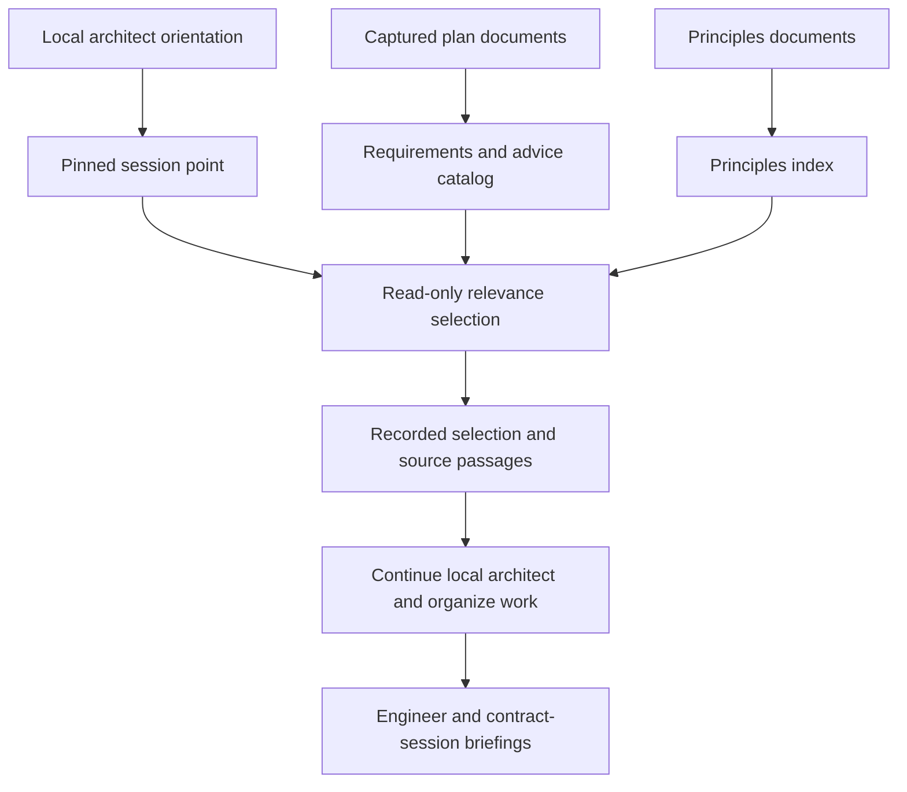

# Plan requirements, advisory items and context selection

**Date:** 2026-09-25. **Status:** analysis recording the direction agreed in
discussion. The mechanisms below need an implementation plan and executable
validation; this document does not establish their availability.

The goal is for ramify-agent to discover the requirements and advice in an
ordinary plan, deliver relevant information to the pi sessions implementing
it, and account for every binding requirement before declaring the plan
done. The plan may span several files, including scenario documents. The
author supplies no special identifiers, applicability annotations or delivery
metadata: discovery, internal identity and delivery belong to ramify-agent.

The agreed context strategy is to orient a local architect first, select
relevant information through read-only forks of that context, and inject the
result before the architect organizes implementation. **Relevance selection
happens once for a work item. There is no mechanism to revisit that selection
as its scope or approach changes.** Reassessing whether requirements are
satisfied after code changes is a separate operation and remains necessary.

The first non-functional implementation uses one coordinator to assess all
non-functional requirements after functional implementation, delegate repairs
to engineers and account for the final results. Where options are roughly
equivalent, choose the simpler mechanism. More elaborate scheduling and
evidence tracking can follow a demonstrated need.

## What exists today

Source inspected in the checkout at `f0d6ac6cb58b85ed1e40a327e852fde8c545de89`.
Existing unrelated documentation edits were present. The evidence below is
source inspection, not a new runtime test.

| Existing mechanism | What it provides and where the proposed work extends it |
| --- | --- |
| [Plan discovery](../../subs/harness/src/plans/discover.ts) and [input capture](../../subs/harness/src/run/inputs.ts) | Read and hash `plans/<id>/plan.md`. A captured set of several plan documents needs additional handling. |
| [Initial analysis](../../subs/harness/src/analysis/submission.ts) and its [procedure](../../subs/harness/src/prompts/initial-analysis.procedure.md) | The initial architect receives the captured plan and identifies entry capabilities, hypotheses and acceptance scenarios. It does not produce a general requirement/advice catalog. |
| [Hypothesis records](../../subs/harness/src/analysis/records.ts) | Forecast capabilities to reuse, create or extract. This is narrower than arbitrary advice in a plan. |
| [Local architect briefing](../../subs/harness/src/work/session.ts) | Carries selected requirement and acceptance references. Heading references render as names; line excerpts are shortened to 160 characters. |
| [Engineer briefing](../../subs/harness/src/work/engineer.ts) | Carries the architect's chosen approach. It has no separate delivery contract for the plan's original advisory items. |
| [Contract requirements](../../subs/harness/src/contracts/records.ts) | Account for consumer/provider agreements and verification. They are not a general list of plan requirements. |
| [Work-item records](../../subs/harness/src/work/records.ts) and [run service](../../subs/harness/src/run/service.ts) | Work originates from entry capabilities, provider obligations, consumer verification or scenario integration. The final gate accounts for tracked scenarios and contract requirements, but not arbitrary structural or quality requirements. |
| [Agent port](../../subs/harness/subs/agent/src/interfaces/port.ts), [pi adapter](../../subs/harness/subs/agent/subs/pi/src/pi-agent.ts) and [review integration](../../subs/harness/src/run/service.ts) | Support pinned forks, context appends without a model call, recorded fork fallback, and durable brief delivery. These are reusable mechanisms; local architect orientation and relevance selection are new workflow steps. |

## One catalog, with requirements and advice distinguished

The initial architect extracts both binding requirements and advisory items
during its existing analysis of the plan. The harness assigns their internal
identities and records their provenance. The catalog retains:

- the original document, captured revision and source passage;
- the interpretation and any uncertainty introduced by extraction;
- whether the item is a requirement or advice;
- the requirement's type, such as functional or non-functional;
- applicability conditions stated by the source or inferred by the architect,
  with that distinction retained.

These are semantic needs, not a finalized schema. An ambiguous statement
keeps its original wording and uncertainty until a consequential decision
requires resolving it. Keywords alone cannot reliably distinguish an
obligation from a suggestion.

For example, "use XYZ to implement mail sending" is an implementation
constraint. "XYZ could be a good fit" is advice. Neither should change force
as it passes through extraction, relevance selection and an engineer brief.
If the local architect adopts the suggestion, its chosen approach is a
separate decision attributable to that architect.

Every binding plan requirement belongs to the set that must be accounted for
at completion. Advice has no satisfaction gate and needs no lifecycle merely
to record that it was ignored. Material choices can retain their rationale
without requiring a disposition for every suggestion.

The catalog is an interpretation with references to its sources. It does not
replace those sources or prove that extraction found every relevant statement.
The captured documents remain available for focused reading.

## Capture plans with several files

The harness needs an internal manifest of the plan's source documents,
including accompanying scenarios, with exact bytes and hashes. Source
references then identify a document and a passage within that captured set.
This avoids having one session read the captured main file while another
reads a changed companion file from the working tree.

Discovery should use the root plan, local references and accompanying plan
material without requiring the author to maintain a manifest. It must
distinguish incorporated requirements from examples and background references:
a link alone does not make every statement in its target binding. The exact
discovery bounds and handling of unavailable references remain to be designed.

Principles documents need comparable indexing and revision capture. Selection
considers their governing scope and status; a filename ending in
`.principles.md` alone does not make a separate project's document or a
historical proposal applicable here.

## Orient, select once, then organize work

The local architect first reads its goal, known requirements, module
documentation, relevant source and available interfaces. This is an explicit
orientation turn: it yields a pinned session point before assigning
implementation work. The initial understanding supplies the relevance
judgment with concrete local context without committing to an approach first.

A selector examines the whole applicable catalog or index, retrieving source
passages where needed. It asks which items could affect the work's design,
implementation, testing or decomposition. Matching only the files currently
expected to change would miss constraints on dependencies and choices that
have not yet been made. Plausibly applicable items retain their conditions
rather than being excluded solely because applicability is uncertain.

Use one fork examining both the plan catalog and the principles material in
v1. Two parallel forks, one per source collection, remain a possible later
optimization if corpus size or measured latency justifies the additional
machinery. The author does not encode this execution choice. No measured
threshold or cost advantage has been established.

Selection produces a context package containing:

- relevant requirements and principles, with original source passages;
- advisory items identified as suggestions;
- concise reasons for relevance;
- conditions, uncertainties and possible conflicts;
- material gaps in what was inspected.

The selector identifies passages and explains relevance. The harness retrieves
the captured text and assembles the package, preserving qualifications in
binding passages. A short summary can introduce the package; it is not the
only representation of a mandatory constraint.

The harness combines selector results, deduplicates references, persists the
package and appends it to the parent context. This does not need another
merging agent. The main architect resolves interactions between the sources
while organizing work. A selection fork has no authority to weaken a
requirement or make an implementation decision for the parent.

**Selection is performed once after orientation for each work item.** It is
not refreshed on later iterations, delegation results or approach changes.
Session reconstruction and failed-append recovery redeliver the recorded
package rather than rerunning relevance selection. A newly created work item
has its own initial orientation and selection; that is not a revisit of its
parent's selection. Ordinary source consultation remains available.

## Delivery continues into implementation

The local architect records which selected items apply to each assignment.
The harness includes the relevant source passages in engineer and contract
session briefings, including fresh sessions continuing the same assignment.
This is normal assignment preparation from the existing selection, not a new
scan of the catalogs.

The delivery must preserve the distinction between the source's requirement,
the source's suggestion and the architect's chosen approach. Otherwise a
tentative suggestion placed in today's `approach` field would read as an
instruction, or a requirement could disappear into an abbreviated summary.
Applicable source material can also inform reviews of that work.

Relevance selection and completion have different responsibilities. An item
not selected for one work item remains in the plan's required set if it is a
binding requirement. A relevance judgment cannot waive it. Advice never enters
that set merely because a selector delivered it.

## Generalize what must be satisfied

Plan requirements become the unit of completion. Capabilities describe some
of the requested behavior; scenarios and other checks provide evidence;
work items organize implementation. A requirement may involve several work
items, and one iteration may satisfy several requirements.

Functional versus non-functional is useful descriptive information, but it
does not uniquely select a verification method:

| Requirement | Possible evidence |
| --- | --- |
| A user can send mail | Acceptance scenarios |
| Mail sending uses XYZ | Inspection of the actual implementation path, supported by tests where useful |
| Response latency stays within a limit under a specified workload | A benchmark with those conditions |
| A responsibility moves to a given module | Structural assertions against current source or sufficient Ramify evidence |
| Existing behavior survives a refactor | Existing scenarios and regression tests, with their coverage limits |

Some non-functional requirements fit Cucumber. Others should use the evidence
appropriate to their meaning. Installing XYZ does not establish that the mail
path uses it. Passing regression tests supports preservation within their
coverage, not complete behavioral equivalence.

Requirements also differ in when they must hold. A target structure can be
assessed at completion. An invariant governing a migration can require
intermediate evidence. A strict implementation choice must influence the
engineer while functional behavior is being written, even if its final
assessment happens later.

## V1: one coordinator for non-functional assessment and repair

The default execution sequence is:

1. Discover requirements and advice, and deliver the selected context to
   implementors before they organize work.
2. Implement functional requirements, satisfying accompanying constraints
   and quality requirements wherever possible.
3. Assign the complete non-functional requirement list to one coordinator,
   including original passages, criteria and available implementation evidence.
4. Let that coordinator use sub-agents to investigate compliance and make
   corrections, grouping and ordering tasks as it sees fit.
5. Reassess every non-functional requirement after corrections and run the
   existing project and functional acceptance checks on the final candidate
   before declaring the plan done.

This is a default schedule. A structural prerequisite or a constraint that
determines feasibility can require action during functional implementation.
The information is delivered early so the architect can make that decision.

The coordinator initially assesses each requirement, delegating investigation
where useful and reusing evidence where it answers the question. It distinguishes
**satisfied**, **not satisfied** and **undetermined**, and cites the candidate
revision, inspected scope, evidence and remaining uncertainty. Related
requirements may share an investigation or repair. An undetermined result
calls for investigation before speculative code changes. Requirements already
satisfied need no implementation task.

Decomposition belongs to the coordinator. It can request a focused engineer
iteration, inspect its result and choose the next task. V1 needs no new
requirement dependency graph, module ownership negotiation, synthetic
capabilities or consumer/provider contracts to represent these corrections.
Tasks carry the relevant requirement passages, the requested outcome and
useful evidence. Engineers return changes, checks and unresolved issues;
finishing a task does not itself satisfy its parent requirements.

### Engineering sessions and the starting module

The one additional Ramify-specific feature for this repair workflow is a
coordinator-selected starting module for an engineering iteration. The
engineer starts in that module's `src/`, with its module context, and may
move elsewhere in the project when the task requires it. The starting module
provides focus; it is not a write boundary for these sessions.

This requires the repair session's instructions and write policy to allow
work across modules. Merely naming a module in the assignment while retaining
the ordinary module write restriction would not implement the proposal.
Project boundaries and existing execution protections still apply. Ordinary
functional engineering sessions are outside this change.

The current session/tool working-directory behavior needs a separate
investigation. This analysis records the intended starting behavior and makes
no finding about whether today's implementation provides it.

### Keep orchestration and completion simple

Use sequential child sessions in v1. The coordinator resumes after each result
and chooses the next investigation or repair. Reuse the harness's session
lifecycle, persistence, recovery, execution limits and single-writer handling;
do not introduce a separate nested scheduler or assume a native pi sub-agent
facility. Parallel investigations and concurrent edits are later optimizations.

Persist a flat result list keyed by the catalog's internally assigned
requirement identities. Each result contains its status, evidence and assessed
candidate revision, with unresolved questions where applicable. The coordinator
owns the semantic judgment; the harness verifies that every non-functional
requirement has a result and prevents completion while any is not satisfied or
undetermined. V1 does not require a second independent assessor.

After a correction batch, reassess all non-functional requirements against the
resulting candidate. Then run the existing final project and functional gates.
A failure returns to the coordinator for correction within the run's limits;
further edits require renewed assessment and checks. Completion requires both
the complete satisfaction results and passing gates for the final candidate.
An agent's semantic assessment remains a judgment; passing a mechanical check
establishes only what that check covers.

A pure refactoring plan can enter assessment immediately because it has no
new functional work. The same coordinator can organize structural changes and
verify preservation requirements, using existing regression checks where
appropriate. It may stage a migration when useful, without requiring the
harness to model a migration protocol in v1.

Corrections can invalidate earlier satisfaction evidence. Assessments bind
the revision and scope they examined. Reassessing the complete list avoids
building selective evidence invalidation in v1. **This is
rechecking satisfaction, not revisiting the context selection.**

Final assessment can establish end-state constraints. A requirement that must
hold throughout a migration also needs evidence from the intermediate states;
the coordinator must arrange that evidence during execution. If it is missing,
the final state alone cannot establish compliance. V1 adds no general harness
mechanism for enforcing temporal invariants.

Missing evidence, exhausted correction limits and unmet requirements remain
explicit. They cannot silently become satisfaction. A recorded plan deviation
must remain distinguishable from meeting the original requirement. Advisory
review and CheckFinding settlement do not substitute for required completion
evidence.

## Efficiency and limits

The initial architect already reads the plan, so catalog extraction can
extend that analysis without a separate model call. Principles indexing can
be shared for the captured source set. Orientation supplies local context to
selection; the main architect then retains the useful passages without the
selector's full reading history.

Forking retains history but does not make it free to process. Two selectors
inherit the orientation twice, and any cache savings depend on actual model
requests. Existing [live review measurements](../plans/12-check-findings/results.md#real-pi-run-2026-09-24)
do not establish a matched fork-versus-fresh saving.

Start with the combined selector. If optimization becomes necessary, compare
it with two parallel selectors, using full-plan reading by local architects
as the baseline. Measure relevant-item recall,
binding requirements missed, suggestions promoted incorrectly, parent-context
size, total token cost, delay before implementation and later repair or human
correction. Smaller prompts alone do not establish greater efficiency.

Catalog omissions remain a discovery limitation; selectors cannot recover an
item they never receive from the catalog without consulting its sources.
Structural validation can verify references and recorded coverage, but cannot
prove complete semantic extraction. One-time selection also accepts that later
implementation discoveries may make additional material relevant; ordinary
source reading and final requirement accounting remain available, without an
automatic selection-refresh mechanism.

## Relationship to earlier analysis and remaining design work

The earlier [refactoring and debugging analysis](2026-09-23-refactoring-and-debugging-plans.md)
proposed a separate refactoring plan kind and sequential composition of plan
kinds. This discussion generalizes the completion model so mixed and purely
structural plans can share a requirement list and execution machinery. Its
structural targets, preservation boundaries and staged transformations remain
useful inputs to the coordinator's reasoning. The v1 coordinator workflow above
replaces the earlier suggestion here to build requirement-originated work and
coordinated dependency machinery as part of the first implementation.

The following details need an implementation design:

- Discovery and capture bounds for plans with several files and principles
  documents, including background material and unavailable references.
- Exact catalog, selection, assignment and assessment records, and their
  links to existing capabilities, scenarios and contract requirements.
- The orientation submission and how incomplete selection is reported and
  recovered without pretending it delivered all applicable information.
- The coordinator's child-assignment/result protocol, reuse of session
  recovery, and engineering equipment for work across modules.
- Accepted evidence for each requirement, bounded investigation/correction,
  and how deviations or unresolved interpretations affect completion.

Requirement dependency graphs, selective evidence invalidation, parallel child
sessions and parallel selectors are deferred. They are not prerequisites for
v1. Investigating current engineer starting directories is separate work.

Revisitable relevance selection is not part of this design.
