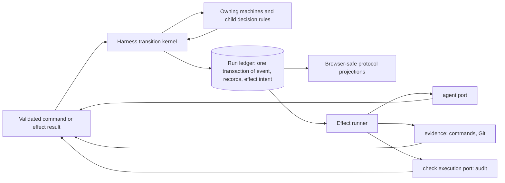

# State machines for ramify-agent's decomposition and implementation workflow

**Date:** 2026-09-26. **Status:** architecture analysis and proposal for review; no library choice has been adopted and no migration or implementation is specified here. Revised the same day after review, adding the boundary rules, the single event vocabulary and the actor-free use of the library.

## Recommendation

Use **XState v5** to define the harness's consequential workflow lifecycles as pure statecharts, driven with its pure `transition` and `initialTransition` functions and never as running actors. Keep the [run ledger](../../subs/harness/src/run/log.ts) as the authority for committed state, records and effect intents. XState supplies explicit states, guards, transitions, machine composition and graph-based path enumeration; it does not become a second durable store, a second event vocabulary or an authority over semantic agent decisions.

The governing rule is:

> A machine decides whether a committed event may follow the committed history and what it changes. The harness composes every affected owner's decision, then commits one ledger transaction. An effect runner performs external work from a committed intent, through the owner that already hides that work, and reports its result as another validated transition.

Three boundary rules follow from the present module structure and are part of the recommendation:

1. **Cross-machine commits are atomic.** One run event can change more than one machine's state, as a carrier event changes CheckFinding standing today. The harness composes all affected owner decisions before one append; it never commits each machine's result separately and never reinterprets a child's state.
2. **Effects stay behind their existing owners.** The harness dispatches durable intents through the agent port, the evidence child and the check execution port. A machine owns policy and lifecycle; those modules keep the execution details.
3. **Public and child contracts stay where they are.** Clients receive harness-owned, browser-safe protocol projections derived from committed state. A child decision rule exposes domain inputs and decisions, not XState snapshots or ledger types.

This is a recommendation about the **resulting architecture**, not an implementation sequence. The [harness principles](../harness.principles.md) continue to govern agent scope, semantic authority, acceptance and repository state. The [autonomous-loop architecture](../architecture/autonomous-implementation-loop.md) describes the global architect, local architect, engineer and harness responsibilities. A statechart should make those handoffs inspectable without replacing the agents' judgment.

## Evidence and present boundary

The project's [package manifest](../../package.json) declares no state machine library. Its control flow is implemented with events, reducers and orchestration code. The [composition recovery table](../../subs/harness/src/tests/helpers/recovery-table.ts) already names ten *conceptual* state machines: the run, initial analysis, placement request, work item, iteration, delegation, gate and repair, context budget, writer, and stop/restart/supersession. Those names are test taxonomy, not ten separately instantiated runtime machines. The table's rows are written by hand against those ten, and each row states its recovery in prose; nothing today derives the rows from a machine definition or proves the set of paths complete.

The [run service](../../subs/harness/src/run/service.ts) performs command admission, agent invocation, scheduling, gate execution, persistence and recovery. Its [`events.jsonl` schema](../../subs/harness/src/run/log.ts) names durable transitions; one flushed ledger line can carry the event and the record bodies it commits. [Run snapshots](../../subs/harness/src/run/snapshot.ts) derive public status and phase from events. [Sessions](../../subs/harness/src/run/sessions.ts), [scenarios](../../subs/harness/subs/scenarios/src/states.ts), [CheckFindings](../../subs/harness/subs/check-findings/src/decide.ts) and [non-functional rounds](../../subs/harness/subs/nonfunctional/src/rounds.ts) already have local transition rules. The [scheduler](../../subs/harness/src/contracts/schedule.ts) selects work from committed items, requirement revisions and provider conformance.

External work is already behind owners the harness does not see through. The [agent port](../../subs/harness/subs/agent/src/interfaces/port.ts) hides which agent runs a session. The [`evidence` child](../../subs/harness/README.md) runs the project's own commands, hashes guarded files and holds the Git service the run branch needs. The [`audit` child](../../subs/harness/subs/audit/src/check-execution.ts) implements the harness's [check execution port](../../subs/harness/src/checks/execution.ts). The harness's [protocol files](../../subs/harness/module.ramify) are exposed to the parent tagged `browser`, and the [root re-exposes them](../../module.ramify) to the web client; nothing else of the harness reaches a browser.

Several properties of this design are worth preserving as constraints on the new architecture:

- The ledger is authoritative; record files and UI views are projections. A transaction is durable before it licenses an agent or closes work. [Run service](../../subs/harness/src/run/service.ts), [ledger](../../subs/harness/subs/ledger/src/ledger.ts).
- External operations cross an intent/completion boundary under an idempotency key. A process restart can re-drive an unfinished effect without pretending that the effect never began. [Ledger effects](../../subs/harness/subs/ledger/src/effects.ts).
- Agent submissions are evidence and proposed decisions. The harness validates them and owns state transitions; agents do not write lifecycle state. [Autonomous-loop architecture](../architecture/autonomous-implementation-loop.md#8-the-harness-remains-the-deterministic-execution-owner).
- One writer may mutate the execution tree. Read-only review attempts can overlap it, but stale results and unsettled writers cannot license a later gate. [Writer ownership](../../subs/harness/src/run/writer.ts), [review architecture](../architecture/check-findings.md#durability-concurrency-and-recovery).
- A passing gate is tied to an audited commit and published evidence; a completed run is not delivery or merge into a destination branch. [Final gate](../../subs/harness/src/run/service.ts), [Plan 7](../plans/07-commit-audit-integration/main-plan.md).
- A CheckFinding change is decided by its child and committed by the harness as one line. The [CheckFinding transaction](../../subs/harness/src/check-findings/transition.ts) asks the child to decide and apply its own events under the run mutex, refuses a partial replay, verifies that the carrier event carries exactly the decided events, and appends the carrier, its records and the CheckFinding record copies together.
- The harness translates run events; a pure child decides its domain rule. The [non-functional phase replay](../../subs/harness/src/run/nonfunctional-phase.ts) rebuilds a `RoundDecisionInput` from committed transactions and hands only that to the [round decision](../../subs/harness/subs/nonfunctional/src/rounds.ts). The child never sees a run event, a ledger entry or a service type.

The earlier [implementation-loop](../implementation-loop.md) and [work-loop](../work-loop.md) documents are useful design history, but their proposed statuses and recovery policies differ from the current run log and service. This proposal uses current source and the later architecture as its baseline. For example, the current protocol has `failed` and `interrupted` run outcomes and an optional initial-analysis review stop. [Job states](../../subs/harness/src/interfaces/protocol/jobs.ts), [run phases](../../subs/harness/src/interfaces/protocol/runs.ts).

## Why XState v5

XState v5 has typed machine setup, nested and parallel states, and pure `initialTransition`/`transition` functions that calculate a next state and its actions without starting an actor or executing effects. Its graph utilities, now shipped at the core package's `xstate/graph` subpath with the separate `@xstate/graph` package deprecated, can enumerate machine paths for review and tests. These are documented in [setup](https://stately.ai/docs/setup), [parallel states](https://stately.ai/docs/parallel-states), [pure transitions](https://stately.ai/docs/transitions#transitioning-state) and [graph utilities](https://stately.ai/docs/graph). The core `xstate` package is enough for this proposal; the web client need not run the durable workflow machine.

[Robot3](https://github.com/matthewp/robot) is a smaller functional finite-state-machine library and a reasonable option for isolated lifecycles. XState is the stronger fit for this harness because the desired result includes hierarchical work, concurrent review activity and machine-derived path analysis. This is an architectural fit judgment, not a performance comparison. No dependency has been installed or benchmarked.

**Actors are not used.** XState's actor model, with `invoke`, `spawn` and persisted actor snapshots, is the part of the library this harness must not adopt. Its documentation says restoration does not rerun completed actions but *does* restart invocations and restore spawned actors recursively. That is unsafe as a recovery rule for a Git commit, audit or agent that may have written files, and it would place effect execution in the library instead of behind the owners named above. [XState persistence](https://stately.ai/docs/persistence). The harness therefore uses machines only through the pure functions: a machine is a typed transition table with hierarchy, guards and a graph. Authoritative state is reconstructed from committed run events every time.

## The target shape

The transition kernel belongs to the **harness**, which is the sole durable writer. Under the run mutex it reads committed state, verifies the command's identity and revision, asks every affected machine or child rule for its decision, and appends the accepted event with its records as one transaction. External effects run outside that critical section, through the owner that already performs that kind of work. Their results return with the invocation, attempt, source revision and candidate identity needed to refuse a stale answer. A committed effect intent remains recoverable even if the process disappears. The existing [`RunService.write`](../../subs/harness/src/run/service.ts) and [CheckFinding transaction](../../subs/harness/src/check-findings/transition.ts) show the serialization boundary this must cover: state read, ID allocation, decision and append, not merely the final write.

### One event vocabulary

The machines consume the run log's own event types. There is no second, machine-specific event vocabulary and no translation layer between the two. A machine definition declares which committed event types move its finite states; every other event type either revises its context or does not concern it. Replaying a log prefix through `transition` from `initialTransition` yields the machine's state; admitting a command means computing the event it would commit, running `transition` against the reconstructed state, and appending only if the machine reports a change or an explicitly declared idempotent repeat.

This mapping settles two things the alternatives would leave open. First, XState's rule that an event with no enabled transition leaves the state unchanged becomes a refusal at the kernel, not a silent no-op, unless the machine names that event as a permitted repeat. Second, the [existing log validation](../../subs/harness/src/run/log.ts) and a machine definition cannot disagree about which sequences are legal without a test catching it, because both are read against the same events. Event schemas stay where they are, in the log; machine definitions add only which states each event enters and leaves.

Records-only events such as an outline revision or a refreshed view are context updates. A machine may accept them as self-transitions that assign context, or ignore them. They must not be promoted to state nodes to make the graph look complete.

### Machine inventory and ownership

| Machine or decision rule | Owner | State it should make explicit | Data and judgment kept outside its finite states |
| --- | --- | --- | --- |
| **Run execution** | `harness` | Analysis, optional review wait, readiness, scenario materialization, work coordination, non-functional phase, final verification, stopping, terminal outcome. | Plan text, capability registry, hypothesis revisions, work graph and check evidence. |
| **Initial analysis** | `harness` | Architect invocation, validated submission, evidence staging, accepted analysis or bounded failure. | The architect's capability and scenario judgments; their structured records. |
| **Placement request** | `harness` | Request, current-view preparation, fork, partial retry, decision acceptance, keyed brief append, delivery to requester. | Capability identity and placement judgment, owned by the global architect. |
| **Work item** | `harness` | Ready, local orientation and planning, active iteration, yielded for provider, resumed for verification, completion gate, completed or refused. One instance is keyed by work-item ID. | Goal, owner, outline, dependencies and requirement revisions. The depth-first [frontier rule](../../subs/harness/src/contracts/schedule.ts) remains a deterministic policy over those records. |
| **Delegation/requirement** | `harness` | Contract request, agreement registered, provider pending, provider conformed at a revision, consumer verification due, verified; revised evidence reopens the obligation. | Contract terms, conformance tests and agent ownership decisions. The latest revision is part of identity, not a state name. |
| **Iteration** | `harness` | Assigned, writer awaited, engineer or contract sub-session active, writer settling, gate due, architect assessment, closed or follow-up assigned. | Assignment content, write scope, changed files and semantic assessment. |
| **Gate attempt** | `harness` | Prepared, commit intent, commit known, audit in progress, result recorded, passed/failed/not verified. A recovery path identifies whether a commit already exists by its attempt identity. | Check policy, command outputs, Git objects and audit evidence. The `evidence` child performs commands and Git; the `audit` child performs check execution; both stay behind their ports. |
| **Session/invocation and writer** | `harness` | Session `live`/`suspended`/`finished`; invocation active/stopping/settled, with the ended reason including `context-budget-reached`; writer free/held/unsettled. | Transcripts, token measurements and process observations. The writer's state fences launches and gates. |
| **Review request** | `harness` | Queued, attempt running, complete/partial/not verified, settled or retry due. Instances may be concurrent readers. | Review judgment and CheckFinding reports. |
| **Non-functional round** | `harness/nonfunctional` for pure round rules; `harness` for effects | Candidate prepared, initial assessment, investigation when evidence is undetermined, repair, reassessment, round closure or unavailable. | NFR text and evidence, candidate tree, agent conclusions and bounded policy. [Current decision rule](../../subs/harness/subs/nonfunctional/src/rounds.ts). |
| **CheckFinding standing** | `harness/check-findings` for identity, provenance and disposition rules; `harness` for the carrier commit | Disposition standing of one finding, as the child's [decision rule](../../subs/harness/subs/check-findings/src/decide.ts) already states it. | Report validation, semantic match and evidence, which remain domain functions. |

Two of the recovery table's ten machines are deliberately **not** rows. The **context budget and compaction** taxonomy is a bound on the invocation machine and an effect within a session: the budget is policy, compaction is an observation-fed effect, and reaching the budget is one ended reason of an invocation. It has no lifecycle of its own. **Stop, restart and supersession** are cross-cutting: stopping is a state of run execution, restart is the recovery rule applied on load, and supersession is the basis check that refuses a stale result at the kernel. They are expressed as guards and recovery entries on the machines they interrupt, not as an eleventh machine. The recovery table should keep its ten labels for test composition; the machine set need not mirror them one to one.

These are **logical machine boundaries**, not a request for a new Ramify module per row. A machine that owns only state logic can remain an internal file of its existing owner. The `harness` composes the lifecycles because it owns the run and all durable transitions; `harness/ledger` remains domain-neutral. Pure domain children keep the rules that govern their meaning, and a child exposes domain inputs and decisions only: the harness translates committed events into the child's input, as the [non-functional phase](../../subs/harness/src/run/nonfunctional-phase.ts) does now, and a child never imports a ledger type, a run event or a machine snapshot. This follows the current [module responsibilities](../../subs/harness/README.md) and [contract authority principle](../../../docs/agents/module-architect.principles.md#contracts-follow-responsibility).

The small [scenario reducer](../../subs/harness/subs/scenarios/src/states.ts) already expresses its four states and allowed edges clearly. XState is useful there only if sharing the machine graph or transition tooling produces a concrete benefit. Do not turn every enum or record revision into a state node.

### Run and work coordination

The run machine should state the *control phase*; work-item instances should state the *local lifecycle*. A dynamic graph of work items, provider obligations and requirement revisions belongs in context and committed records. It should not be expanded into one enormous run-state Cartesian product. The scheduler chooses the next runnable item from that graph, then the run machine authorizes its start. A work item can yield while a provider item becomes active; when conformance at the current revision is committed, the consumer becomes eligible for verification. [Current scheduling rule](../../subs/harness/src/contracts/schedule.ts).

One possible **run execution** statechart is below. The labels describe committed outcomes, not direct calls to Git or an agent. `stopping` and the four terminal outcomes are available from the applicable active states; the diagram omits their repeated incoming edges for readability. The review wait is optional, and an empty fixed non-functional catalog can advance without assessment work.

```mermaid
stateDiagram-v2
    [*] --> analysis
    analysis --> awaitingReview: analysis accepted; review requested
    analysis --> readiness: analysis accepted; no review stop
    awaitingReview --> readiness: analysis approved
    readiness --> materialization: readiness passed
    materialization --> working: scenarios materialized
    working --> nonfunctional: all work items completed
    nonfunctional --> finalVerification: assessment settled
    finalVerification --> completed: final gate passed with evidence
    completed --> [*]
```

The diagram names `materialization` and `nonfunctional` as states. The public [run phase](../../subs/harness/src/interfaces/protocol/runs.ts) enumeration has neither today; it reports `working` across both. Adopting this machine as the phase projection would extend that browser-exposed enumeration, which is a protocol change to record, not a side effect.

The **placement request** is a separate instance because it can retry a partial fork without rewinding the run or another work item. Its statechart should expose `requested → evidence-current → fork-running → decision-accepted → brief-append-pending → delivered`, plus bounded partial, unavailable and superseded outcomes. The `decision-accepted` event does not itself mean the requester received the brief. [Current placement and delivery events](../../subs/harness/src/run/log.ts).

Delegation shows how the machines compose. A consumer work item records `work-item-yielded` with the requirement IDs it awaits. A contract registration commits a provider obligation and its revision; the scheduler selects its provider work item. After a provider gate establishes `provider-conformed` at that revision, the consumer can record `work-item-resumed`. Only its verification iteration can commit `requirement-verified`. The requirement machine therefore distinguishes *provider conformed* from *consumer verified*, and a contract revision reopens the latter at the new revision. [Current event contracts](../../subs/harness/src/run/log.ts), [scheduler](../../subs/harness/src/contracts/schedule.ts).

The run must guard final completion with **all** of the following committed facts: every required work item completed, every current requirement verified, tracked scenarios implemented, a passing full final gate, and candidate-bound audit evidence for the assessed tree. An empty queue alone does not imply success. [Current final gate](../../subs/harness/src/run/service.ts), [acceptance-scenario architecture](../architecture/acceptance-scenarios.md#11-the-final-gate).

Analysis approval and a person's CheckFinding command on a plan deviation can be recorded after operational completion today. The proposed architecture therefore makes *run execution* terminal while treating these later human decisions as separate, durable decision lifecycles attached to the run. It does not reopen a completed execution state merely to record a review. [Terminal-event exception](../../subs/harness/src/run/log.ts).

### Atomic cross-machine commits

One committed event can move more than one machine. A gate attempt's result moves the gate machine, may close an iteration, may conform a provider requirement and may carry CheckFinding events. The kernel therefore composes decisions before it appends:

1. Reconstruct each affected machine's state from the committed prefix, under the run mutex.
2. Ask each owning machine or child rule for its decision on the candidate event. A child that owns its own event stream, as CheckFindings does, decides and applies its own events; the kernel does not reinterpret that state.
3. Refuse the whole command if any owner refuses, if any child reports a partial replay, or if the carrier does not carry exactly what the children decided.
4. Append one transaction: the event, its records and every co-committed record copy.

This is the present [CheckFinding transaction](../../subs/harness/src/check-findings/transition.ts) generalized to more than one owner. A generic kernel that committed each machine's result as its own line would let a crash leave the gate closed and the iteration open, which the ledger's one-line rule exists to prevent.

### Transition vocabulary and control surface

Use five distinct concepts in the machine contracts:

| Concept | Meaning |
| --- | --- |
| **Command** | An authenticated request to attempt a transition, with command ID, expected version and applicable evidence basis. It may be refused without changing state. |
| **Committed event** | The durable fact that a validated transition occurred, with identities and record bodies in the ledger transaction. It is a run log event type; replaying it reconstructs machine state. |
| **Effect intent/result** | A durable request to perform an external action under an idempotency key, followed by its observed outcome. The outcome is another transition input. |
| **Observation** | Diagnostic activity, transcript, usage or a coverage gap. It can inform a later decision but does not itself advance workflow state. |
| **Projection** | A read-only answer for clients: phase, waiting reason, current owner/attempt, available domain commands, rejected-command reason, evidence and coverage. It never writes. |

A projection is a harness-owned protocol type, exposed tagged `browser` and re-exposed by the root as the [existing protocol files](../../subs/harness/module.ramify) are. It is derived from committed state, never from a machine snapshot, and it carries no XState type, ledger type or machine definition. The web client learns which domain commands the harness would currently accept and why the last one was refused; it does not learn the machine.

The machine model should make each legitimate wait visible: person reviewing analysis, provider conformance, architect fork, writer settlement, audit publication, review completion and missing evidence are different reasons. A client may offer **domain commands** the harness currently authorizes, rather than a generic `forceTransition`. An absent or invalid event must produce an explicit refusal or corruption result. XState normally leaves a machine unchanged when no transition is enabled, so the kernel must distinguish a deliberate no-op or idempotent repeat from a forbidden command, as the single event vocabulary above requires. [XState transitions](https://stately.ai/docs/transitions).

XState guards should be synchronous and pure, as its [guard guidance](https://stately.ai/docs/guards) requires. A guard reads authenticated, committed facts passed into the decision. Source reads, Git calls, agents and audits happen outside it, through the agent port, the evidence child and the check execution port; their results return as validated events with a captured basis. Named actions produced by a pure transition describe records or effect intents. They do not directly perform I/O before the ledger append. A transition whose XState internals take several microsteps commits one stable domain outcome; externally important milestones receive their own durable events. Transient `always` states are not emitted to subscribers, so they must not stand in for audit or publication boundaries. [XState eventless transitions](https://stately.ai/docs/eventless-transitions).

### Durability, concurrency and recovery

The run log remains one authoritative sequence. Each machine instance derives its state from the relevant committed events, keyed by run, work-item, requirement revision, gate or invocation identity. An optional cached machine state is a projection with a last-applied sequence, never a competing source of truth. Machine definitions and event interpretation need explicit versions so a later definition cannot silently reinterpret an older log. IDs, time and other nondeterministic facts enter through committed event data, not calls made while replaying a transition. Corrupt or unsupported histories are reported as unavailable with evidence rather than treated as an empty run. [Existing run-log validation](../../subs/harness/src/run/log.ts), [ledger reader](../../subs/harness/subs/ledger/src/ledger.ts).

Only the harness commits an application transition. It validates the captured basis again under the run mutex when an asynchronous result arrives; results from superseded invocations or outdated candidate trees cannot advance work. The one-writer rule is a resource invariant across machines, while review readers may run concurrently. Nothing in the library replaces the project lock, run mutex, process settlement or idempotency key. [Writer rules](../architecture/autonomous-implementation-loop.md#execution-readiness-and-writer-ownership), [review concurrency](../architecture/check-findings.md#durability-concurrency-and-recovery).

On restart, the harness replays the ledger, materializes missing record copies, identifies unfinished effect intents, and applies the recovery rule for the phase and attempt found. Recovery itself records a transition. The current code deliberately interrupts most unfinished runs but can continue the marked non-functional phase after validating its ledger prefix, inputs, writer releases and candidate tree. That distinction should be explicit in the machine definitions, not inferred from a live process. [Current recovery](../../subs/harness/src/run/service.ts), [non-functional replay](../../subs/harness/src/run/nonfunctional-phase.ts).

The architecture is successful when a reviewer can answer from the machine definitions and committed evidence: **what state is this work in, what event may move it, who may provide that event, what evidence must it name, which external effect is outstanding, and what happens if the process stops now?** Replaying one log prefix must yield the same state and available actions every time. A stale result, unverified check, missing record or unresolved writer must have an explicit refused, unavailable or blocked outcome; none may silently become success. These are design criteria for the target model, not claims of current test coverage.

## Architectural alternatives

| Alternative | Judgment |
| --- | --- |
| **Keep the present reducers and service flow** | Preserves a working ledger and avoids a second modeling language. Its concrete cost is that the consequential run and handoff states are distributed through a large service and several projections, and the recovery table that reasons across them is written by hand, so no tool can say whether its rows cover every path. The strongest case for a machine library here is path enumeration against that table. |
| **Use XState for the durable decision model, ledger for authority** | **Recommended.** Gives explicit statecharts and path analysis while retaining transaction, identity and recovery contracts. Requires a disciplined kernel between pure machine decisions and committed effects, and the three boundary rules above. |
| **Persist XState actor snapshots as the run authority** | Rejected for this harness: restoration can restart invocations, and a snapshot alone cannot prove whether a Git commit, agent write or audit publication completed. It would also create a second authority beside `events.jsonl`. [XState persistence](https://stately.ai/docs/persistence). |
| **A separate `state-machines` Ramify module** | Rejected. No independently owned responsibility would be hidden by it; it would move coordination knowledge out of the harness without reducing it, and it would need the harness's event vocabulary to do anything, inverting the dependency. Machines stay as internal files of their owners. |
| **Use Robot3 for the whole workflow** | Smaller API, but less aligned with the desired hierarchical and concurrent workflow analysis. It remains plausible for small isolated machines. [Robot3 project](https://github.com/matthewp/robot). |

## What this proposal deliberately leaves for a later decision

This document does not define a file-by-file migration, compatibility period, implementation iterations, dependency pin, new public pause/resume commands or a new delivery/merge workflow. It also does not assert that drawing a statechart makes an agent's semantic judgment deterministic. The architecture choice to review is **XState v5 as the workflow model with the run ledger as authority**, using owner-local machines through the pure transition functions, one event vocabulary shared with the log, an explicit durable effect boundary behind the existing owners, and the three boundary rules.

The first questions an implementation plan must answer are, in order: which existing event types each machine declares as moving its states and which it treats as context; how the kernel generalizes the CheckFinding transaction to compose several owners in one append; and whether the run phase enumeration gains the two states the run machine names. Each is a contract review, not a coding choice.

No code was changed and no runtime test was run for this analysis. The source references establish present behavior; the XState and Robot3 references establish library capabilities. The proposed machine decomposition, boundary rules and fit judgment remain to be accepted before an implementation plan is written.
