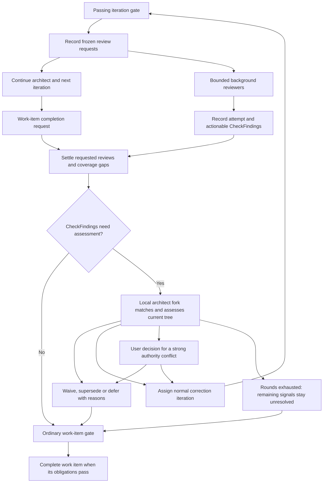

# CheckFindings in ramify-agent

**Status:** Proposed architecture. **Date:** 2026-09-24.

This document applies the [CheckFinding principles](../check-findings.principles.md)
to the existing application. It specifies ownership, records and integration
contracts for implementation planning. It does not declare the feature
implemented or change the authority of existing gates, scenarios or contracts.

## Answer

Add one **`harness/check-findings` child** that implements the rules for identifying
an issue, retaining its observations and judgments, validating dispositions,
and deriving what still needs attention. Keep it pure: callers supply evidence
and receive proposed transitions or query results. It owns its domain
contracts and has no filesystem, agent, Git, HTTP or scheduling dependencies.

The **harness remains the application coordinator**. It starts checks and
reviews, binds their outputs to trusted evidence, obtains architect decisions,
assigns repairs, enforces authority and commits transitions through the
existing ledger. Reviewers report concerns; a fork of the responsible local
architect assesses them when the work item has CheckFindings; ordinary engineer
iterations perform repairs. A CheckFinding never changes a gate verdict.

Under the principles, a CheckFinding is a **risk signal**: objective when a
check observed it, subjective when an agent judged it, with a risk level and
a credibility derived from the provenance of what grounds it. The system
spends on a signal in proportion to both. No signal is skipped: the local
architect gives every signal of its work item at least a little attention,
and every subjective signal is waivable.

The **ledger remains the only persistence mechanism**, and **web remains a
client of the harness's protocol**. Ramify supplies its existing project
checks and generated views. It knows nothing of this CheckFinding lifecycle,
review scheduling or harness authority.

## Request

Design the CheckFinding architecture for the use cases already identified:
parallel iteration code, scope and design/principles reviews; conditional
assessment at module work-item completion; check failures and focused flaky
test investigation; and later sealed-file justifications and broader gap or
delivery reviews. The question combines discovery and placement. The current
consumer and composition point is `ramify-agent/harness`.

The design must keep the expected clean iteration inexpensive: background
review runs alongside subsequent work, a clean review creates no CheckFinding, and
an empty actionable CheckFinding set requires no additional architect assessment.
It must also support a factual failure and a disputed agent judgment without
pretending they have the same resolution rule.

## Evidence

The following are existing capabilities; later sections are proposals.

- The [harness](../../subs/harness/README.md) owns run state, orchestration and
  its public protocol. Its [run service](../../subs/harness/src/run/service.ts)
  already composes agents, gates and work-item completion.
- [RunLog](../../subs/harness/src/run/log.ts) reads its authoritative history
  from the [ledger](../../subs/harness/subs/ledger/src/ledger.ts). A ledger
  transaction contains an event and record bodies, which can be materialized
  again after a crash. The run service's `write` constructs the event under
  the run mutex; this existing serialization should serve CheckFinding commits.
- The run service currently holds one `run.session` and `run.invocationDone`
  for active invocation shutdown. That is insufficient for simultaneous
  background reviewers even though appends are serialized.
- [Gate attempts](../../subs/harness/src/checks/records.ts) and
  [gate policy](../../subs/harness/src/checks/gate.ts) already record results
  and choose repair or recovery. The
  [accepted source query](../../subs/harness/src/checks/accepted.ts) advances
  from passing committing checkpoints; that does not establish semantic
  review completion.
- The [agent port](../../subs/harness/subs/agent/src/interfaces/port.ts)
  supports tools, structured submissions, pinned session forks, per-session
  working directories and post-mutation callbacks. These enable review
  composition but do not implement a review scheduler or enforce snapshot
  reads on their own.
- The [scenarios child](../../subs/harness/subs/scenarios/README.md) provides
  a local example of a pure domain module used by several stages of the
  harness. The [evidence child](../../subs/harness/subs/evidence/README.md)
  obtains project facts; the [audit child](../../subs/harness/subs/audit/README.md)
  implements check execution over commits. Neither owns CheckFinding disposition.

## Ownership and modular boundaries

```text
ramify-agent
├── harness
│   ├── CheckFindings       NEW: issue identity, evidence and disposition rules
│   ├── agent          existing: session execution port
│   │   └── pi         existing: pi adapter and session implementation
│   ├── evidence       existing: project facts, snapshots and command execution
│   ├── audit          existing: execution of the harness's verified check plan
│   ├── ledger         existing: durable append, projections and effect recovery
│   └── scenarios      existing: acceptance-scenario semantics
└── web                existing: presentation and commands over the protocol
```

| Responsibility | Owner | Boundary |
| --- | --- | --- |
| CheckFinding identity, report history, disposition validation and current view | `harness/check-findings` | Pure data in, transitions or views out. No agent calls or durable writes. |
| Review requests, queue, deadlines, snapshot selection and work-item closure | Harness, initially `src/reviews/` | Coordinates existing owners; does not reimplement CheckFinding lifecycle. |
| Translation from check/review/seal output into CheckFinding evidence | Harness, beside each producer integration | Knows the producer's actual selection, result and source. Only trusted execution code can attest a factual rerun. |
| Who can decide, what a repair may change, and when a user is needed | Harness work and command handling | Validates the actor against the current assignment and governing records. Agents supply semantic judgments. |
| CheckFinding transitions and review records on disk | Existing ledger, called by harness | One run log; materialized records and indexes are rebuildable projections. |
| Source snapshots, diffs and hashes | Existing evidence owner, composed by harness | Supplies immutable review inputs. Does not interpret their semantic quality. |
| Public query/command contracts | Harness `src/interfaces/protocol/` | Browser-safe projections owned with the behavior serving them. |
| Display, filters and optional inspection | Web | Consumes projections; does not resolve CheckFindings locally. |

This split keeps knowledge about issue continuity and valid resolutions in
one place. The harness need not understand the reducer or repeat its rules in
every producer, projection and recovery path. Conversely, the CheckFinding child
need not understand capability decomposition, iteration scheduling, pi or
repository worktrees. The harness joins those responsibilities through small
contracts.

The child has no sibling imports. Its inputs use opaque attempt, evidence,
source and responsible-work references whose meaning and authenticity the
harness establishes. It does not import `Run`, `GateAttempt`,
`IterationAssignment`, Cucumber messages or Ramify diagnostics. Producer
adapters translate those existing records into the child's own vocabulary;
the original records remain the detailed evidence.

### Alternatives

**Keep everything in harness folders** is the strongest alternative, and was
reasonable for the earlier single-pilot discussion. It avoids a module
boundary. The now-explicit common rules—multiple independent reporters,
judgment supersession, factual verification, deferral, reopening and later
sealed-save assessment—form a coherent responsibility that would otherwise
be shared by producer ingestion, work-item completion and queries. A small
pure child is warranted by those invariants, not by the number of callers.

**Put reviews and CheckFindings together in a large new child** would hide more
files but require the child to know the harness's assignments, sessions,
writer ownership, gate progression and repair scheduling. That moves the
control loop across a boundary without reducing what must be understood
together. Keep review orchestration in the harness initially.

**Put CheckFindings in evidence, audit or ledger** would mix project observation,
commit verification or generic persistence with agent judgments and work
dispositions. **A project-level sibling or shared schema module** adds no
independent authority. None is recommended.

## Three records with distinct meanings

A **check attempt** remains the producer's execution record: what ran, on
which source and selection, and what happened. Existing gate and scenario
records retain that responsibility. Do not create CheckFindings for every log
line, successful check or ordinary transient diagnostic.

A **review attempt** records one review question applied to frozen inputs,
including an empty valid result or a coverage gap. Its lifecycle is separate
from any issues it reports. A review can succeed with no CheckFindings; a failed
review can provide no usable judgment.

A **CheckFinding** identifies an issue that needs continued attention or a
disposition. Its reports are immutable observations plus attributed judgments.
Its decisions explain what the system chose to do. The current view is
derived from that history.

The harness already uses the word finding for something else: `HookFinding`
and `FindingsSeen` in `hooks/post-write.ts` and the engineer submission gate's
`openFindings` carry Ramify diagnostics to the engineer. Those remain check
attempt evidence on their existing path. They are not CheckFindings unless a
producer adapter promotes one, and every CheckFinding identifier in this
document and its implementation keeps the `CheckFinding` prefix so the two
vocabularies cannot be confused.

### Minimum CheckFinding contract

These are semantic fields, not a final TypeScript schema.

| Field | Meaning |
| --- | --- |
| `id`, `revision` | Run-local issue identity and revision used to reject stale decisions. A cross-run reference includes the run ID. |
| `owner` | One responsible work reference, ordinarily the originating module work item. A run-level owner accommodates initial-plan and future final reviews. It identifies responsibility, not a live session. |
| `reports` | Producer, attempt/report key, source identity, evidence references and observed result; any interpretation includes the agent, rationale and uncertainty. Large bodies stay in evidence artifacts. |
| `verification` | Whether a claimed resolution needs producer check evidence or an agent assessment. Chosen by the trusted producer integration, not by the reporting agent. |
| `decisions` | Actor, considered CheckFinding revision, source/evidence, action, rationale and links to repair work or a superseding assessment. |
| `relations` | Explicit, justified links such as duplicate-of or follows-from. File overlap is not issue identity. |
| `risk` | High, medium or low: the harm if the concern is real. The reporter proposes it; the assessing architect may correct it, and the correction is a recorded decision. |
| `ground`, `credibility` | What grounds the signal, named by the reporter as a reference the harness can classify: a principles document, the original plan, a frozen scenario, an approved requirement, an agent's test or documentation, or nothing. Credibility is derived by the harness from that provenance and from whether an objective signal was reproduced; a reporter cannot declare it. |
| `modules` | The modules the evidence concerns, derived by the harness from the report's locations on the report's own source tree, or the owner work item's module when no location falls inside a module. Used for presentation and for waive authority, never for identity. |

The child receives immutable source references and compares them for identity;
the harness retains the concrete commit/tree, document revision or file/hash
manifest behind them. A dirty sealed-file edit has a captured file identity,
not an invented commit identity. Initial plan reviews can reference a captured
analysis artifact before any implementation commit exists. Evidence scoped to
one file or document must not be presented as whole-project evidence.

A report can mix fact and judgment. For example, “this sealed file changed
from A to B” is observed, while “that change is warranted” is the engineer's
judgment. The CheckFinding's question is whether to retain the exception, so its
disposition uses an assessment. A failing test's existence is also observed,
but a claim that the failure is fixed requires execution evidence. Superseding
a causal judgment about that failure does not erase the failed execution.

### Identity and promotion

Recognition has three steps, each answering a different question:

1. **Was this exact report already delivered?** The ingestion key is the
   producer, attempt and report key. Retrying that submission is idempotent.
   The same key with different content is rejected. This prevents a replayed
   callback or crash recovery from creating a second CheckFinding.
2. **Did this producer identify the same obligation again?** A trusted
   producer may supply a stable issue key within one owner and verification
   scope: for example, test identity plus unchanged assertion/obligation
   version, or a structural rule plus the same affected symbol and rule
   version. The harness validates that key against the producer's real
   output. If it names exactly one existing CheckFinding, append a new report to
   that CheckFinding, including when the CheckFinding was previously closed and the
   new evidence requires reassessment. A changed obligation gets a new key
   and an explicit relation to the earlier CheckFinding. An ambiguous key is not
   silently resolved by an arbitrary first match.
3. **Could two judgments describe the same concern?** Record a new CheckFinding
   provisionally when the producer has no reliable issue key. A reviewer may
   suggest an existing CheckFinding and explain why, but this is only a hint:
   parallel reviewers may not have seen each other's reports. The **local
   architect is the matching agent** at the work-item reconciliation step.
   It sees the collected CheckFindings together, confirms a same-issue relation
   or keeps the concerns separate, and records the reason. Linked CheckFindings
   can be presented as one assessment group while retaining both original
   IDs, reports and verification obligations. A reasonable match is enough:
   matching subjective signals is a judgment, and it must not cost more than
   the signals are worth.

Agent prose, line numbers, similar wording and file overlap alone never
merge CheckFindings. Two reviewers can report the same defect concurrently, before
either has seen the other's CheckFinding; the batch assessment handles that case
without inserting another synchronous reviewer turn. Likewise, two concerns
about one file can remain separate: a behavior bug and a simplification
suggestion may need different decisions. A same-issue relation cannot let a
subjective review close an unrelated factual failure.

The CheckFinding index used for steps 1 and 2 is derived from run-log events.
It is a projection, not another mutable authority. Matching always uses the
current accepted records under the run's serialized transition, so two
concurrent review callbacks cannot both allocate the same issue identity.
The [disposition rules](#disposition-rules) decide whether a fresh report
reopens a closed issue; a repeated report never reopens a waiver.

### The architect's semantic match

The harness gives a fork of the local architect one bounded packet at
reconciliation:
all CheckFindings reported for this work item, relevant earlier CheckFindings for the
same work item (including closed and deferred ones), their original claims and
evidence, the assignments and requirements they cite, and the current source
candidate. It can retrieve a referenced diff or report body when summaries
are insufficient. When the set is large, deterministic owner and reference
filters offer candidate pairs, but the architect may inspect beyond those
pairs; filtering is not a negative identity verdict.

For each plausible pair of judgmental CheckFindings, the architect decides
whether they describe the **same underlying behavior or violated obligation**.
It must cite the shared behavior, expected outcome and evidence that supports
the match. A common file, similar wording or one possible code fix is
insufficient. It distinguishes `same-issue`, `related-but-distinct`,
`distinct` and `uncertain`. Unmatched CheckFindings remain separate by default;
uncertainty is recorded when there was a plausible match to examine.

The architect fork submits these match decisions with its ordinary CheckFinding
dispositions and next work-item action in **one assessment**, so the matching
step does not add a separate agent call. A same-issue decision names the
earlier CheckFinding as the group's canonical ID and links the new one to it. The
new report and its ID stay in the durable history. The group can share one
repair assignment, but each factual verification obligation remains visible
and must be satisfied independently. A related-but-distinct decision keeps
separate dispositions even if one repair happens to address both concerns.

A match entry names the two CheckFinding IDs and captured revisions, relation,
shared behavior or obligation, evidence references and rationale. The harness
commits the accepted relation with the assessment; the reducer derives the
group from those records. The architect need not emit a `distinct` entry for
every unrelated pair.

For example, code and scope reviewers may both report that the same new
default violates one requirement; the architect can link them. A code
reviewer reporting a bad default and a design reviewer reporting duplicated
configuration may cite the same file but remain distinct. If two test runs
fail the same unchanged test obligation, the producer key joins their
reports without asking the architect to rediscover that execution identity.

The harness checks that the named IDs exist in the captured work-item set,
that the assessment uses current CheckFinding revisions, and that the link creates
no cycle or cross-owner transfer. It records the architect's semantic reason
as a judgment; it cannot mechanically prove that the issues are equivalent.
If a proposed match crosses work-item ownership, the architect responsible
for their common coordination scope decides the relation and owner before
one repair is scheduled for both. That may be the global architect when no
local architect holds the common scope. It does not require another matcher
role.

The matching fork is the reconciliation fork described under
[Reusing agent context](#reusing-agent-context). The harness gives it only
this work item's assessment authority, validates its structured submission
and records its decisions. The read-only scope-review fork has no such
authority.

Promote actionable review concerns immediately because they must survive to
work-item reconciliation. Promote a factual result when it needs continuity,
focused investigation or an explicit disposition. Ordinary immediate repair
may remain entirely on its existing gate-attempt path. Promote every saved
sealed exception when that later producer is implemented. An unavailable
review is recorded on its attempt, rather than invented as a source defect.

## Disposition rules

Use three derived standings: **open**, **deferred**, and **closed**. The reason
for that standing is always visible; “closed” alone is never a quality claim.
Repair scheduling and user attention are decisions, not additional competing
lifecycle machines.

| Action | Result and required evidence |
| --- | --- |
| Plan a repair | Remains open; link the responsible correction assignment or durable pending assignment intent. |
| Report a repair | Remains open until fixed; link what the engineer changed and the candidate it claims repaired. |
| Fix | Closed as fixed, with a check rerun or a fresh assessment appropriate to the producer's verification rule. |
| Supersede a judgment | Closed or narrowed with an explicit replacement assessment and rationale. Cannot cancel a required factual verification obligation. |
| Waive | Closed as waived, with the actor, the accepted risk and the reason. Does not claim a repair or change a gate result. Refused for a required check. |
| Revoke a waiver | Open again at a new revision. The user can revoke any waiver; an agent only its own or a lower authority's. |
| Defer | Deferred with a responsible owner, reason and revisit condition or follow-up reference. Does not claim fixed. |
| Correct the risk level | The assessing architect may raise or lower the reporter's level; the correction is recorded with its reason. |
| Request a user decision | Remains open; cite the exact conflict and current alternatives. Only the architect's judgment of an authority conflict requests one; the risk level orders attention and never escalates by itself. |
| Reopen | Open at a new revision when matching evidence contradicts a fix, a supersession or a deferral. Never applies to a waiver. Preserve earlier decisions. |

Waiving is a settlement. The user can waive any subjective signal; an agent
can waive one when it has authority over every module the signal concerns:
the local architect for its own module, the global architect for the
project. A fresh report of the same issue joins a waived CheckFinding as
evidence and does not reopen it; only an explicit revocation does. Conversely,
mere absence from a later report cannot close an existing CheckFinding.

The harness validates that the actor can make the decision. The CheckFinding child
validates the transition, expected revision and evidence requirements using
the authority and evidence references supplied by that trusted caller. It
does not parse prose to decide whether a human must approve something.
Agents cannot submit their own trusted check-result or authority attestations.

The boundary carries more than an opaque `passed` flag. For a check-based
resolution, the trusted input names the producer, subject/obligation key,
candidate source, executed coverage, outcome and original evidence reference.
The child rejects mismatched obligations, insufficient coverage and
not-verified outcomes. For an assessment, it receives the bound actor, current
source, specific reports being reassessed, reasoning and supporting evidence.
The harness authenticates those references and preserves their concrete
records. An authorized revision of a test obligation is recorded as that
decision, with the old and new obligation references; it never masquerades as
verification of the old assertion.

Strong contradictions with explicit requirements, principles or protected
obligations follow the existing authority boundary. Weak tensions can be
resolved automatically and reported as material choices when appropriate.
Required checks remain governed by their own policy even if a related CheckFinding
is deferred or waived. The simplest initial rule permits deferral and waiving
only when they do not evade a required obligation or reserved approval.

### Plan deviations

A plan deviation is the one CheckFinding that holds nothing. When a local
architect answers that its request cannot be met as stated, the global
architect answers the unresolved request: a placement decision, a plan
deviation, or that nothing of the plan remains worth doing, which fails the
run. A deviation records the requirement as written at its plan lines, what
the run does instead, why, the alternatives rejected and what the person
loses. The plan file is never changed; the deviation is a durable record
beside it that binds the rest of the run. Local architects receive it with
the requirement it changes, and scope reviews judge the work against the plan
as it amends it. A deviation may reword a pending scenario, and the harness
renders that scenario's feature file from it.

Its CheckFinding is the run's, high risk and agent-generated, located at the
plan lines, and it awaits the user's decision from the start. Unlike every
other open CheckFinding it holds neither its work item's completion nor the
final gate: the work item that asked goes on under it, and a run that
recorded any completes with them to review, never plainly. The user accepts
a deviation by waiving it or answering `accept`, and rejects it by answering
`reject` with the requirement a follow-up run must meet; both remain
possible after the run ends. Past the run's limit of deviations, five by
default, a further one holds the work item that asked until the user
decides, and a rejection there fails the run.

### Environment problems

The global architect may also answer an unresolved request with an
environment problem: the conflict lies in how the gate or the harness runs,
not in the plan or the architecture. Its CheckFinding is the run's, high
risk and agent-generated, with the diagnosis as its rationale and the
operator's suggested change as its remedy. It awaits the operator from the
start and holds the work item that asked. The operator resumes the run by
answering `resume` or waiving it, which closes it as waived and returns the
work item to its local architect with the diagnosis; answering `end` fails
the run. Nothing is placed and no deviation is recorded.

## Application flow



### Review requests and execution

For each eligible passing iteration, record enabled code, scope and design
review requests before the driver advances past the iteration. A request
captures the assignment reference, iteration base, audited candidate and tree,
gate, selected requirement and guidance revisions, review kind, prompt/policy
version, and intended session fork point. Recovery must derive missing
requests idempotently from passed iterations; a crash between gate recording
and scheduling must not silently omit review.

Use one reviewer role with kind-specific inputs and structured output. The
reviewer reads evidence and submits concerns; it cannot edit the project,
schedule repairs, change authority or dispose of CheckFindings. A concern
must identify a concrete consequence, evidence and a possible bounded remedy.
Empty diff and no actionable concern are valid results when the inputs were
actually inspected. Invalid output, unavailable inputs and failed execution
remain not verified.

A review attempt records `queued`, `running` or `finished`. A finished attempt
records completed coverage or why it was not verified. Coverage can be partial:
usable concerns remain usable, while the unexamined region is explicit. The
projection distinguishes clean covered scope, reported concerns and missing
coverage rather than reducing them all to one success flag. Retrying uses a
new attempt under the same immutable request, with one accepted result;
superseded attempts cannot later inject another result.

A valid partial result may end the request with explicit missing coverage.
If further coverage is wanted, create a new request linked to it; do not
overwrite the accepted result or silently withdraw its concerns.

Reviewers must read a **snapshot**, not the next engineer's working tree.
The evidence owner supplies candidate files and diffs; harness review tools
confine reads to that snapshot and the captured evidence bundle. A different
working directory alone is insufficient if unrestricted tools can read
absolute paths into the live workspace. Start with bounded read/search/list
and submission tools, without an unrestricted shell or writing tools. Any
required generated view must belong to the candidate; a newer live view is
not equivalent evidence.

One immutable snapshot can serve the three questions. The review scheduler
has bounded concurrency, queue size, retry count and total work-item wait.
Engineering receives priority. If review cannot be scheduled within policy,
record not-verified coverage and its reason. The implementation plan must pick
initial limits and measure queue delay, reviewer cost and completion tail.
No concurrency default should be justified merely by there being three kinds.

### Reusing agent context

Scope review forks the local architect at the pinned point that produced the
assignment. It receives that assignment and the frozen candidate diff. Later
architect turns must not change the fork's source of intent. The fork is asked
to challenge scope, and has no authority inherited from its parent's role.

CheckFinding reconciliation uses a **different fork point**: the local
architect's retained point after its `request-completion` submission, when
the ordinary iterations of this work item are known. The engineer's
`completion-proposed` submission is a different record and never a fork
point. The reconciliation fork never starts from a later, moving session
head. The earlier fork taken when an iteration was assigned serves scope
review and would lack later CheckFindings. The fork receives the settled
CheckFindings and current candidate, matches related issues, and makes the
bounded disposition and next-action decision for this work item.

Neither point is recorded today. `iteration-assigned` carries the invocation
but no session ref, and no event records the point after a completion
request. Both refs must be captured durably with the events that commit the
assignment and the completion request; without the captured ref, the
fallback below applies.

The brief the reconciliation fork returns follows the
[harness principle for focused architect forks](../harness.principles.md#an-oriented-context-is-reused-never-required):
the fork returns a concise brief of accepted decisions, which the harness
appends to the parent context without another model call. Persist decisions
first; the brief cites those durable records and is appended under an
idempotency key. If context append fails, the next architect invocation
receives the same brief from the run log. The parent session remains available
for a correction round or later decision.

A missing fork point falls back to a fresh local architect session with the
same complete evidence packet. Record whether the requested fork actually
started as a fork. Session reuse reduces repeated orientation; the evidence
packet and decisions provide recovery.

Design review can fork a retained orientation session that has read the
applicable principles and architecture guidance. Key the orientation by the
guidance selection and hashes, scope, prompt and execution configuration.
Changed guidance requires a new orientation. Retrieve only relevant guidance;
do not load every project document into every reviewer.

Both strategies fall back to a fresh reviewer with a complete captured input
bundle. Record actual session mode and lineage. Forking is an optimization,
not a requirement for correctness or proof of lower cost. The pi adapter's
fork behavior with an isolated snapshot needs a focused implementation probe.

### Reconciliation and repairs

The batch boundary is a **module work item**. Before its completion gate,
settle all review requests belonging to that item's completed iterations.
At a deadline, durably finish unfinished attempts as not verified and fence
their results; stop the corresponding sessions and retain cleanup ownership
until they settle. Best-effort policy may proceed with a recorded review gap.
A late callback cannot create a CheckFinding after this boundary has closed.

Capture a reconciliation basis: the current audited source, settled review
request set and CheckFinding revisions. If no open or due-for-reassessment CheckFindings
remain, run the ordinary work-item gate without an extra architect turn.
Deferred CheckFindings are visible history and become actionable when their
recorded revisit condition applies.

The harness evaluates that condition in the work context and supplies the due
CheckFinding IDs to the query. The CheckFinding child does not interpret run phases or
schedule future work.

Otherwise, fork the local architect from its captured completion-request
point to assess all current concerns together. The fork can find that later
iterations already repaired an issue, supersede a weak earlier judgment,
waive a justified tradeoff, defer a nonblocking improvement, or choose
correction work. Its packet orders the signals by risk and credibility, so
that a low-risk, low-credibility signal costs it a one-line waiver and a
high-risk, credible one gets its attention. Give it concise summaries
and retrievable evidence, not every transcript. Its submission may contain
the batch dispositions and its next ordinary action in one response.

The harness validates the basis and actor before recording the decisions.
Commit a repair decision and its assignment together where both are ready;
otherwise retain an explicit pending assignment intent. A crash must not
leave a CheckFinding that claims scheduled work without any recoverable assignment.
The engineer for a new correction is the ordinary engineer of that assignment;
existing session-reuse policy decides whether to reuse context. The reviewer
does not become the repair engineer.

Repairs retain the normal iteration gate and review path. A repair claim
keeps the CheckFinding open until its verification rule is satisfied. For a
judgmental concern, the local architect fork can perform that fresh assessment
against current evidence; a compulsory second reviewer for every disposition
would defeat the intended latency model. If independent re-review is selected
and unavailable, record the gap and choose an explicit risk disposition when
permitted instead of claiming verified repair.

Further source changes or new relevant CheckFinding revisions invalidate the
affected reconciliation decisions. Before `work-item-completed`, validate
the settled request set, dispositions and required gate against the completion
candidate. Deterministic harness scenario rendering may change commit identity;
carry its explicit lineage and verify its expected bytes. A changed
implementation cannot inherit reconciliation through that exception.

Bound assessment and correction rounds, with a mechanical floor: the first
round may correct any signal the architect chooses; a later round may be
started only for a signal of non-low risk, and its review covers the
correction's own change. At exhaustion the remaining signals stay
**unresolved**: neither the harness nor a final agent turn settles them, and
the work item completes with them visible. Unresolved is a normal end state.
Required failures remain failures and unresolved authority conflicts retain
their decision path. A round limit must not manufacture a clean outcome.

A correction iteration ends in a new completion request, which captures a new
fork point. The next reconciliation forks from that latest point and receives
the CheckFindings still open or due after the previous decisions, together
with any new reports from the correction's own reviews. It does not repeat
decisions that the earlier basis still supports.

### Early concerns and ownership beyond the current item

An ordinary concern waits for the batch. A concern about a contract that later
work will rely on can be included in the architect's next safe briefing. A
reviewer's risk level is advice for that decision, not an automatic permission
to interrupt the writer or change the assignment.

The origin and remediation owner are separate. Keep the CheckFinding with its
originating work item unless a recorded architect decision transfers
responsibility. Cross-module repairs use the existing architect and contract
paths. A reporter cannot create an arbitrary foreign work item. If the target
work is already closed, record the unresolved ownership and use an explicit
new correction/reopening path; this architecture does not pretend that the
current harness already has one. This is why cumulative final reviews remain
a later feature.

## Factual checks and flaky tests

Existing gate repair continues immediately. Background review policy cannot
defer a failed required test until module completion. A promoted test CheckFinding
adds continuity; it does not become a second gate engine.

The trusted check integration builds a verification key from the producer,
test identity, unchanged behavioral obligation and relevant selection/config
identity. It binds the execution result to the candidate source and comparable
environment. The CheckFinding child can validate a matching witness and a source
reference, but the producer owns interpreting its machine report and proving
which test actually ran. Do not infer a test pass solely from process exit or
absence from a list of failures.

No stable test identity means no claimed same-test reconciliation. Keep the
command failure and logs on the attempt until an adapter can supply the
necessary evidence. Scenario IDs and structured structural diagnostics can
be integrated sooner where their owner supplies adequate identity and
coverage. A changed or removed assertion is an obligation change, not a
passing rerun of the old test. An agent's explanation can challenge the
obligation through its authority path, but cannot impersonate execution.

Focused flaky investigation is a check producer responsibility in the harness,
using its existing execution/evidence boundary. Store each attempt and derive
**reproduced**, **intermittent** or **inconclusive**. Two focused passes may
support a provisional intermittent classification; a timeout or runner error
is inconclusive. Comparable passing evidence is necessary to claim repair,
but a later pass alone does not establish that an intermittent defect was
fixed. Preserve the failed execution and uncertainty. A flaky disposition can
change the next investigation or repair decision under explicit policy; it
cannot rewrite a failing required gate as passed.

## Sealed edits and future producers

The [sealed-edit follow-up](../analysis/2026-09-24-sealed-file-edit-hooks.md)
remains a separate implementation plan. Its hook and justified-save tool
belong to harness engineer equipment and seal policy. The save commits its
exact file evidence, justification and CheckFinding creation together, so it cannot
succeed while leaving no reviewable CheckFinding. The CheckFinding child assesses the
exception's lifecycle, not filesystem permissions. The gate still verifies
that the exact changed contents have a matching save. Changing the file again
invalidates that save; hard-denied artifacts and assignment scope keep their
existing authorities.

| Producer or use case | Integration with this architecture | Delivery boundary |
| --- | --- | --- |
| Iteration code review | Judgmental report about a frozen candidate; local architect chooses the response. | First delivery. |
| Scope review | Judgmental report citing immutable assignment intent and diff evidence; architect fork is optional context reuse. | First delivery. |
| Design, simplification and principles review | Judgmental report with relevant guidance revision, consequence and bounded remedy. | First delivery, with warm orientation measured separately. |
| Repeated structural or scenario failures | Producer evidence with issue identity and owner-check verification; existing immediate repair remains. | Add only where continued tracking changes a decision. |
| Focused flaky investigation | Execution attempts and classification linked to the factual failure. | Follow-up once runner identity and reports support it. |
| Saved sealed-file exception | Observed file change plus agent justification; local architect assesses retaining it. | Separate sealed-edit plan. |
| Initial plan coverage review | Review request over captured plan/analysis artifacts; initial architect is responsible before acceptance. | Later; requires staging/revision of initial analysis. |
| Work-item gap review | Review question over cumulative item output; same reconciliation and correction path. | Later, if iteration reviews leave material gaps. |
| Cumulative scope/risk, final gap, documentation review | Review over broader source and requirements, with a responsible run owner. | Later; final review needs a defined correction path before run closure. |
| Peer review | Another attempt for the same question with independent provenance; disagreement remains judgment. | Optional later policy; no new CheckFinding lifecycle. |
| Delivery/merge audit | Original gate or audit evidence plus CheckFindings only for issues needing continuity. | Separate delivery design; no implication that an implementation run publishes changes. |

Support these through explicit, small producer adapters. Do not introduce a
general plugin registry, generic workflow engine or per-producer CheckFinding store.
The same CheckFinding model serves them, while their own attempt and authority
contracts remain distinct.

## Durability, concurrency and recovery

All application transitions use the existing run ledger. A review result,
its terminal attempt record and its CheckFinding events are committed in one
transaction. Large evidence bodies are stored immutably first and referenced
by content identity. CheckFinding JSON, lists and counts are projections, never
independent authorities. No separate CheckFinding journal or mutable database is
needed.

Extend the existing run command serialization to cover **reading current
state, allocating IDs, checking expected revisions, deciding a transition and
appending it**. Serializing the final append alone is insufficient if two
callbacks have already built records from the same earlier state. Keep slow
agent work, source reads and check execution outside that critical section;
validate their captured basis when committing the result. Existing direct
ledger effect paths must obey the same application sequencing contract.

Replace the single active invocation fields with a harness-owned registry
keyed by invocation ID, retaining one writer and a bounded set of readers.
Stop and shutdown address every live invocation, and recovery reconstructs
requests and terminal attempts from the log. A reviewer may be retried from
its frozen input without depending on its old session. Resource cleanup stays
owned even after the result is fenced. Terminal runs accept no late CheckFinding
mutations.

| Interruption point | Recovery requirement |
| --- | --- |
| Gate passed before reviews were requested | Derive missing request keys and record them once before closure. |
| Request recorded before a session started | Queue it from the durable request. |
| Session lost with no terminal result | Retry within bounds or mark not verified; do not infer clean. |
| Output received before its transaction committed | Retry ingestion by attempt/report key. |
| Result committed before a projection was written | Rebuild from the ledger; do not run the reviewer again merely to restore JSON. |
| Architect response returned after a CheckFinding changed | Reject the affected stale decision and reassess current evidence. |
| Reconciliation fork lost or parent brief append interrupted | If no assessment committed, retry from the captured point or start fresh with the same packet. If committed, do not rerun the assessment; append its recorded brief idempotently. |
| Review arrives after its attempt was fenced | Ignore it as a decision input; keep attempt failure/coverage and cleanup explicit. |
| Repair or sealed save recorded before a crash | Recover assignment/save and linked CheckFinding from the same transition. |

Deferred issues stay inspectable in their originating run with owner and
revisit condition. They are excluded from ordinary resolved summaries. A
later run can create a new CheckFinding linked to the original; it does not mutate
the old run after its terminal event. Automatic cross-run backlog scheduling
and follow-up plan drafting are separate future capabilities.

## Proposed changes

The module declaration and paths below describe the proposed implementation;
they are not files created by this design document.

```text
subs/harness/subs/check-findings/
  README.md                     purpose, invariants and examples
  module.ramify
  src/interfaces/check-findings.ts    domain commands, events, evidence and views
  src/identity.ts               ingestion keys and supported issue relations
  src/decide.ts                 validate a proposed change and emit events
  src/replay.ts                 derive state from accepted events
  src/queries.ts                select attention, history and summaries
  src/tests/                    pure behavioral cases
```

**New-module brief:** parent `harness`; purpose “maintains issue identity and
valid dispositions across check observations and agent judgments”; no module
tags; composition point is harness producer ingestion and work-item
reconciliation. It hides matching, reopening, supersession and verification
rules. Its three behavioral operations are:

- `decideCheckFindingChange`: validate a command against current state and trusted
  evidence/authority references; return domain events or a precise rejection.
- `applyCheckFindingEvent`: replay an accepted event into CheckFinding state.
- `selectCheckFindings`: derive bounded summaries and which issues need attention
  at a supplied decision boundary.

Suggested declaration, with every signature companion owned and exported
from the interfaces file:

```text
ramify 1
module check-findings

expose-src * from "interfaces/check-findings.ts" to parent
expose-src decideCheckFindingChange from "decide.ts" to parent
expose-src applyCheckFindingEvent from "replay.ts" to parent
expose-src selectCheckFindings from "queries.ts" to parent
```

Use ordinary internal harness folders for `reviews/` and CheckFinding producer
integration. Extend its run events/layout/projections and existing local
architect submissions: `iteration-assigned` gains the local architect's
session ref at assignment, and the event that commits a `request-completion`
submission records the ref after it, so both fork points are durable. `checks/` supplies factual producer evidence;
`work/engineer-equipment.ts` integrates the later seal hook. No source is moved
merely to establish the new child, and existing gate attempts retain their
formats until a concrete integration needs a versioned extension.

The child owns its domain API. The harness separately owns browser-safe wire
projections in `src/interfaces/protocol/check-findings.ts`, including bounded CheckFinding
lists/details, review attempts/coverage and a command for answering an explicit
CheckFinding decision request. Public projections must not leak internal CheckFinding
state types or import Node behavior. Proposed exposure path:

```text
// subs/harness/module.ramify
expose-src * from "interfaces/protocol/check-findings.ts" tagged [browser] to parent

// module.ramify: exact names supplied by that protocol file
expose-sub CheckFindingSummary, CheckFindingDetail, CheckFindingListResponse from harness to descendants
expose-sub ReviewAttemptView, ReviewListResponse, RespondToCheckFindingCommand from harness to descendants
expose-sub checkFindingSummarySchema, checkFindingDetailSchema, checkFindingListResponseSchema from harness to descendants
expose-sub reviewAttemptViewSchema, reviewListResponseSchema, respondToCheckFindingCommandSchema from harness to descendants
```

The implementation plan must include any additional named signature
companions and verify the actual imports with generated API views and a
Ramify check. These snippets propose an exposure path, not proof that unwritten
symbols are currently importable.

Web should place CheckFindings beside their work item, attempt, candidate diff and
repair session, ordered by risk, then credibility, then recency, and grouped
by the modules their evidence concerns. The global view shows for each
module how many signals are unsettled, and opens that module's list. A
non-low risk signal left unresolved because it surfaced in the latest review
is marked distinctly. Default summaries show material choices with their fix
and remaining uncertainty, and explicit user decisions when needed. Settled
signals remain available through optional inspection. CheckFinding standing,
required-check verdict and review coverage are separate fields.

The deciding architect records a communication judgment with its disposition:
quiet by default, report the material choice, or request a decision. Record
why it chose to report or ask. The architect judges the strength of a
conflict; the harness validates the actor, current authority references and
required request fields. The UI renders that result; the risk level orders
the list and never turns into a decision request by itself.

The user's commands are answering a pending decision, waiving a signal and
revoking a waiver. There is no generic “mark resolved” command that bypasses
the disposition contract. Every user command carries the expected CheckFinding
revision, and a decision answer its pending request, so it cannot silently
apply to a later change.

## Studio lessons applied

The comparison uses the installed cucumber-viz `0.7.0` source. Paths below
are relative to `src/domain-sub-apps/implementation-studio/` in that package;
its architecture is evidence for adaptation, not authority over ramify-agent.

| Source lesson | Decision here |
| --- | --- |
| `core/workflow/check-findings/check-finding-machine.ts` separates pure transitions from persistence, but carries classification, drafting, remediation and waiver states. | Keep the pure domain boundary; use only open/deferred/closed standing plus explicit decisions and evidence. Existing work scheduling handles repairs. |
| `core/runtime/finding-store/check-finding-store.ts` records journal events and reconstructs artifacts. | Use the existing run ledger and atomic event/record transactions; add no parallel store. |
| `core/workflow/check-findings/check-finding-classifier.ts` can treat cross-producer file overlap as the same issue and ranks producer precedence. | Match supported issue identities or deliberate relations. No global producer hierarchy can replace a required verification obligation. |
| `core/runtime/finding-lifecycle/check-finding-reconciliation.ts` distinguishes successful, skipped and inconclusive owner reruns, and resolves a CheckFinding whose fingerprint is absent from a successful rerun; skipped and inconclusive reruns resolve nothing. | Retain the coverage distinctions. The fingerprint carries no same-obligation identity, so require positive same-obligation test evidence or adequate complete-check coverage, and reject a fingerprint match across a changed obligation. |
| `core/runtime/flaky-followup/flaky-confirmation-runner.ts` performs bounded focused reruns; its loop treats any non-passing rerun, including a process launch error, as reproduced. | Reuse bounded focused investigation, but preserve runner errors as inconclusive and intermittent classification as provisional. |
| The [review analysis](../analysis/2026-09-24-implementation-studio-adoption.md#specific-studio-behavior-to-correct-while-adapting-it) records malformed or unavailable Studio reviews becoming empty/pass results. | Require a valid result and explicit coverage. Empty valid output and unavailable review are different. |
| The [sealed-edit analysis](../analysis/2026-09-24-sealed-file-edit-hooks.md#studio-precedent-and-what-to-take-from-it) finds justified writes linked to pending CheckFindings. | Preserve the exact edit and reason; use local-architect assessment and escalate only at the governing authority boundary. |

These are source-observed mechanisms and design judgments about adaptation,
not measurements of their frequency or impact on delivered quality.

## Next step

Author a focused implementation plan in this order:

1. Domain contracts and the pure CheckFinding child, exercised through harness
   ingestion and ledger replay; include judgment and factual verification
   cases so a subjective-only pilot does not hard-code the wrong lifecycle.
2. Background invocation lifecycle, immutable snapshot access and durable
   review attempts; start with one real review integration to prove the path.
3. Scope and design inputs, a fork of the local architect for matching and
   reconciliation, durable brief return, and normal correction assignments;
   preserve the fast path for a work item without CheckFindings. Measure the fork against fresh
   sessions before relying on a cost or latency benefit.
4. Add selected factual producers where their identity is sufficient. Plan
   focused flaky execution and sealed-edit hooks as their own follow-ups.

This order is a delivery recommendation, not a promise to implement every
future review now. The contracts leave room for them without implementing
their separate correction or approval workflows prematurely.

Acceptance must demonstrate clean, invalid and partial reviews; overlapping
reader/writer sessions; an old result arriving after closure; a crash before
and after result commit; stale architect decisions; a judgment superseded
without code changes; a repair claim awaiting evidence; unrelated issues in
one file; same-test and wrong-test reruns; inconclusive flaky investigation;
an unavailable architect fork point, a failed parent-context append, and
routine reconciliation that needs no user intervention. Measure reviewer
tokens, warm-up cost, queue delay, work-item tail, CheckFindings retained after
reassessment, repair rounds and human decisions. These reveal both useful
coverage and unnecessary machinery.

## Method and limits

The architect/API refresh completed at
`rev/1:bc4ab96a-fdcf-43fc-b9f7-d02b710797fb:4`. It reports nine modules, but
production dependencies are **unavailable (`wait-limit`)** and test references
are unavailable. The API metadata reports coverage limits. The earlier
retained map supplied discovery leads; current defining sources supplied the
behavioral evidence above. No negative search is used as proof that a
capability is absent, and no claim of complete importability is made for the
proposed module.

Module-architect references used: `discovery.md`, `placement.md`,
`cognitive-decomposition.md`, `access.md` and `report.md`. The project
[contract-ownership principle](../../../docs/agents/module-architect.principles.md#contracts-follow-responsibility)
governs the placement decision. Inspected implementation sources were
`subs/harness/src/run/{service,log,mutations}.ts`,
`subs/harness/src/checks/accepted.ts`, the ledger's `src/ledger.ts`, and the
agent port's `src/interfaces/port.ts`, with existing analyses supplying the
previously inspected check, equipment and pi details. The Studio source files
read directly are named in the lessons table's first five rows.

This is documentation design. No runtime changes, module declarations or
exposure changes were applied, and no executable acceptance test was run.
Snapshot isolation through pi, scheduler costs and the proposed declarations
still need implementation verification. Existing analyses remain the record
of alternatives considered; this document is the proposed architecture for
the combined scope.
