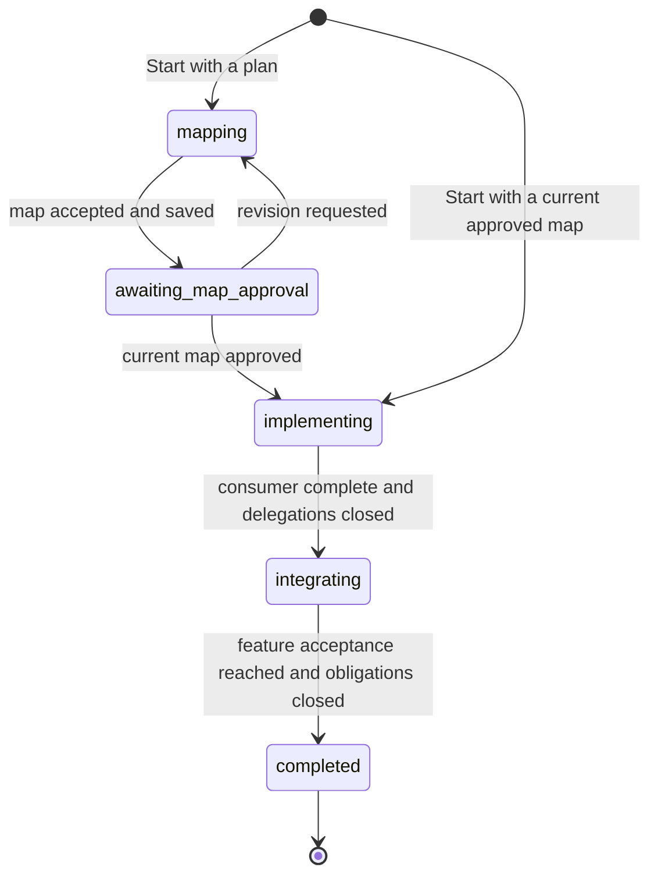
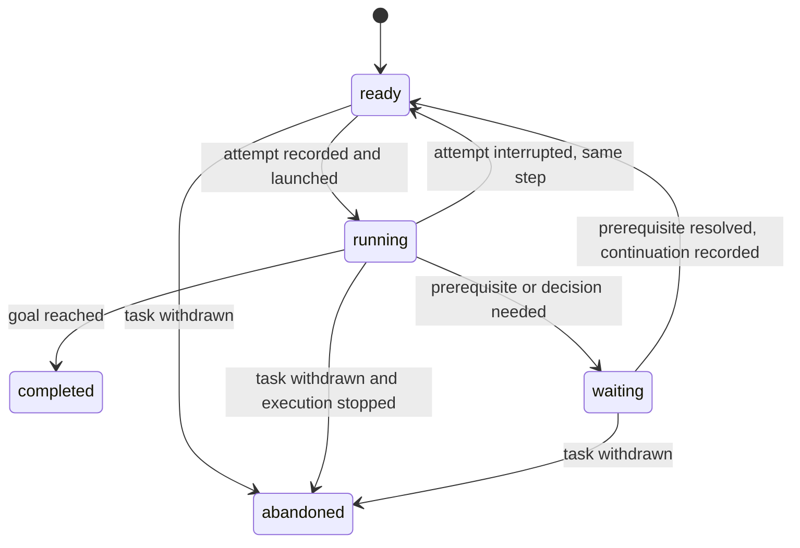

# Implementation loop: a durable task state machine

**Status:** Superseded design proposal, 2026-09-19. Its contract-first task
sequence describes an earlier proposal; the current implementation design is
the [autonomous implementation loop](architecture/autonomous-implementation-loop.md).
No implementation or acceptance is claimed by this document. It follows the
[harness principles](harness.principles.md).
The [architecture draft](architecture.md) supplies context, not constraints.

The whole plan has an outer machine: **map, approve, implement, integrate,
complete**. Within each working phase, a **task can invoke an agent, wait for
other work or a decision, and continue**. Implementation, architect
consultation, contract work and integration use the same task lifecycle.
Their differences belong in their briefs, result schemas and transition rules.

The machine makes orchestration deterministic. It does not make an agent's
answer deterministic. Given the same recorded events, it reaches the same
state and selects the same next action, without asking an agent again.

## Whole-plan execution

Execution starts with a person's **Start** command naming a project and a
plan. The harness validates those inputs, captures the plan, records the run
configuration and creates the run durably before launching an agent. An
invalid start request creates no run; retrying an accepted command returns
the same run. The browser is not needed after that command.



This is the main progression. The global pause, decision, recovery and
cancellation transitions below apply throughout it. The entry using an
approved map connects the implementation loop to the existing mapping flow;
it does not regenerate a map that is already usable.

| Phase | Entry action | Event that advances the plan |
| --- | --- | --- |
| `mapping` | Call an architect task with the captured feature request. | Accept and save the capability map: capabilities, their owners and relationships, and existing behavior available for reuse. Move to `awaiting_map_approval`. |
| `awaiting_map_approval` | Pause for a person's decision on that map revision. | Approval of the current proposal enters `implementing`; a revision request returns to `mapping` with the feedback. |
| `implementing` | Obtain the initial execution decision, then create one bounded implementation task at the highest consumer. | That implementation task completes, including its returns from delegated work, and all implementation obligations are closed. Create the composition task and enter `integrating`. |
| `integrating` | Call the composition task at the common ancestor of the participating modules. | Its feature acceptance is reached, every delegation is closed and no decision remains outstanding. Complete the run. |

The map specifies capabilities, not work. It contains no work-item list,
implementation steps, task ordering or agent scope assignments. Execution
decisions use the capability map and the feature request to derive work as
needed; they are separate records, not additions to the map.

On entering `implementing`, an architect task selects the highest consumer
and the initial bounded scope and goal. The harness records that execution
decision and creates the implementation task. This setup uses the ordinary
architect task lifecycle and does not add another outer phase. Subsequent
tasks arise from implementation evidence and discovered needs.

The highest consumer establishes the executable feature tests from the
feature request. Those tests guide work throughout implementation and
decide completion in composition. Missing acceptance evidence cannot become
success merely because every scheduled item has returned.

Map approval and entry through an existing approved map check the captured
plan and source identities required by the mapping contract. Source changes
made during authorized implementation are expected; they do not send the
plan back to mapping automatically.

### Side work stays within the current phase

During `implementing`, the active task can call an architect, a contract
engineer or another implementation task. The plan remains `implementing`.
During `integrating`, the composition task can make the same calls. The plan
remains `integrating`, and the result returns to composition for another
feature-level check. Discovery does not restart the whole plan.

Thus the plan can have this exact state:

```text
phase: implementing; control: active
consumer task: waiting for provider
  provider task: waiting for architect
    architect task: running
```

Each working phase identifies the task whose completion can advance it: the
map producer, the initial consumer implementation, or final composition.
Completion of setup, architect consultation or a nested provider cannot do so.
Applying the designated task's completion and creating the next phase's task are
one logical transition, reconstructed from one accepted event.

### Pause, decisions, recovery and cancellation

The complete run state has a phase, a control status and the task tree. Its
control status is `active`, `paused`, `completed` or `cancelled`. Keeping
phase and control separate preserves where work resumes without introducing
states such as "implementation paused for contract approval" for every case.

| Event | Whole-plan transition |
| --- | --- |
| Human decision required | Keep the phase and task continuation; set control to `paused` and record the exact proposal or question. Initial map approval is one such decision. |
| Decision supplied | Apply the recorded continuation. Resume only when every blocking decision is resolved; initial map approval also advances the phase. Rejection can request revision or cancel, but never counts as success. |
| User pauses | Keep the phase, prevent launches and stop the current attempt. Resume continues its unfinished step once stopping is established. |
| Agent or harness crashes | Restore the phase and task tree from durable records. An active run retries its unfinished step after establishing that the previous attempt has stopped. A paused run stays paused. |
| Runtime failure requires intervention or a budget is exhausted | Keep the phase, pause with the reason and preserve unfinished work. |
| User cancels | Prevent launches, stop execution, abandon unfinished tasks and set control to `cancelled`. Retain files and results. |
| Final composition succeeds | Set control to `completed` only after the completion guards pass. Retain the final `integrating` phase as historical context. |

An explicit pause must be cleared explicitly; answering an unrelated decision
does not clear it. A run is active only when no pause reason remains. Resume
alone cannot approve a structural proposal or resolve an impossible request.

The two terminal outcomes are **completed** and **cancelled**. An impossible
requirement or persistent runtime failure leaves an explicit paused run until
a person changes the request, resolves the problem or cancels. An amended
feature request is captured as a new input revision, supersedes affected
pending work and returns to `mapping`; completed work remains recorded and
can be reused. Ordinary map amendments within the feature stay in their
current phase and use architect tasks and decisions.

Completion records the final map and contract revisions and references to
feature acceptance evidence. It does not imply a Git commit, merge, deploy
or publication. Such an action would need an explicit step in the requested
workflow. A completed run is terminal; later feature work starts a new run.

The outer machine owns phase progression and run control. The task machine
below owns invocation, delegation and return. Both are parts of the same
durable transition system, not an implicit outer loop around the task machine.

## 1. Separate the task, its step and its attempt

- A **task** has a stable identity, a bounded scope and a goal. It can survive
  several agent invocations and delegate work without losing its identity.
- A **step** is the current instruction within that task: implement the
  consumer, resolve a particular discovery, or integrate a returned provider.
  Its brief and relevant map and contract revisions are fixed before launch.
- An **attempt** is one execution of that step through pi. A crash creates a
  new attempt of the same step. An accepted result or decision can create a
  new step.

These distinctions need only records and identifiers, not three engines.
Restarting an attempt preserves the step's intent but reads today's files.
Returning from a delegation changes the step's instruction deliberately.

An invocation is idempotent in the sense of the principles: it can start
again, inspect the repository and finish what remains. The harness neither
rolls back its edits nor requires its conversation to survive. A retry may
take a different path and produce a different answer.

## 2. One task lifecycle



| State | Meaning |
| --- | --- |
| `ready` | A complete step brief exists and may be invoked. |
| `running` | An attempt has been authorized; its result is outstanding. This includes the interval before the process actually starts. |
| `waiting` | A durable prerequisite names the child task or human decision required, and the continuation to run afterwards. |
| `completed` | This task's goal was reported reached under its completion contract. |
| `abandoned` | The task was withdrawn or superseded. Its caller's obligation remains unresolved until explicitly replaced or withdrawn too. |

`completed` and `abandoned` are terminal. A later revision that invalidates
completed work creates follow-up work; it does not rewrite history.
Every state/event pair absent from the transition rules is rejected without
changing state. In particular, a waiting task cannot launch, a finished task
cannot accept another outcome, and an abandoned child cannot satisfy its
caller's prerequisite.

Run control is separate: `active`, `paused`, `completed` or `cancelled`.
Pausing prevents launches and stops any current attempt. After execution has
stopped, its task becomes `ready` with the same step. A run waiting for a
person is `paused`; its task retains the specific `waiting` reason. Resuming
does not clear that prerequisite. Cancelling abandons unfinished tasks after
stopping execution and keeps their files.

There is no task state for each error or each role. A compilation failure
stays within the invocation. An adapter failure causes retry or a run pause.
A semantic obstacle creates a prerequisite. The event records the reason.

## 3. Calling another task is the side-quest mechanism

The first version executes one invocation at a time, depth first. A waiting
task calls a child task and records a continuation. The child can do the
same. Completion returns to the caller with only the relevant artifacts,
changed assumptions and follow-ups.

This forms a task tree, independent of the module tree. An architect child
can see more modules than its calling engineer. A contract child reads both
sides and writes only their contract. Neither inherits the caller's scope
or conversation automatically.

A continuation contains the next operation, the obligation being resolved,
and the artifact references it needs. It is a typed record, not executable
code or prose that another agent must interpret to recover control flow.
Examples are `use-discovery-answer`, `validate-contract`, `implement-provider`,
`integrate-provider` and `resume-with-decision`.

Several needs are kept in a stable order. Resolve one, return to the consumer
to integrate it, then address the next still-open need. That order is supplied
by the agent and saved when accepted. The harness does not estimate
which need matters most. Only the next step is fixed; later needs can change
as the consumer learns.

Use this tree initially, without a general dependency-graph scheduler or a
workflow language. A repeated need with the same obligation ID refers to the
existing obligation. Similar text is not sufficient to merge needs. Shared
providers can be discovered as existing behavior by later consumers; two
callers do not share a live child task in the first version.

## 4. Specialization is a small transition table

Every role submits one of the principles' five semantic outcomes. A role's
schema describes the payload, including executable evidence or a typed
architect decision. Free text is explanation, never a scheduling instruction.

| Accepted outcome | Deterministic handling |
| --- | --- |
| `goal-reached` | Complete this task and apply its caller's saved continuation. For a phase's entry task, apply the outer machine's phase transition and completion guards. |
| `partial-with-needs` | Keep this task open, record its needs and call the next required task. The caller waits. |
| `contract-revision-needed` | Call the contract engineer with the affected contract and evidence; continue through contract validation and affected implementation work. |
| `cannot-satisfy` | Call the authority responsible for the disputed requirement: the contract engineer for a delegated contract, the architect for placement or scope, a person for the feature requirement. |
| `map-wrong` | Call the architect for a proposed correction; obtain a person's decision for changed ownership or structure before applying it. |

The authority reference comes from the task's delegation record. The harness
does not diagnose why the request is impossible. If the responsible agent
also cannot satisfy its goal, the obstacle moves to its caller's authority;
it must not call itself recursively with the same question. An unresolved
feature requirement ultimately waits for a person.

An architect's successful result uses a closed decision set:

| Decision | Next operation |
| --- | --- |
| Use existing available behavior | Resume the engineer with the API-view references. |
| Change exposure | Record the exact proposed declarations, obtain structural approval, then call a scoped implementation task. |
| Implement in the current scope | Resume the engineer with the clarified goal. |
| Delegate to another owner | Use the assigned scope and the appropriate delegation recipe below. |
| Change scope or map | Record the proposed revision; request approval for structure or changed ownership; replace affected pending steps before launching again. |

An unresolved proposal uses `cannot-satisfy` or `map-wrong` and waits for the
appropriate authority; it is not a successful decision containing an
unbounded list of instructions. A need may skip ownership consultation when
it references a mapped capability with an explicit owner. This does not
supply a task or its scope: a separate execution decision must establish
those before delegation. Otherwise an architect resolves both questions.

The controller checks record shape, identifiers, scope relationships,
approvals and referenced revisions. Agents decide reuse, placement, contract
adequacy, decomposition and whether the goal is reached. It never infers
these from a test log or free-form response.

## 5. The implementation recipe

Start from the highest consumer selected by the initial execution decision,
using the capability map and feature request. Do not eagerly instantiate every
possible provider. Its initial task includes establishing the feature's
behavioral tests from the request.

For a missing provider outside the engineer's scope:

1. The consumer implements what it can, using a fake for the missing behavior,
   and leaves executable evidence and a written need. It reports partial
   completion. A local sketch is provisional, not a provider contract.
2. Resolve ownership from the mapped capability or an architect task, and
   obtain a bounded task scope through a separate execution decision.
3. For a seam between branches, a contract task reads both sides and writes
   the interface and conformance suite, with a fake where needed. The owning
   boundary is their common ancestor. A delegation within one branch can use
   its existing contract; a missing or disputed contract uses the same
   contract task mechanism.
4. A bounded consumer task validates its behavior against that contract's
   fake. If it does not fit, request contract revision before provider work.
   On success, record the accepted contract and suite revision.
5. A provider task implements the obligation in its assigned scope. It may
   recursively discover its own needs. Its completion requires the agreed
   conformance suite to pass unchanged against the real implementation.
6. Resume the original consumer with `integrate-provider`: replace this fake
   and run the consumer's own behavioral tests with the real provider.
   Only that result can close the delegation. Other outstanding fakes remain
   explicit needs, so this return can be partial again.

This extra consumer validation in step 4 ensures the contract engineer's
output has actually been tried by its consumer before delegating it. All six
operations use ordinary tasks and continuations; none needs a new lifecycle
state.

An obligation records its consumer, its need evidence, the accepted contract
revision, the provider task, and the consumer return that closes it. Provider
completion alone never closes the obligation. Reusing unchanged conformance
tests is the provider's obligation; changing them goes through revision.

A contract revision identifies affected consumers and outstanding tasks.
The contract engineer supplies that impact list. Known obligation references
are checked mechanically; discovery of other consumers remains semantic work.
Retain old evidence, invalidate affected pending briefs, repeat consumer
validation, and create follow-up work for previously completed tasks as
needed. A person's structural approval does not itself complete that work.

When the implementation phase's entry task reports its goal reached and
ordinary delegations are closed, the outer machine always calls a composition task at the
lowest common ancestor of the participating modules. It may finish quickly
if the feature tests already pass. It verifies wiring, lifecycle and feature
behavior, and can call the same discovery and delegation machinery if its
corrections exceed its scope. The outer phase is now `integrating`; its
successful return completes the run, so completion does not schedule
composition repeatedly. Both entry tasks use the ordinary task lifecycle.

The run finishes only when that outer transition records successful feature
acceptance with no open obligations or decisions. An empty queue is not
completion.

## 6. Human decisions and loops that cannot progress

Structural changes, including new exposure paths, wait for approval of an
identified proposal revision. Approval authorizes the scoped work; rejection
returns the objection to the proposing agent or cancels the affected work.
Changing the feature requirement records the revised input explicitly. A
bare Resume command never substitutes for one of these decisions.

Changes that keep approved ownership and structure can amend the map without
pausing the whole run. The initial implementation map is approved before implementation,
following the current mapping plan. Further autonomy policy can refine this
later.

Before adding a delegation, check whether its obligation already appears in
the active ancestor chain. A cycle calls the architect with the cycle
evidence; the controller does not invent a common-ancestor redesign.

Persist finite retry and invocation budgets in the run configuration. Runtime
retries consume a step's retry budget; accepted side quests also consume the
run's invocation budget. Exhaustion pauses with the unresolved state intact.
This bounds repeated revisions or fresh IDs that evade exact cycle checks.
Continuation requires an explicit decision or a budget change.

## 7. Persistence and crash recovery

Use one authoritative event log for an implementation run, following the
file-based approach in [Plan 1](plans/01-implementation-map/main-plan.md#durable-state-and-recovery).
The outer phase, run control, task state, active call chain, command receipts and obligations are
projections of that log. Briefs and large results can be immutable files
referenced by hash; neither a session transcript nor a second mutable task
database is needed for recovery.

Agents write project source, tests, fakes and need evidence. The harness alone
writes orchestration records and accepts structured results through a tool.
These are different kinds of repository state; “the only writer” refers to
the harness's durable control records.

The core can be an ordinary pure reducer plus an effect driver:

```text
apply(state, recordedEvent) -> nextState
nextAction(state) -> launch | stop | awaitDecision | finish | none
```

The driver validates a submission and records its accepted payload before
acknowledging it. Applying that one event completes the attempt and selects
the next task or prerequisite atomically in the logical state. IDs for newly
created tasks and continuations derive from that event, so replay cannot
create a second delegation. Files referenced by an event must be written and
flushed first. An unreferenced file is not an accepted result.

Before starting pi, append the attempt authorization. A result must identify
the current task, step and attempt. An exact retry of an accepted submission
returns its receipt; conflicting duplicates and submissions from obsolete
attempts are rejected. Human commands likewise carry an ID and expected run
version. Event order resolves races between stop, approval and submission.

| Interruption point | Recovery |
| --- | --- |
| Before attempt authorization | The task remains ready; schedule it normally. |
| After authorization, before launch or during execution | Retire that attempt and launch the same step afresh, subject to run control and retry budget. Keep source edits. |
| After source edits, before result acceptance | Same recovery. The new agent inspects the files and completes or reports the remaining need. |
| After writing a result file, before its acceptance event | The file has no control authority. Retry the step. |
| After result acceptance, before acknowledgement or launching a child | Replay the accepted event and continue. Do not invoke the completed step again. |
| While waiting for a child or person | Reconstruct the same prerequisite and continuation. |

The writer lock and execution ownership must ensure the previous invocation,
including any tool subprocesses, can no longer write before a replacement
starts. Rejecting a late result
alone does not stop a surviving worker from editing source. The existing pi
spike found cooperative stopping; the adapter must establish termination,
using a worker process if necessary. If it cannot establish that, pause
instead of starting a concurrent replacement.

Invalid structured output is a protocol error: return validation diagnostics
for bounded correction, then retire the attempt through the runtime-failure
path. It is never fabricated into `cannot-satisfy`. Missing credentials or
other conditions requiring intervention pause directly. Ordinary build and
test failures remain the agent's responsibility.

Recovery guarantees require intact source files and control records. Source
edits are not transactions, and a retry does not promise identical output;
the fresh agent handles partially completed work under the same brief.

## 8. Small first implementation and its acceptance

Implement the reducer and sequential driver in `harness`, the shared records
among its public contracts, and pi behind the agent port. The web client projects the
same state and submits commands. No additional module boundaries are needed
just to name these responsibilities.

The first version trusts a schema-valid agent completion with references to
the required evidence. The harness enforces open-obligation and revision
guards but does not independently establish that the tests ran or prove the
feature correct. Independent verification is a separate policy decision.
Ramify remains in the agent environment, outside orchestration.

Use a scripted agent to demonstrate these traces before a live pi trial:

| Trace | Required observation |
| --- | --- |
| Start → mapping → approval → implementation → composition → completion | The saved input starts the run; approval selects the exact map; only final feature acceptance can complete it. |
| Start with an approved map; request map revision; amend the feature request | A usable approved map skips mapping; revision feedback returns to the architect; a changed feature input explicitly re-enters mapping. |
| Consumer → contract → consumer validation → provider → consumer return → composition | Delegation closes only after the real provider passes the consumer's tests; feature completion follows composition. |
| Provider discovers another provider | A nested call returns to its immediate caller, then to the original consumer. |
| Existing available behavior; exposure change; missing behavior; wrong ownership | Each uses its specified recipe and only the required decisions pause. |
| Contract disputed, including after one consumer completed | Affected work uses the revised contract; old completion evidence is not silently reused. |
| Impossible requirement or dependency cycle | A concrete authority receives the obstacle; unchanged requests do not recurse indefinitely. |
| Crash at every boundary in the recovery table | No accepted result is applied twice; source edits survive; the same unfinished step can start without session history. |
| Duplicate result, old attempt, approval race and duplicate command | At most one accepted transition, with deterministic receipts or rejection. |
| Empty runnable queue with an unresolved obligation | The run remains incomplete and exposes the blocker. |
| Pause, cancel or uncertain worker termination | No replacement invocation starts while the old one can still write. |

Then exercise a small real feature with one seam, one nested discovery and an
intentional interruption. Validate the resulting behavior as well as the
control trace. This document has not executed those acceptance cases.

## 9. Relationship to existing drafts

Earlier drafts that put proposed work items or task scopes in the map need
reconciliation with the capability-only map. This proposal keeps those
execution records separate; it does not revise the earlier drafts here.

The current mapping plan deliberately stops before the implementation loop.
Its event log, command receipts and agent port are useful foundations. Its
mapping-specific policy marks interrupted jobs for manual restart; this
proposal gives implementation attempts automatic retry. Mapping can later
specialize the same lifecycle while retaining its own approval policy.

The present checkout contains persistence primitives and plan browsing; a
pi spike exercises adapter behavior with a scripted model. Those are useful
starting points, not an implemented durable task engine. Existing job
envelopes will need an explicit mapping to this task/run model.

Before an implementation plan is frozen, settle the wire schemas, default
budgets, worker termination mechanism and convention for executable need
artifacts. In particular, recorded failing tests must stay runnable and must
not be mistaken for a passing completion gate. None of these decisions
requires changing the lifecycle above.
